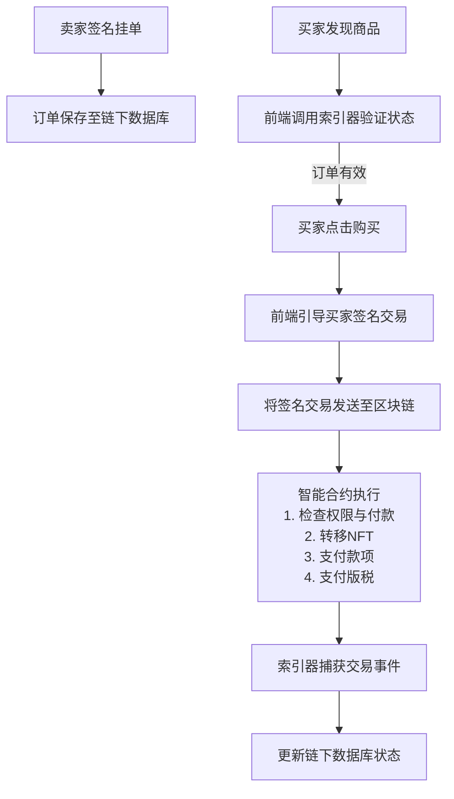

好的，我们来深入剖析 NFT 市场项目。这是一个集金融、艺术、技术和社区于一体的复杂系统。

---

### 一、NFT 市场内部架构

一个全功能的 NFT 市场（如 OpenSea、Blur）通常采用分层架构，结合了链上智能合约和强大的链下基础设施。

#### 1. 智能合约层（链上核心）

这是市场的信任基石，所有资产所有权和关键交易逻辑都部署在区块链上。

*   **NFT 合约本身**：
    *   通常遵循 **ERC-721** 或 **ERC-1155** 标准。市场本身不发行 NFT，而是与这些合约交互。
    *   **ERC-721**：每个代币都是独一无二的（如 CryptoPunks）。
    *   **ERC-1155**：支持半同质化代币，一个合约内可包含多种资产，效率更高（如游戏道具）。

*   **市场的核心合约**：
    *   **代理合约**：用户授权给市场的合约，用于执行交易。这是为了安全，市场本身不能直接动用用户的资产。
    *   **交易合约**：处理核心交易逻辑，如挂单、报价、执行交易。
    *   **版税注册表**：记录 NFT 系列创作者地址和版税比例，确保交易时能自动支付版税。

#### 2. 链下服务层（体验与性能核心）

由于区块链的延迟和高成本，大部分复杂功能都在链下完成。

*   **元数据与文件存储**：
    *   **NFT 本身**：链上 NFT 合约通常只存储一个指向元数据的 `tokenURI`。
    *   **元数据**：一个 JSON 文件，包含 NFT 的名称、描述、图像/视频链接、属性等。
    *   **存储方案**：
        *   **中心化**：AWS S3（有风险，文件可能丢失）。
        *   **去中心化**：**IPFS** 是最佳实践，通过内容寻址保证文件不可篡改。**Arweave** 提供永久存储。

*   **订单簿与索引服务**：
    *   **难点**：在链上存储和查询订单（如所有挂单、报价）极其昂贵和缓慢。
    * **解决方案**：使用**链下订单簿**。用户对订单进行**链下签名**，订单被保存在市场的中心化数据库中。
    *   **索引器**：持续扫描区块链，监听 NFT 转移、铸造等事件，将数据同步到数据库，以便前端快速查询和展示。

*   **前端应用与 API**：
    *   用户交互的界面。
    *   提供 API 给第三方开发者集成。

---

### 二、工作原理

以一个典型的「购买」流程为例，结合上述架构，其工作原理如下：

#### 关键机制解析：

1.  **上架与签名**：
    *   卖家从不“发送”NFT 到市场。他们只是签署一条消息（订单），声明“我愿意以 X 价格出售我的 Token #Y”。这笔签名的订单被发送到市场的数据库。
    *   这被称为 **“离线授权”** ，它无需 Gas 费，也无法被篡改。

2.  **发现与验证**：
    *   买家在前端浏览时，数据来自市场的索引数据库。
    *   当买家决定购买时，前端会通过索引器快速验证该签名订单是否依然有效（例如，NFT 尚未被卖出或转移）。

3.  **交易执行与结算**：
    *   买家点击购买，发送一笔区块链交易，调用市场的交易合约。
    *   合约会验证卖家的签名，检查买家是否支付了足够的钱，然后**原子化地**完成以下操作：
        *   将 NFT 从卖家转移到买家。
        *   将资金从买家转移到卖家。
        *   如有设置，支付平台手续费给市场方。
        *   如有设置，支付版税给创作者。
    *   **“原子化”** 是关键：所有这些操作在一个交易中完成，要么全部成功，要么全部失败，避免了买家付了钱却没收到 NFT 的风险。

---

### 三、技术难点

构建一个健壮的 NFT 市场面临诸多挑战：

1.  **区块链的扩展性与成本**：
    *   **难点**：在以太坊主网高峰期，一笔简单的购买交易可能花费上百美元的 Gas 费，严重损害用户体验。
    *   **解决方案**：采用 **Layer 2 解决方案**（如 Polygon、Arbitrum、Optimism）或侧链。这带来了跨链桥、流动性碎片化等新问题。

2.  **元数据的持久性与真实性**：
    *   **难点**：如果元数据存储在中心化服务器，创作者可以“拉地毯”，改变 NFT 的图像或属性，使其价值归零。
    *   **解决方案**：推广使用 **IPFS** 和 **Arweave**。教育创作者和用户理解“去中心化存储”的重要性。

3.  **订单簿的同步与有效性**：
    *   **难点**：如何确保链下订单簿与链上资产状态实时同步？如果一个 NFT 在另一个平台被卖出，本市场的订单必须立即失效。
    *   **解决方案**：建立强大的索引器和事件监听系统，快速响应链上事件，并即时更新数据库。

4.  **版税执行**：
    *   **难点**：如何强制支付版税？随着市场竞争加剧，一些市场（如 Blur）为了吸引交易者，开始采用可选版税，这损害了创作者利益。
    *   **解决方案**：技术上有**黑名单**、**版税强制执行工具**等，但本质上这是一个经济和治理难题，而非纯技术问题。

5.  **安全性与防欺诈**：
    *   **难点**：网络钓鱼、虚假 NFT 系列、签名劫持等安全威胁层出不穷。
    *   **解决方案**：需要合约审计、前端安全监控、以及用户教育（如验证合约地址、识别虚假网站）。

---

### 四、与同类项目对比

| 特性 | **OpenSea** | **Blur** | **LooksRare** | **Magic Eden** |
| :--- | :--- | :--- | :--- | :--- |
| **定位与策略** | **全能型市场**， NFT 领域的“亚马逊” | **专业交易市场**， 为“Pro Trader”设计 | **社区导向的挑战者**， 强调代币激励 | **多链市场**， 最初在 Solana 上崛起 |
| **核心技术特点** | 支持多链， 推出 **Seaport 协议** （更省 Gas，功能更灵活） | **聚合器**功能强大， 扫货多个市场， UI/UX 为快速交易优化 |  fork of OpenSea 但增加了强力的 **代币奖励模型** | 从 Solana 扩展， Solana 上低 Gas 费体验好 |
| **交易模型** | 链下订单簿， 可选版税 | **聚合器 + 原生市场**， **可选版税**（对创作者不友好） | 链下订单簿， 强制版税 | 链下订单簿， 支持可选版税 |
| **代币经济** | 无代币 | **有代币 $BLUR**， 通过**空投**和**激励** 吸引忠实用户 | **有代币 $LOOKS**， 交易即挖矿， 质押分红 | 有代币， 但模型相对简单 |
| **优势** | **品牌知名度最高**， 流动性最深， 用户基数最大， 对新用户友好 | **交易体验最佳**， Gas 优化好， 代币激励强， 深受专业交易者喜爱 | **对创作者友好**， 交易奖励高 | **多链支持**， 尤其在 Solana 生态有统治力 |
| **劣势** | 被认为“缓慢而陈旧”， 手续费较高（2.5%）， 对专业交易者不友好 | **对创作者不友好**， 激励模型可能导致刷量交易 | 流动性不如 OpenSea， 激励下降后活跃度降低 | 在以太坊生态 面临激烈竞争 |

**总结对比：**

*   **OpenSea vs. Blur**：这是典型的 **“统治者 vs. 挑战者”** 之战。
    *   **OpenSea** 像**大型购物商城**，品类齐全，环境友好，适合所有人闲逛和购买。
    *   **Blur** 像**专业的股票交易大厅**，界面充满数据，工具强大，为追求速度和收益的交易者设计。它的**聚合器**功能可以让你在一个界面买到所有市场的最优报价。

*   **OpenSea/Blur vs. LooksRare**：LooksRare 开启了 **“吸血鬼攻击”** ，通过代币激励从 OpenSea 吸血。但它证明了社区和代币经济的力量，最终因为激励不可持续而衰落。

*   **以太坊系 vs. Magic Eden**：Magic Eden 抓住了 Solana 生态早期低 Gas 费和新兴 NFT 项目的机遇，成为了该生态的龙头，并开始向其他链扩展，展示了**多链战略**的重要性。

**未来的技术趋势**：
1.  **聚合器为王**：像 Blur、Gem 这样的聚合器将成为用户入口，因为它们提供最佳价格。
2.  **链上版税解决方案**：需要更底层的技术来保障创作者收入。
3.  **零 Gas 交易**：通过账户抽象和 Layer 2，实现无感支付 Gas 的体验。
4.  **真去中心化**：从存储到前端，整个栈的去中心化。
