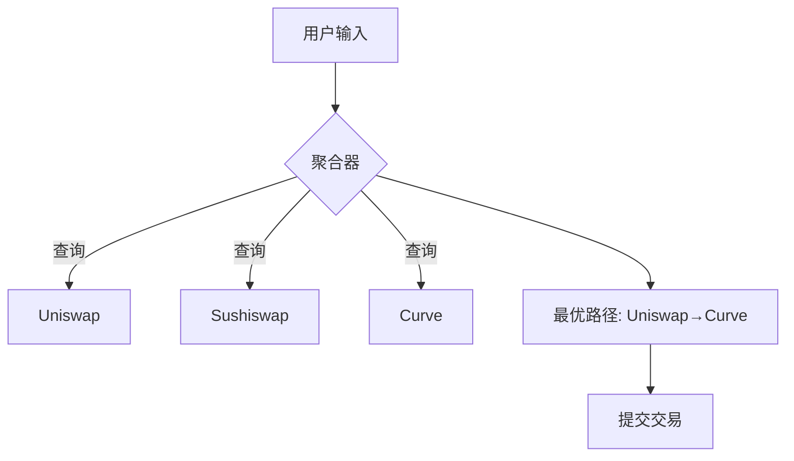

# 一、以太坊中，什么是最优路径，谈谈你的理解


在以太坊生态系统中，**“最优路径”通常指在去中心化金融（DeFi）交易中，通过多跳路由（Multi-hop Routing）或跨协议交互时，找到成本最低、收益最高或效率最高的操作路径**。这一概念的核心是优化资源（如Gas费用、滑点、手续费）的分配，以提升交易效率和用户体验。以下是具体分析：

---

### **1. 最优路径的定义**
在DeFi场景中，最优路径通常指：
- **最小化成本**：降低Gas费用或交易手续费。
- **最大化收益**：通过套利或路径选择获得更高兑换比例。
- **降低风险**：减少滑点、预言机延迟或交易失败的可能性。

例如，用户用ETH兑换DAI时，可能选择“ETH → USDC → DAI”的多跳路径，而非直接兑换，以获得更好的汇率。

---

### **2. 影响路径选择的关键因素**
| **因素**          | **影响**                                                                 |
|-------------------|--------------------------------------------------------------------------|
| **滑点（Slippage）** | 路径中每一步的流动性深度决定了价格波动，需选择滑点最小的池子。            |
| **手续费（Fee）**   | 不同池的费率（如Uniswap v3的0.05%/0.3%/1%）影响总成本，需权衡收益与费用。 |
| **Gas费用**         | 多跳交易需多次合约调用，Gas成本可能超过收益，需优化调用次数。             |
| **链上数据延迟**     | 预言机或区块确认时间可能导致价格差异，需实时性高的路径。                  |

---

### **3. 实现最优路径的技术方法**
#### **(1) 图论与路由算法**
- **建模为图问题**：将流动性池视为节点，交易对作为边，权重为成本或收益。
- **经典算法**：
  - **Dijkstra算法**：寻找单源最短路径（如最低手续费路径）。
  - **Bellman-Ford算法**：处理包含负权重的路径（如套利机会）。
  - **动态规划**：在多池组合中寻找全局最优解。

#### **(2) DeFi专用优化策略**
- **多跳路由（Multi-hop）**：
  - 通过中间代币（如ETH → USDC → DAI）降低滑点。
  - Uniswap v3支持多池路由，允许在单笔交易中跨多个池子执行。
- **套利机会挖掘**：
  - 利用不同协议（如Uniswap、Curve、Balancer）的价格差异进行套利。
  - 工具如Arbitrage DAO通过实时监控链上价格寻找套利路径。

#### **(3) 机器学习与实时数据**
- **预测模型**：基于历史数据训练模型，预测滑点和Gas价格波动。
- **实时反馈系统**：通过链上事件（如Pool Swap事件）动态调整路径。

---

### **4. 实际应用案例**
#### **(1) Uniswap v3的路径优化**
- **集中流动性与多费率**：通过自定义价格区间，LP可提供更高效的流动性，降低滑点。
- **Router 2.0**：支持跨多个池子的路由（如ETH/USDC 0.3%池 + USDC/DAI 0.05%池）。

#### **(2) 1inch Network的Chi置换算法**
- **批量拍卖（Batch Auction）**：聚合多个订单并统一结算，减少Gas成本。
- **Chi Gas Token**：通过Gas代币抵扣Gas费用，降低交易总成本。

#### **(3) Blocknative的Gas平台**
- **Gas价格预测**：实时分析网络拥堵情况，推荐最优Gas价格。
- **交易排序优化**：通过优先Gas费（Priority Fee）加速交易确认。

---

### **5. 挑战与未来方向**
| **挑战**                | **解决方案**                                                                 |
|-------------------------|--------------------------------------------------------------------------------|
| **实时性要求高**         | 采用链下计算（如The Graph）快速获取链上数据，减少链上处理时间。                |
| **Gas费用波动**          | Layer 2扩展方案（如Optimism、Arbitrum）降低Gas成本，支持高频路径优化。         |
| **预言机延迟**           | 使用TWAP（时间加权平均价格）或Chainlink预言机提供更稳定的价格数据。           |
| **复杂路径验证**         | 引入零知识证明（ZK-Rollups）验证路径合法性，确保交易安全性。                  |

---

### **6. 总结**
在以太坊中，最优路径的设计本质是**资源分配的博弈论问题**，需在成本、收益和风险间找到平衡。随着DeFi协议的复杂化（如多链部署、衍生品市场），路径优化将更依赖链下计算与链上验证的结合，而Layer 2技术与智能路由算法的融合将进一步推动这一领域的发展。


# 一、XXX
在以太坊的 **DeFi 交易生态**中，**最优路径（Optimal Path）**是指用户在交换代币时，能够以 **最高效率**（如最低滑点、最低手续费或最大输出金额）完成交易的路径选择。其核心目标是 **最大化用户收益** 并 **最小化成本**，尤其在多跳交易（Multi-hop）中至关重要。以下从技术原理、实现方式和实际应用展开分析：

---

### **1. 最优路径的核心问题**
#### **(1) 为何需要最优路径？**
- **滑点控制**：直接交易（如A→B）可能因流动性不足导致高滑点，而通过中间代币（如A→C→B）可能更优。  
- **手续费优化**：不同交易对的费率不同（如Uniswap V3有0.05%、0.3%、1%三档），路径选择影响总成本。  
- **流动性碎片化**：尤其在V3中，流动性集中在狭窄区间，路径需动态适配。

#### **(2) 关键指标**
- **输出金额最大化**：通过算法比较不同路径的最终输出。  
- **Gas成本最低化**：路径的跳数（Hop）和合约交互复杂度影响Gas开销。  

---

### **2. 技术实现原理**
#### **(1) 路径搜索算法**
- **广度优先搜索（BFS）**：遍历所有可能的中间代币路径（如A→X→B，A→Y→Z→B）。  
- **Dijkstra算法**：将交易对视为图（Graph）中的节点，以手续费或滑点为权重寻找最短路径。  
- **递归拆分**：大额交易可能被拆分为多个子路径（如通过不同流动性池分段成交）。  

**代码示例（简化路径搜索）**：
```solidity
// 伪代码：比较两条路径的输出
function comparePaths(uint amountIn, path1[], path2[]) {
    uint out1 = getAmountOut(amountIn, path1); // 计算路径1输出
    uint out2 = getAmountOut(amountIn, path2); // 计算路径2输出
    return out1 > out2 ? path1 : path2;
}
```

#### **(2) 链下计算+链上验证**
- **链下计算**：由前端或服务器预先模拟路径（通过调用节点的`eth_call`）。  
- **链上验证**：实际交易时，路由器合约（如Uniswap Router）确保输出不低于预期。  

---

### **3. 实际应用场景**
#### **(1) Uniswap的自动路由**
- **V2路由器**：支持简单多跳（如A→B→C），但依赖固定路径。  
- **V3路由优化**：  
  - 动态选择不同费率层级的池子（如优先使用0.05%费率的ETH/USDC池）。  
  - 结合**Tick流动性**，避开低深度区间。

#### **(2) 聚合器（DEX Aggregator）**
- **1inch / Matcha**：跨多个DEX（Uniswap、Sushiswap、Curve）聚合路径，实现全局最优。  
- **Meta-Transaction**：通过智能合约钱包批量优化Gas和路径。

**聚合器工作流**：


---

### **4. 高级优化策略**
#### **(1) 混合路径（Hybrid Routing）**
- **组合V2/V3池子**：V3处理主流代币对（高资本效率），V2处理长尾代币（简单流动性）。  
- **示例**：用户出售`代币A`→通过V2换成`WETH`→通过V3的0.05%池换成`USDC`。

#### **(2) JIT（Just-In-Time）流动性**
- **MEV保护**：机器人在区块内临时提供流动性，捕获最优路径利润（常见于V3窄区间）。  

#### **(3) 滑点动态调整**
- **大额交易**：自动拆分路径，避免单池滑点超过阈值（如1%）。  

---

### **5. 安全与限制**
#### **(1) 风险点**
- **前置攻击（Frontrunning）**：最优路径可能被MEV机器人探测并抢先交易。  
- **过期数据**：链下计算的路径在交易上链时可能已失效（需设置合理截止时间）。  

#### **(2) 解决方案**
- **私有交易**：通过Flashbots等隐私RPC提交交易。  
- **Slippage保护**：用户设置最大可接受滑点（如`amountOutMin`）。  

---

### **6. 开发工具推荐**
- **SDK**：  
  - Uniswap SDK V3：支持复杂路径计算和Tick流动性模拟。  
  - 1inch API：直接获取聚合路径。  
- **本地模拟**：  
  - 使用Hardhat分叉主网环境测试路径：  
    ```javascript
    await hre.network.provider.request({
      method: "hardhat_reset",
      params: [{ forking: { jsonRpcUrl: ALCHEMY_URL } }]
    });
    ```

---

### **总结**
以太坊的最优路径问题是 **算法设计**（图搜索）、**经济激励**（手续费/滑点）和 **实时数据**（流动性变化）的结合。未来的发展方向包括：  
1. **L2集成**：通过Optimism等降低多跳交易的Gas成本。  
2. **AI预测**：机器学习动态预测流动性变化。  
3. **跨链路径**：结合LayerZero等跨链协议扩展至多链最优路径。  

对于开发者，建议优先使用成熟的聚合器API；而对于高级用户，可基于V3 SDK自定义路由策略，平衡效率与安全性。

