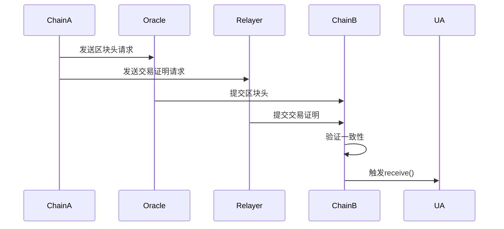

# 一、XXX
### **LayerZero 详解：跨链通信协议及其优化方案**  

#### **1. LayerZero 是什么？**
LayerZero 是一种 **全链互操作性协议（Omnichain Interoperability Protocol）**，旨在实现不同区块链之间的 **轻量级、无需信任的跨链通信**。它不依赖第三方桥接或托管，而是通过智能合约和中继器网络直接验证链间消息。  

**核心目标**：  
✅ **去中心化**：避免中心化桥接风险（如资产托管攻击）。  
✅ **低成本**：优化跨链Gas消耗。  
✅ **通用性**：支持任意数据跨链传递（资产、NFT、合约调用等）。  

---

## **2. LayerZero 的架构**
LayerZero 采用 **“中继器+预言机”双验证模型**，由以下组件构成：  

### **（1）链上端点（Endpoint）**  
- **User Application (UA)**：用户部署的智能合约（如跨链DEX）。  
- **LayerZero Core**：每条链上的核心合约，负责消息发送/接收和验证。  
  - `send()`：打包消息并触发中继器和预言机。  
  - `receive()`：验证消息并传递给目标应用。  

### **（2）链下组件（Off-Chain）**  
| 组件              | 作用                                      | 去中心化程度          |  
|-------------------|------------------------------------------|-----------------------|  
| **Oracle**        | 提供区块头证明（如Chainlink）             | 依赖外部预言机        |  
| **Relayer**       | 提供交易证明（默认为官方运行，可自定义）   | 可替换为第三方中继器  |  

**工作流程**（以链A→链B跨链为例）：  
1. **发送阶段（链A）**：  
   - UA调用`Endpoint.send()`，消息被存储在链A的LayerZero合约中。  
   - 中继器和预言机监听事件，分别获取交易证明和区块头。  

2. **验证阶段（链B）**：  
   - 预言机将链A的区块头推送到链B的LayerZero合约。  
   - 中继器提交交易证明，合约验证两者一致性后执行`receive()`。  



---

## **3. LayerZero 的Gas优化策略**  
LayerZero通过以下设计降低跨链Gas成本：  

### **（1）轻量级验证（Light Verification）**  
- 仅验证**区块头+交易证明**，而非全链状态（如乐观Rollup需7天挑战期）。  
- **节省Gas场景**：跨链转账的Gas比传统桥接低50%以上。  

### **（2）可定制中继器（Custom Relayer）**  
- 默认中继器由LayerZero官方运行（可能产生费用），但开发者可：  
  - **自建中继器**：避免依赖第三方，减少中间成本。  
  - **竞拍中继权**：通过经济激励优化网络效率。  

### **（3）消息压缩（Payload Compression）**  
- 对跨链数据（如代币合约地址、金额）进行编码压缩。  
- **案例**：跨链转账的Payload可缩减至32字节，节省~30% Gas。  

### **（4）批量处理（Batching）**  
- 多个跨链请求打包成单次提交，均摊Oracle和Relayer成本。  
- **适用场景**：DEX的批量跨链清算或NFT集合迁移。  

### **（5）预付费与补贴机制**  
- **预付费模式**：用户在源链支付Gas，避免目标链Gas不足失败。  
- **协议补贴**：LayerZero官方可能对高频应用提供Gas补贴。  

---

## **4. 对比其他跨链方案**  
| 维度               | LayerZero                | 传统桥接                 | 原子交换               |  
|--------------------|--------------------------|--------------------------|------------------------|  
| **信任假设**       | 仅依赖预言机+中继器      | 依赖中心化托管           | 无需信任               |  
| **通用性**         | 支持任意数据             | 仅限资产                 | 仅限代币               |  
| **Gas成本**        | 低（轻验证）             | 中（多层手续费）         | 高（需链上流动性）     |  
| **延迟**           | 中等（依赖Oracle速度）    | 慢（人工审核）           | 快速                   |  

---

## **5. 开发者优化建议**  
- **选择高频链**：优先部署在EVM链（如Ethereum、BSC），其验证成本低于非EVM链（如Solana）。  
- **监控中继器**：自定义中继器时，需确保其在线率以防消息丢失。  
- **使用SDK**：通过LayerZero SDK的`estimateFees()`预计算Gas开销。  

```solidity
// 示例：预估跨链Gas费
(uint nativeFee, ) = lzEndpoint.estimateFees(
    targetChainId,
    userAddress,
    payload,
    false,  // payInZRO (原生代币)
    "0x"    // adapterParams (自定义参数)
);
```

---

## **6. 总结**  
LayerZero通过**去中心化验证架构**和**Gas优化设计**，成为跨链通信的高效解决方案。其核心优势在于：  
- **无需信任**：相比中心化桥更安全。  
- **灵活扩展**：支持任意区块链和数据类型。  
- **成本可控**：通过批量处理、压缩和定制中继器降低费用。  

未来可能通过ZK证明进一步减少对预言机的依赖，实现完全无信任化。开发者应权衡**安全、成本、延迟**三要素，选择适合的跨链策略。


# 二、


LayerZero 是一个**全链（Omnichain）通信协议**，旨在实现不同区块链之间的安全、高效交互。它通过轻量级架构和模块化设计，支持资产、数据和合约调用的跨链传递，无需依赖中间链或全节点验证。以下是其核心架构及Gas优化策略：

---

### **一、LayerZero的架构**
LayerZero 的架构分为 **6层核心组件**，通过去中心化服务（如预言机和中继器）实现跨链验证：

1. **端点（Endpoint）**  
   - 每条链部署的智能合约，负责接收和发送跨链消息。
   - 包含链上轻节点（Ultra Light Node），验证目标链区块头的哈希。

2. **网络（Network）**  
   - 协调消息传递的协议层，确保消息在源链和目标链之间可靠传输。

3. **预言机（Oracle）**  
   - 提供链下数据服务（如区块头、交易证明），通常由去中心化预言机网络（如 Chainlink）或原生链验证者担任。

4. **中继器（Relayer）**  
   - 独立第三方服务，负责监听链上事件、获取交易证明并提交到目标链。中继器可由任何人运行，形成竞争性市场。

5. **验证器（Validator）**  
   - 在目标链验证消息的有效性，确保仅合法消息被处理（如验证区块头与预言机数据一致）。

6. **用户应用（Ultra Light Node）**  
   - 部署在链上的轻量级合约，仅存储目标链区块头的哈希，无需存储完整区块数据。

**工作流程示例**：  
1. 用户在源链发起跨链交易（如转账）。  
2. 源链 Endpoint 将交易数据发送给预言机和中继器。  
3. 预言机将区块头哈希传至目标链，中继器提交交易证明。  
4. 目标链 Endpoint 验证区块头与证明的一致性，确认交易合法性后执行。

---

### **二、LayerZero的Gas优化策略**
LayerZero 通过以下方式降低跨链交易的Gas成本：

1. **轻量级验证（Ultra Light Node）**  
   - 无需在链上存储完整区块数据，仅验证区块头哈希，大幅减少链上计算和存储开销。

2. **批量处理消息**  
   - 将多笔跨链交易合并为单条消息处理，分摊Gas费用（如一次验证多个交易的证明）。

3. **去中心化服务竞争**  
   - 预言机和中继器的市场机制（如 Chainlink 的拍卖模式）可降低服务费用，间接减少用户支付的Gas。

4. **Layer 2 扩展支持**  
   - 在 Optimism、Arbitrum 等 Layer 2 网络上部署 Endpoint，利用其低Gas特性降低跨链成本。

5. **优化消息编码**  
   - 使用高效的数据编码格式（如 ProtoBuf），减少消息体积，降低传输和存储成本。

6. **异步验证机制**  
   - 允许用户先发送消息，后续由中继器异步提交证明，避免同步验证的高Gas消耗。

---

### **三、对比其他跨链方案的Gas优势**
| **方案**         | **Gas成本**       | **特点**                                   |
|------------------|------------------|------------------------------------------|
| **LayerZero**    | 低（轻节点验证） | 无需全节点，依赖预言机和中继器。         |
| **Wormhole**     | 中高（全节点验证） | 需在链上运行完整节点，验证成本较高。       |
| **Chainlink CCIP** | 中（预言机+验证） | 依赖 Chainlink 的去中心化网络，费用透明。  |

---

### **四、实际应用案例**
1. **Stargate（基于LayerZero）**  
   - 跨链资产桥，通过共享流动性池实现100%原生资产兑换，Gas费用比传统桥低50%以上。
2. **Zircuit（LayerZero生态项目）**  
   - 利用 LayerZero 的异步验证机制，将跨链NFT铸造Gas成本降低至$0.1以下。

---

### **总结**
LayerZero 通过**轻量化验证+去中心化服务市场**的架构，解决了传统跨链桥的高Gas问题。其核心创新在于将复杂验证逻辑移至链下，仅保留关键验证步骤在链上，从而兼顾安全性和效率。未来，随着 Layer 2 扩展和更多优化策略的落地（如零知识证明压缩），其 Gas 成本有望进一步降低。
