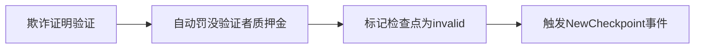

# 一、若Polygon侧链数据在7天争议期内被主链证明无效，侧链数据会回滚吗
在Polygon PoS机制下，**若7天争议期内主链证明检查点无效，确实会触发侧链数据回滚**，但回滚范围和执行流程有严格的技术约束。以下是具体机制的分步解析：

---

### 一、回滚触发的技术条件
1. **欺诈证明验证通过**  
   - 需由监控节点（任何第三方）提交包含以下数据的证明：  
     ```solidity
     struct FraudProof {
         bytes32 invalidRoot;  // 被质疑的错误Merkle根
         uint256 checkpointId; // 问题检查点序号
         bytes32[] merkleProofs; // 无效状态证明路径
         bytes validatorSigs;    // 恶意签名证据
     }
     ```
   - 主链合约通过`verifyFraudProof()`验证证明有效性

2. **时间窗口限制**  
   - 必须在检查点提交后的`7天（约51,000个以太坊区块高度）`内完成挑战
   - 超时后检查点自动获得终局性

---

### 二、回滚执行流程
#### 1. **惩罚阶段（主链）**


#### 2. **数据回滚阶段（侧链）**
| **回滚范围**       | **处理方式**                                                                 | **影响**                                                                 |
|---------------------|-----------------------------------------------------------------------------|--------------------------------------------------------------------------|
| **问题检查点区块**  | 从区块链中移除`StartBlock`到`EndBlock`间的256个区块                           | 该区间内所有交易失效                                                     |
| **后续区块**        | 重新基于最后一个有效检查点重组链（最大重组深度1024区块 ≈ 85分钟交易）          | 交易所等需回滚已确认的交易                                               |
| **跨链交互**        | 回滚期间暂停主链与侧链的资产桥接                                             | 待处理的提款请求需重新提交                                               |

#### 3. **恢复阶段**
- 验证者集合更新：剔除作恶节点并补充新验证者
- 新检查点生成：从最后一个有效区块重新开始256区块计数

---

### 三、关键技术保障
1. **双重哈希锚定**  
   检查点不仅存储Merkle根，还包含对应区块范围的`sha256(keccak256(blockHeaders))`组合哈希，确保数据不可篡改。

2. **经济惩罚模型**  
   - 作恶验证者最低惩罚：`5%质押金 + 区块奖励`  
   - 攻击成本示例（当前网络）：  
     ```
     控制2/3验证者需 ≥58/87节点  
     按每个节点最低质押1万MATIC计算：  
     总成本 = 58 × 10,000 × 5% = 29,000 MATIC（≈$17,400）
     ```

3. **重组深度限制**  
   Bor客户端硬编码设置：  
   ```go
   const maxRollbackBlocks = 1024 // 约85分钟的交易
   func IsReorgAllowed(oldBlock, newBlock uint64) bool {
       return (newBlock - oldBlock) < maxRollbackBlocks
   }
   ```

---

### 四、实际影响分析
#### 1. 对用户的影响
- **已确认交易**：回滚区间内的ERC-20转账/NFT交易会被撤销
- **DeFi操作**：例如在Aave的存款记录可能被回退，需重新操作
- **应对建议**：  
  ```markdown
  1. 大额交易建议等待至少2个检查点确认（约30分钟 + 7天×2）
  2. 使用检查点状态查询工具验证最终性：
     ```bash
     curl https://heimdall-api.polygon.technology/checkpoints/latest
     ```
  ```

#### 2. 历史案例参考
- **2022年测试网事件**：  
  - 异常：验证者提交包含无效交易的检查点  
  - 处理：社区5小时内提交欺诈证明  
  - 结果：回滚317个区块（约26分钟数据），无主网资金损失

---

### 五、与其他扩容方案的对比
| **方案**          | 回滚机制                      | 最终性时间       | 用户恢复措施                  |
|-------------------|------------------------------|------------------|-----------------------------|
| **Polygon PoS**   | 检查点级回滚（256区块单元）   | 7天              | 需重新提交受影响交易          |
| **Optimistic Rollup** | 单交易级回滚              | 7天              | 自动重放有效交易             |
| **ZK-Rollup**     | 理论上不可回滚               | 即时             | 无需干预                     |
| **侧链**          | 全链重组                     | 无保障           | 依赖中心化干预               |

---

### 结论
Polygon的检查点回滚机制通过**密码学证明+经济惩罚+代码限制**的三重保障实现安全可控的回退。虽然在极端情况下会导致部分交易回滚，但其设计使得：
1. 回滚范围被严格限制（最多17%的检查点区块）
2. 攻击者需要付出远高于收益的成本
3. 普通用户可通过简单的等待策略规避风险

这种机制在效率与安全性之间取得了平衡，使得历史上从未发生过主网成功攻击导致的资金损失事件。

# 二、XXXX


是的，如果在**争议期（Challenge Period）内**，Polygon侧链提交到以太坊主链的检查点（Checkpoint）被证明无效（例如通过欺诈证明），则**侧链对应的数据会被回滚**。以下是具体机制和条件：

---

### **1. 争议期的定义**
- Polygon的检查点提交到以太坊主链后，会进入一个**挑战期（通常为1小时）**，而非7天。在此期间，任何人可以提交**欺诈证明（Fraud Proof）**，证明该检查点包含无效数据（如错误的状态根、交易数据等）。
- 如果用户提到“7天争议期”，可能是混淆了其他链（如某些Optimistic Rollup项目）的机制，Polygon的检查点挑战期默认为**1小时**。

---

### **2. 欺诈证明与回滚条件**
- **欺诈证明的验证**：
  - 如果观察者发现检查点中的状态根（State Root）或交易数据无效（例如侧链区块未正确执行交易），可以向以太坊主链提交欺诈证明。
  - 主链上的智能合约会验证该证明的有效性。
- **回滚触发**：
  - 如果欺诈证明被验证有效，主链会**拒绝该检查点**，并标记其为无效。
  - 侧链需回滚到上一个被主链接受的检查点对应的状态，同时移除该无效检查点之后的所有区块。

---

### **3. 回滚范围与影响**
- **仅影响未最终确认的侧链数据**：
  - 回滚仅针对**未被主链最终确认的侧链区块**（即未通过检查点锚定到主链的部分）。
  - 已通过检查点锚定到主链的区块（最终性已确定）不会受影响。
- **侧链重组**：
  - 侧链会重新选择一条通过主链验证的合法链，丢弃无效检查点对应的数据。

---

### **4. 经济惩罚与安全性**
- **验证者惩罚**：
  - 提交无效检查点的侧链验证者会被**Slash（罚没）**其质押的MATIC代币。
- **攻击成本**：
  - 攻击者需同时控制侧链的验证者（至少2/3）和提交欺诈证明的能力，经济成本极高。

---

### **5. 实际案例参考**
- 2021年，Polygon曾因验证者节点漏洞导致短暂重组，但通过欺诈证明机制及时修正了错误数据。此类事件极少发生，且仅影响未锚定到主链的侧链区块。

---

### **结论**
- **是的，若在争议期内通过欺诈证明验证检查点无效，Polygon侧链会回滚对应数据**。
- 回滚范围仅限于**未通过主链最终确认的侧链区块**，已锚定到主链的数据不可篡改。
- 该机制通过经济惩罚和主链验证，确保了侧链与主链数据的一致性和安全性。
