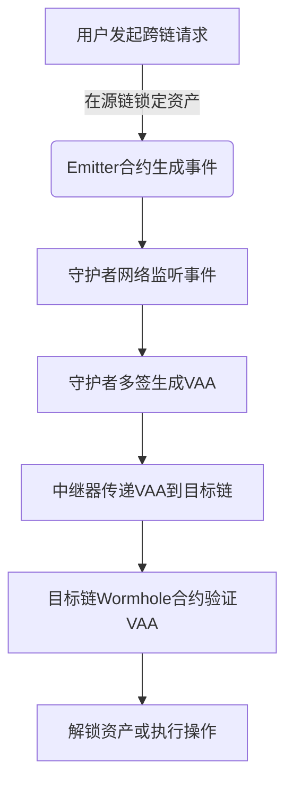
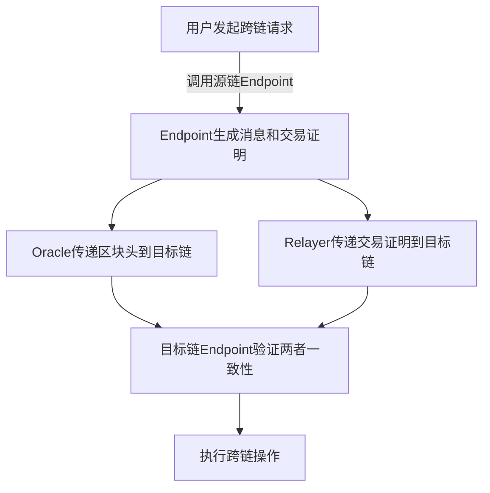

# 一、详细说一下wormhole工作原理，给出工作流程图，并与layerzero做对比

### Wormhole 工作原理详解（附流程图）  
#### **1. 核心组件**  
- **守护者网络（Guardian Network）**：19个节点组成的多签验证群体。  
- **Emitter合约**：部署在每条链上的智能合约，用于生成跨链事件（如资产锁定）。  
- **VAA（Verified Action Approval）**：由守护者签名的跨链消息凭证。  
- **中继器（Relayer）**：负责传递VAA到目标链（可选择公共或私有中继）。  

#### **2. 工作流程（以跨链转账为例）**  


1. **步骤解析**：  
   - 用户在源链（如以太坊）调用Emitter合约，锁定资产并生成事件日志。  
   - 守护者节点监听事件，达成共识后对消息签名，生成VAA（类似“跨链收据”）。  
   - 中继器获取VAA并支付目标链Gas费，将VAA提交到目标链（如Solana）。  
   - 目标链的Wormhole合约验证VAA签名有效性，执行对应操作（如 mint 映射代币）。  

---

### **LayerZero 工作原理对比**  
#### **1. 核心组件**  
- **Endpoint合约**：每条链上的轻量级通信接口。  
- **Oracle**：传递区块头信息（如 Chainlink）。  
- **Relayer**：传递交易证明（用户可自建）。  

#### **2. 工作流程**  


1. **步骤解析**：  
   - 用户通过源链Endpoint发送消息，同时生成交易证明。  
   - Oracle独立提交区块头，Relayer提交交易证明（两者路径分离）。  
   - 目标链Endpoint验证两者数据是否匹配（防止单一组件作恶）。  

---

### **关键对比表**  
| **维度**          | **Wormhole**                          | **LayerZero**                        |  
|-------------------|---------------------------------------|---------------------------------------|  
| **验证模型**      | 19个守护者多签共识                   | Oracle + Relayer 分离验证            |  
| **延迟**          | 依赖守护者轮次（分钟级）             | 直接验证（秒级）                     |  
| **信任假设**      | 需信任守护者网络                     | 需信任Oracle和Relayer不同时作恶      |  
| **灵活性**        | 依赖官方中继器（默认）               | 用户可自建Relayer                    |  
| **典型用例**      | Solana跨链桥、NFT转移                | Stargate（原生资产跨链）             |  
| **安全性事件**    | 2022年守护者私钥泄露（3.25亿损失）   | 无公开重大漏洞                       |  

---

### **流程图总结**  
1. **Wormhole**：  
   ```  
   用户 → 源链Emitter → 守护者网络 → VAA → 中继器 → 目标链验证 → 执行  
   ```  
2. **LayerZero**：  
   ```  
   用户 → 源链Endpoint → Oracle + Relayer → 目标链Endpoint → 执行  
   ```  

**本质区别**：  
- Wormhole依赖“中心化多签”快速验证，适合高价值但低频场景。  
- LayerZero通过“分离验证”降低信任成本，适合高频且自定义需求。


# 二、详细说一下wormhole工作原理，给出工作流程图，并与layerzero做对比


### **Wormhole 工作原理详解与流程图**

#### **1. 核心组件**
- **Guardians（守护者节点）**：31 个去中心化节点，负责监控链上事件并签名验证消息。
- **VAAs（Verifiable Action Approvals）**：包含消息内容和 Guardians 签名的加密证明。
- **中继网络**：负责将 VAA 从源链传递到目标链。

---

#### **2. 工作流程图（文字版）**
```plaintext
1. 用户发起跨链请求
   ↓
2. 源链合约生成 "Observation"（观察消息）
   ↓
3. Guardians 监控到消息 → 对消息签名
   ↓
4. 当 ≥2/3 Guardians 签名 → 生成 VAA
   ↓
5. 中继网络将 VAA 传递到目标链
   ↓
6. 目标链合约验证 VAA 签名 → 执行操作（如铸造资产）
   ↓
7. 用户在目标链接收资产或执行结果
```

---

#### **3. 关键技术点**
- **轻节点验证**：Guardians 节点运行轻客户端，验证源链区块头。
- **共识机制**：VAA 需 ≥2/3 Guardians 签名才能生效（拜占庭容错）。
- **资产跨链模式**：通过 "锁定+铸造" 实现资产跨链（如 ETH → wETH）。

---

### **Wormhole vs. LayerZero 对比**

| **维度**          | **Wormhole**                                                                 | **LayerZero**                                                                 |
|-------------------|------------------------------------------------------------------------------|-------------------------------------------------------------------------------|
| **信任模型**      | 依赖 Guardians 节点（需信任其不作恶，曾因单节点漏洞被盗 2.5 亿美元）。       | 依赖链上轻节点 + 预言机 + 中继，无需信任外部节点（理论上更安全）。            |
| **验证方式**      | Guardians 签名生成 VAA → 目标链仅验证签名。                                   | 目标链验证源链区块头（通过预言机）和 Merkle 证明（需链上计算）。              |
| **效率与成本**    | 速度极快（链下签名），Gas 费低，但需等待 Guardians 签名（约 30 秒-1 分钟）。   | 验证需链上计算，Gas 费较高，但无需等待外部节点（约 10-30 秒）。              |
| **资产托管**      | 使用封装资产（如 wETH），依赖流动性池（存在托管风险）。                       | 直接转移资产，无需封装（如原生 ETH 跨链）。                                   |
| **攻击面**        | Guardians 被攻击 → 可伪造 VAA（如 2022 年 Solana 跨链桥被盗）。                | 预言机或中继被攻击 → 可能伪造区块头（但需同时攻破源链和目标链）。             |
| **适用场景**      | 多链资产转移（如 NFT、稳定币）。                                              | 高安全性需求场景（如 DeFi 清算、关键数据传递）。                               |
| **去中心化程度**  | 中等（Guardians 由机构/项目方运营）。                                          | 较高（协议开源，依赖链上合约）。                                              |

---

### **核心差异总结**
1. **安全模型**  
   - **Wormhole**：依赖 Guardians 的诚实（中心化风险）。  
   - **LayerZero**：依赖密码学证明（链上验证），理论上更抗审查。

2. **性能权衡**  
   - **Wormhole**：适合高频、低成本场景（如游戏、社交）。  
   - **LayerZero**：适合高价值资产跨链（容忍较高 Gas 费用）。

3. **资产模式**  
   - **Wormhole**：封装资产（依赖流动性池）。  
   - **LayerZero**：直接转移（无托管风险）。

4. **历史事件**  
   - **Wormhole**：2022 年因 Guardians 节点漏洞被盗 2.5 亿美元。  
   - **LayerZero**：未发生重大安全事故（截至 2025 年 10 月）。

---

### **流程图对比（文字版）**
#### **Wormhole 跨链流程**
```plaintext
用户 → 源链合约生成消息 → Guardians 签名 → 生成 VAA → 中继传递 → 目标链验证签名 → 执行操作
```

#### **LayerZero 跨链流程**
```plaintext
用户 → 源链轻节点验证交易 → 预言机更新区块头 → 中继传递证明 → 目标链验证区块头 + Merkle 证明 → 执行操作
```

---

### **总结**
- **Wormhole**：速度更快、成本更低，但依赖中心化 Guardians，适合多链资产流转。  
- **LayerZero**：安全性更高，但 Gas 成本较高，适合对安全性敏感的 DeFi 应用。
