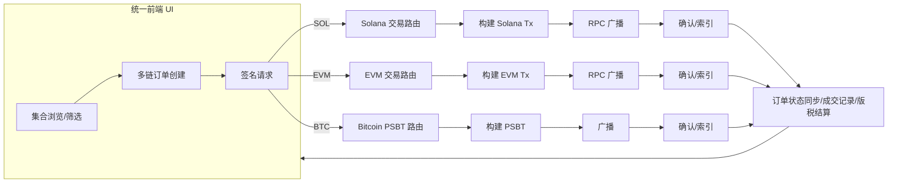
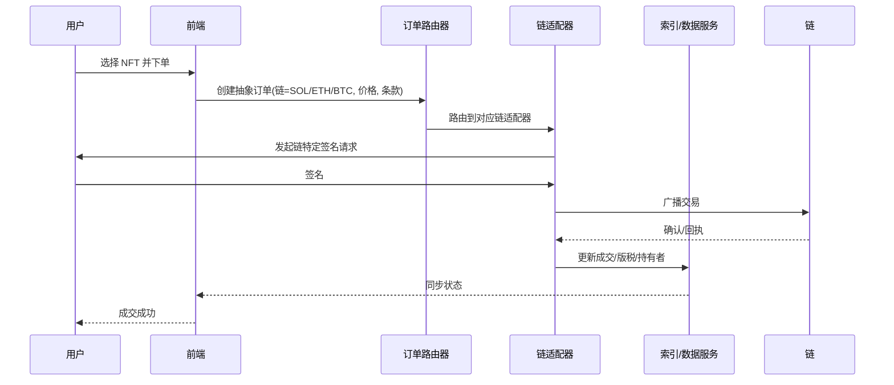

### 概览
- **核心业务**: NFT 一站式市场与发行平台（Launchpad）、聚合与撮合、创作者工具（版税、铸造、白名单）、交易体验优化（拍卖/竞价/批量购买/报价）、钱包与数据接口生态。
- **多链支持**: 起源于 Solana，已扩展至以太坊生态（ETH、Base 等）、Polygon（历史上支持，策略可能调整）、比特币生态（Ordinals/Runes），以及其它 EVM/L2。不同链采用各自原生标准与签名/结算流程。
- **跨链维度**: UI/订单簿层聚合（统一浏览、统一检索、跨链筛选）、多链报价与结算抽象（同一界面多币种）、跨链资产搬运（通常非“同一 NFT 跨链转移”，而是跨链展示、下单、清算在各自链完成），个别场景采用“包装/镜像 NFT”、“Burn-and-Mint”或跨链桥协议实现迁移。

注: 具体支持链与费率策略会随时间调整，建议以官网文档和产品实际为准。

---

### 一、核心业务拆解
- **市场/交易撮合**
  - 列表、检索、排序（价格、稀有度、成交量、链、合约/Collection）
  - 下单/购买：签名授权、链上结算、可选批量购买或报价
  - 拍卖/竞价与报价（bids/offers）
  - 交易聚合（统一 UI，底层按链路由）
- **Launchpad（发行/铸造）**
  - 创作者入驻与 KYC/合规
  - 一站式铸造流程：白名单、分阶段销售、公售、版税策略
  - 防机器人机制与限购
- **创作者工具**
  - 版税与分润设置（随链和合约标准实现差异）
  - 上架与元数据更新工具（集中式/去中心化元数据托管）
- **费用与版税（通行做法，平台策略会变）**
  - 平台手续费（例：~1%–2%，因链与活动而异）
  - 版税执行：链上强制/合约级检查/市场执行与自愿支付并存
- **数据与开发者生态**
  - 市场/集合/交易数据 API（部分需密钥）
  - SDK/示例（按链种类：Solana Metaplex、EVM ethers/web3、比特币 Ordinals PSBT）

---

### 二、多链支持与技术要点
- **Solana**
  - 标准：Metaplex Token Metadata、cNFT（压缩 NFT）
  - 结算：高 TPS、低 Gas，签名使用 ed25519
  - 特色：cNFT 用于海量铸造与低成本交易
- **以太坊/EVM（ETH、Base 等）**
  - 标准：ERC-721/1155，签名 secp256k1
  - 交易：常见的 `permit/listing` 结构，订单撮合后链上成交
- **Polygon（历史）/其它 EVM**
  - 与 ETH 类似（更低 Gas），有时用于大规模 PFP/游戏资产
- **比特币（Ordinals/Runes）**
  - Ordinals 以“铭刻”Satoshi 为载体，采用 PSBT 交易流程
  - Runes 为同生态代币/铭文标准之一
  - 交易特征：UTXO 模型、UTXO 选择、手续费市场波动大

---

### 三、跨链维度与产品抽象
- **统一发现与检索**
  - 跨链合并展示：同 UI 中筛选不同链的集合、排序、稀有度
- **跨链下单体验**
  - 前端抽象“订单”对象，后端按链路由签名与广播
  - 价格以各自计价货币（SOL/ETH/BTC/...），UI 统一以法币或主币折算
- **资产跨链迁移（非核心常规交易流）**
  - 常见做法：展示跨链信息，不进行“同一 NFT 跨链移动”
  - 若需迁移：采用“包装/镜像 NFT”（锁定源链，在目标链铸造包装）或“Burn-and-Mint”（源链销毁，目标链重铸）、跨链桥协议（安全与去信任权衡）

---

### 四、参考架构与流程图





---

### 五、代码示例（教学用，展示多链要点）

- Solana：读取集合与 NFT 元数据（Metaplex JS）
```ts
import { Connection, clusterApiUrl, PublicKey } from '@solana/web3.js';
import { Metaplex, bundlrStorage } from '@metaplex-foundation/js';

const connection = new Connection(clusterApiUrl('mainnet-beta'), 'confirmed');
const metaplex = Metaplex.make(connection).use(bundlrStorage());

async function fetchNftsByCreator(creator: string) {
  const creatorPk = new PublicKey(creator);
  const nfts = await metaplex.nfts().findAllByCreator({ creator: creatorPk, position: 1 });
  return nfts.map(n => ({
    mint: n.mintAddress.toBase58(),
    name: n.name,
    uri: n.uri,
  }));
}

fetchNftsByCreator('CreatorPubkeyHere').then(console.log);
```

- EVM：读取 ERC‑721 元数据与持有人（ethers.js）
```ts
import { ethers } from 'ethers';

const provider = new ethers.JsonRpcProvider(process.env.ETH_RPC!);
const erc721Abi = [
  'function name() view returns (string)',
  'function tokenURI(uint256 tokenId) view returns (string)',
  'function ownerOf(uint256 tokenId) view returns (address)'
];

async function getNftInfo(contract: string, tokenId: bigint) {
  const nft = new ethers.Contract(contract, erc721Abi, provider);
  const [name, tokenURI, owner] = await Promise.all([
    nft.name(),
    nft.tokenURI(tokenId),
    nft.ownerOf(tokenId),
  ]);
  return { name, tokenURI, owner };
}

getNftInfo('0xContract', 1n).then(console.log);
```

- Bitcoin Ordinals：构建/签名 PSBT（bitcoinjs-lib 概念示例）
```ts
import { networks, Psbt, payments } from 'bitcoinjs-lib';

// 注意：需要完整的 UTXO/Ordinals 索引来确保铭刻UTXO不被拆分
const network = networks.bitcoin;

function buildPsbtToTransferOrdinal(params: {
  inputUtxo: { txid: string; vout: number; value: number };
  toAddress: string;
  changeAddress: string;
  feeSats: number;
}) {
  const psbt = new Psbt({ network });
  psbt.addInput({
    hash: params.inputUtxo.txid,
    index: params.inputUtxo.vout,
    witnessUtxo: { script: Buffer.alloc(0), value: params.inputUtxo.value }
  });
  psbt.addOutput({ address: params.toAddress, value: params.inputUtxo.value - params.feeSats });
  // 如需找零与额外输入，应在此补全，并确保不“污染”铭刻 UTXO
  return psbt;
}
```

- 统一下单抽象（伪代码：根据链路由执行）
```ts
type Chain = 'SOL' | 'EVM' | 'BTC';

interface OrderInput {
  chain: Chain;
  assetId: string;        // mint / contract+tokenId / ordinal-UTXO
  price: string;          // 以 SOL/ETH/BTC 计价
  takerAddress: string;
}

async function placeOrder(order: OrderInput) {
  if (order.chain === 'SOL') {
    return placeSolanaOrder(order);
  }
  if (order.chain === 'EVM') {
    return placeEvmOrder(order);
  }
  return placeBitcoinOrdinalOrder(order);
}

async function placeSolanaOrder(o: OrderInput) { /* 构建并签名 Solana Tx */ }
async function placeEvmOrder(o: OrderInput) { /* 构建并签名 EVM Tx */ }
async function placeBitcoinOrdinalOrder(o: OrderInput) { /* 构建并签名 PSBT */ }
```

- 跨链“包装 NFT”思路（教学用示意）
```ts
// 源链锁仓 -> 目标链铸造包装NFT；赎回时反向操作
async function bridgeWrapNft(params: {
  sourceChain: Chain; targetChain: Chain;
  assetRef: string; recipientOnTarget: string;
}) {
  await lockOnSource(params.sourceChain, params.assetRef);
  const wrappedId = await mintWrappedOnTarget(params.targetChain, params.assetRef, params.recipientOnTarget);
  return wrappedId;
}
```

---

### 六、风控与合规要点
- 欺诈与洗售检测：黑名单、图谱分析、异常定价检测
- 版税合规：尽可能遵循创作者设置；不同链技术约束导致的执行差异
- KYC/AML：Launchpad 与大额法币出入金环节
- 安全：EVM 签名钓鱼防护、Ordinals UTXO 精确选择、Solana cNFT 索引一致性

---

### 七、对标指标（供评估）
- 流动性与成交量（按链/Collection）
- 上新速度（新链/新标准支持）
- 创作者留存（Launchpad 规模与复用率）
- 交易效率与失败率（按链统计）
- 手续费/版税履约率
- 用户端性能（TTI、搜索延迟、聚合响应时间）

---

### 八、落地建议（开发者视角）
- 采用“多链适配层 + 统一订单抽象 + 后端索引服务”的架构
- 前端：同构 UI 与价格折算组件；强类型区分链特有字段
- 后端：每链独立队列处理与 RPC 提升（重试、回执追踪）
- 数据：事件驱动索引，落地到可检索存储（ES/ClickHouse）
- 安全：签名请求白名单、域隔离、稳定 RPC 与备份提供商
- Beta 环节先支持 1–2 条链打磨流程，再扩展

---

如需，我可以基于你关注的具体链或业务（例如只做 Solana + Ordinals），提供更贴合的接口封装与端到端最小示例。
