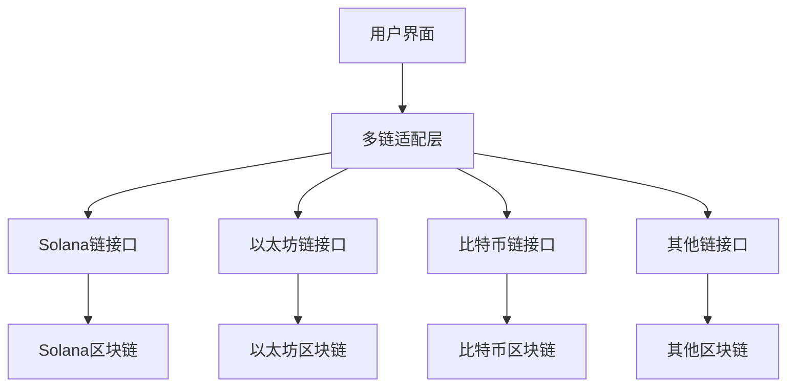
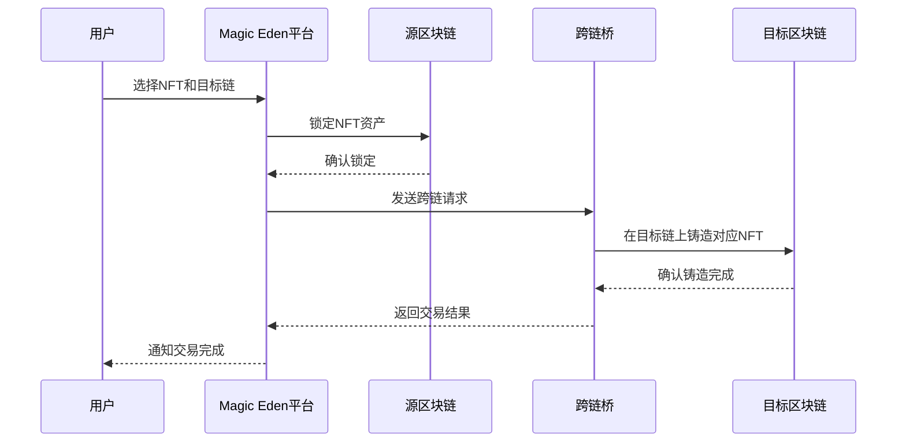
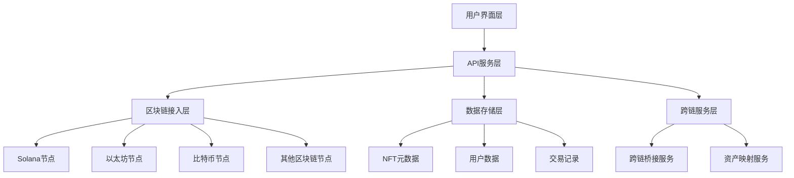
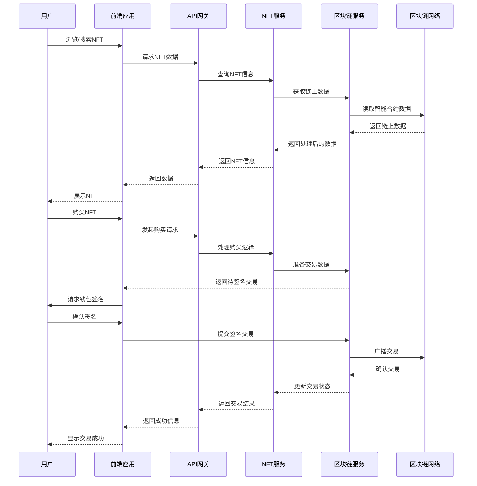

我将帮您分析 Magic Eden 网站，从 NFT 市场、多链和跨链的维度进行详细分析。

[4 tools called]

# Magic Eden NFT市场分析

## 1. NFT市场概述

Magic Eden是一个领先的NFT交易平台，成立于2021年9月。根据最新数据，Magic Eden以1.2247亿美元的月交易量占据36.7%的市场份额，连续六个月位居NFT交易量榜首。在比特币Ordinals市场中，Magic Eden更是占据超过70%的日交易量，展现出强大的市场影响力。

## 2. 多链支持分析

### 2.1 支持的区块链网络

Magic Eden最初基于Solana区块链构建，随着发展已扩展支持多个区块链网络：
- Solana
- 比特币
- 以太坊
- Base
- ApeChain
- Abstract
- Berachain
- Monad Testnet
- Avalanche
- Arbitrum
- Sei
- BNB Chain
- Polygon

### 2.2 多链架构

Magic Eden的多链架构允许用户在不同区块链上进行NFT交易，其技术实现主要包括：



### 2.3 多链钱包集成

Magic Eden集成了多种区块链钱包，包括：
- Phantom (Solana)
- MetaMask (以太坊、Polygon等)
- Hiro (比特币)
- 其他支持的钱包

## 3. 跨链功能分析

### 3.1 跨链交易流程

Magic Eden的跨链功能允许用户在不同区块链之间进行NFT交易和转移，其流程如下：



### 3.2 跨链技术实现

Magic Eden通过以下技术实现跨链功能：

1. **智能合约互操作性**：在各区块链上部署互操作的智能合约
2. **跨链消息传递**：使用跨链桥接技术实现不同区块链之间的消息传递
3. **资产映射**：建立不同区块链上NFT资产的映射关系

### 3.3 跨链API示例

以下是使用Magic Eden API进行跨链NFT转移的示例代码：

```javascript
// 跨链NFT转移示例 - 从以太坊到Solana
const Web3 = require('web3');
const { Connection, PublicKey, Transaction } = require('@solana/web3.js');

// 初始化Web3和Solana连接
const web3 = new Web3('https://mainnet.infura.io/v3/YOUR_INFURA_KEY');
const solanaConnection = new Connection('https://api.mainnet-beta.solana.com');

// NFT合约地址和ABI
const ethNftContractAddress = '0xYourEthereumNFTContract';
const ethNftContractABI = [...]; // 以太坊NFT合约ABI

async function transferNFTCrossChain(
  ethWalletPrivateKey,
  solanaWalletPublicKey,
  tokenId
) {
  try {
    // 步骤1: 在以太坊上锁定NFT
    const ethAccount = web3.eth.accounts.privateKeyToAccount(ethWalletPrivateKey);
    const nftContract = new web3.eth.Contract(ethNftContractABI, ethNftContractAddress);
    
    // 锁定NFT到跨链桥合约
    const bridgeContractAddress = '0xCrosschainBridgeContract';
    const lockTx = await nftContract.methods
      .safeTransferFrom(ethAccount.address, bridgeContractAddress, tokenId)
      .send({ from: ethAccount.address });
    
    console.log('NFT已锁定在以太坊上，交易哈希:', lockTx.transactionHash);
    
    // 步骤2: 通过Magic Eden API请求跨链转移
    const response = await fetch('https://api.magiceden.dev/v1/crosschain/transfer', {
      method: 'POST',
      headers: {
        'Content-Type': 'application/json',
        'Authorization': 'Bearer YOUR_API_KEY'
      },
      body: JSON.stringify({
        sourceChain: 'ethereum',
        destinationChain: 'solana',
        tokenId: tokenId,
        sourceTransactionHash: lockTx.transactionHash,
        destinationAddress: solanaWalletPublicKey
      })
    });
    
    const result = await response.json();
    console.log('跨链转移请求已提交:', result);
    
    // 步骤3: 监听Solana上的NFT铸造事件
    // 这里需要实现轮询或订阅Magic Eden API的转移状态
    
    return result;
  } catch (error) {
    console.error('跨链转移失败:', error);
    throw error;
  }
}

// 调用示例
transferNFTCrossChain(
  'YOUR_ETH_PRIVATE_KEY',
  'YOUR_SOLANA_PUBLIC_KEY',
  '123456'
).then(console.log).catch(console.error);
```

## 4. 技术架构

### 4.1 整体架构



### 4.2 数据流程



## 5. NFT集合数据获取示例

以下是使用Magic Eden API获取NFT集合信息的Python代码示例：

```python
import requests

def get_collection_info(collection_name):
    """
    获取Magic Eden上指定NFT集合的信息
    
    参数:
        collection_name (str): 集合名称
        
    返回:
        dict: 集合信息
    """
    api_url = f"https://api.magiceden.dev/v2/collections/{collection_name}"
    
    try:
        response = requests.get(api_url)
        response.raise_for_status()  # 如果请求失败则抛出异常
        
        collection_data = response.json()
        return {
            "名称": collection_data.get("name"),
            "符号": collection_data.get("symbol"),
            "描述": collection_data.get("description"),
            "地板价": f"{collection_data.get('floorPrice')/1e9} SOL" if collection_data.get('floorPrice') else "未知",
            "总交易量": f"{collection_data.get('volumeAll')/1e9} SOL" if collection_data.get('volumeAll') else "未知",
            "总上架数量": collection_data.get("listedCount"),
            "总供应量": collection_data.get("totalItems")
        }
    except requests.exceptions.RequestException as e:
        return {"错误": f"请求失败: {str(e)}"}

# 示例调用
collection_info = get_collection_info("degods")
print("集合信息:")
for key, value in collection_info.items():
    print(f"{key}: {value}")
```

## 6. 多链NFT市场的优势与挑战

### 6.1 优势

1. **更广泛的用户覆盖**：支持多个区块链，吸引不同链上的用户
2. **流动性增强**：跨链交易增加NFT的流动性
3. **风险分散**：不依赖单一区块链，降低技术风险
4. **创新空间扩大**：可以利用不同区块链的特性开发创新功能

### 6.2 挑战

1. **技术复杂性**：需要维护多链基础设施和跨链桥接
2. **安全风险**：跨链操作增加了潜在的安全风险点
3. **用户体验**：需要确保多链和跨链操作对用户友好
4. **监管合规**：不同区块链可能面临不同的监管要求

## 7. 总结

Magic Eden作为领先的NFT市场平台，通过多链支持和跨链功能，为用户提供了丰富的NFT交易体验。其技术架构支持在多个区块链上进行NFT的铸造、购买和出售，并通过跨链桥接技术实现不同区块链之间的NFT转移。这种多链和跨链策略不仅扩大了用户基础，也增强了NFT的流动性和价值。

随着区块链技术的不断发展，Magic Eden有望继续扩展其多链和跨链功能，为NFT市场带来更多创新和机遇。
