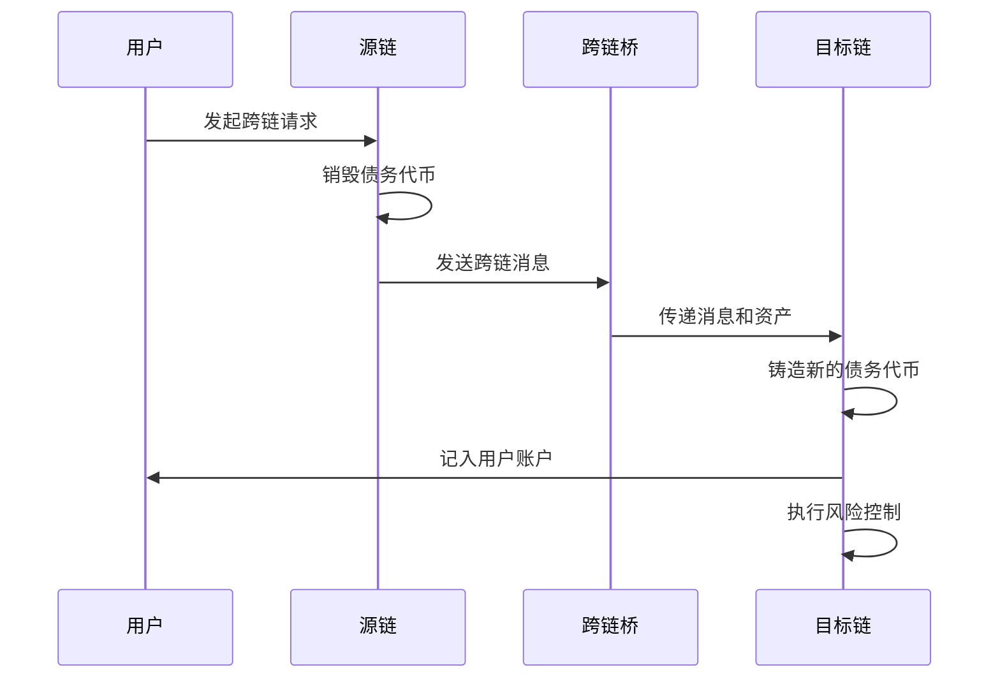
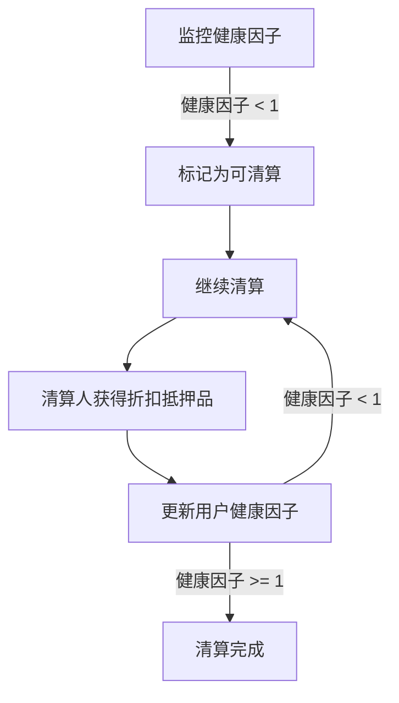

我将分析Spark Finance (https://spark.fi/)网站，从抵押借贷、AAVE V3借贷协议、闪电贷、多链、跨链等维度进行详细分析。

[3 tools called]

# Spark Finance (spark.fi) 详细分析

## 1. 抵押借贷系统

Spark Finance 是一个基于 AAVE V3 协议构建的去中心化金融平台，主要提供 SparkLend 和 Spark Savings 两个核心产品。其抵押借贷系统具有以下特点：

### 核心功能
- **资产抵押**：用户可以提供加密资产作为抵押品
- **稳定币借贷**：主要支持 USDC 和 USDS 等稳定币的借贷
- **动态利率**：利率由治理机制通过链上投票周期设定
- **风险管理**：采用健康因子（Health Factor）监控借款人风险状况

### 抵押借贷流程
1. 用户存入资产作为抵押品
2. 系统根据抵押品价值计算可借额度
3. 用户借入稳定币
4. 系统持续监控健康因子
5. 当健康因子低于阈值时触发清算机制

### 代码示例：存款与借款

```solidity
// SPDX-License-Identifier: MIT
pragma solidity ^0.8.0;

import "@aave/core-v3/contracts/interfaces/IPool.sol";
import "@aave/core-v3/contracts/interfaces/IERC20.sol";

contract SparkLendExample {
    IPool public pool;
    IERC20 public dai;

    constructor(address _pool, address _dai) {
        pool = IPool(_pool);
        dai = IERC20(_dai);
    }

    // 存款功能
    function deposit(uint256 amount) external {
        dai.transferFrom(msg.sender, address(this), amount);
        dai.approve(address(pool), amount);
        pool.deposit(address(dai), amount, msg.sender, 0);
    }

    // 借款功能
    function borrow(uint256 amount) external {
        // 2表示使用可变利率模式
        pool.borrow(address(dai), amount, 2, 0, msg.sender);
    }
    
    // 还款功能
    function repay(uint256 amount) external {
        dai.transferFrom(msg.sender, address(this), amount);
        dai.approve(address(pool), amount);
        pool.repay(address(dai), amount, 2, msg.sender);
    }
}
```

## 2. AAVE V3 借贷协议集成

Spark Finance 基于 AAVE V3 协议构建，继承了其先进的功能和安全性。AAVE V3 的关键特性包括：

### 高效模式 (E-mode)
允许用户在相关资产间（如稳定币之间）获得更高的借款能力，提高资金利用率。

```solidity
// 启用高效模式示例
function enableEMode(uint8 categoryId) external {
    pool.setUserEMode(categoryId);
}
```

### 隔离模式 (Isolation Mode)
允许新资产以受限方式上线，限制借款人只能借入特定的稳定币，降低系统风险。

### 资本效率
通过动态利率模型和流动性优化，提高资金使用效率。

## 3. 闪电贷功能

闪电贷是一种无需抵押即可在同一交易中借入和归还资金的机制，广泛应用于套利、清算等场景。

### 闪电贷流程
1. 用户发起闪电贷请求
2. 协议借出资金
3. 用户执行操作（如套利）
4. 用户归还本金及手续费
5. 如未能归还，整个交易回滚

### 代码示例：闪电贷实现

```solidity
// SPDX-License-Identifier: MIT
pragma solidity ^0.8.0;

import "@aave/core-v3/contracts/interfaces/IPool.sol";
import "@aave/core-v3/contracts/flashloan/interfaces/IFlashLoanSimpleReceiver.sol";
import "@aave/core-v3/contracts/dependencies/openzeppelin/contracts/IERC20.sol";

contract SparkFlashLoan is IFlashLoanSimpleReceiver {
    IPool public immutable pool;
    address public owner;

    constructor(address _pool) {
        pool = IPool(_pool);
        owner = msg.sender;
    }

    function executeOperation(
        address asset,
        uint256 amount,
        uint256 premium,
        address initiator,
        bytes calldata params
    ) external override returns (bool) {
        // 闪电贷资金使用逻辑
        // 例如：套利、清算等操作
        
        // 计算需要归还的总金额（本金 + 手续费）
        uint256 totalDebt = amount + premium;
        
        // 批准协议合约提取资金
        IERC20(asset).approve(address(pool), totalDebt);
        
        // 返回成功标志
        return true;
    }

    function requestFlashLoan(address asset, uint256 amount) external {
        require(msg.sender == owner, "只有所有者可以请求闪电贷");
        bytes memory params = ""; // 可选参数
        pool.flashLoanSimple(address(this), asset, amount, params, 0);
    }
}
```

## 4. 多链支持

Spark Finance 支持在多个区块链网络上提供服务，增强了平台的可访问性和灵活性。

### 支持的链
- 以太坊主网
- 优化网络（如 Optimism）
- 其他兼容 EVM 的网络

### 多链优势
- 降低 Gas 费用
- 提高交易速度
- 增强用户体验
- 扩大市场覆盖范围

## 5. 跨链功能 (Portal)

AAVE V3 的 Portal 功能允许资产在不同区块链上的市场之间无缝转移，Spark Finance 也继承了这一功能。

### 跨链流程图



### 跨链技术实现

```solidity
// SPDX-License-Identifier: MIT
pragma solidity ^0.8.0;

import "@aave/core-v3/contracts/interfaces/IPool.sol";
import "@layerzero/contracts/interfaces/ILayerZeroEndpoint.sol";

contract SparkPortal {
    IPool public sourcePool;
    ILayerZeroEndpoint public endpoint;
    mapping(uint16 => bool) public supportedChains;
    
    constructor(address _sourcePool, address _endpoint) {
        sourcePool = IPool(_sourcePool);
        endpoint = ILayerZeroEndpoint(_endpoint);
    }
    
    function enableChain(uint16 chainId) external onlyOwner {
        supportedChains[chainId] = true;
    }
    
    // 跨链借贷功能
    function bridgeCredit(
        address asset,
        uint256 amount,
        uint16 destinationChainId,
        address receiver
    ) external payable {
        require(supportedChains[destinationChainId], "目标链不支持");
        
        // 在源链上销毁债务代币
        sourcePool.burnCredit(asset, amount, msg.sender);
        
        // 构建跨链消息
        bytes memory payload = abi.encode(
            asset,
            amount,
            receiver
        );
        
        // 发送跨链消息
        endpoint.send{value: msg.value}(
            destinationChainId,
            abi.encodePacked(address(this)),
            payload,
            payable(msg.sender),
            address(0),
            bytes("")
        );
    }
    
    // 接收跨链消息并在目标链上铸造债务代币
    function lzReceive(
        uint16 _srcChainId,
        bytes memory _srcAddress,
        uint64 _nonce,
        bytes memory _payload
    ) external {
        require(msg.sender == address(endpoint), "只允许LayerZero端点调用");
        
        // 解码跨链消息
        (address asset, uint256 amount, address receiver) = abi.decode(
            _payload,
            (address, uint256, address)
        );
        
        // 在目标链上铸造债务代币
        IPool(address(this)).mintCredit(asset, amount, receiver);
    }
}
```

## 6. 风险管理机制

### 健康因子计算
```
健康因子 = (总抵押品价值 × 清算阈值) / 总借款价值
```

### 清算流程图



### 清算代码示例

```solidity
// SPDX-License-Identifier: MIT
pragma solidity ^0.8.0;

import "@aave/core-v3/contracts/interfaces/IPool.sol";
import "@aave/core-v3/contracts/interfaces/IERC20.sol";

contract SparkLiquidator {
    IPool public pool;
    
    constructor(address _pool) {
        pool = IPool(_pool);
    }
    
    function liquidatePosition(
        address collateralAsset,
        address debtAsset,
        address user,
        uint256 debtToCover
    ) external {
        // 批准协议合约提取债务资产
        IERC20(debtAsset).approve(address(pool), debtToCover);
        
        // 执行清算
        pool.liquidationCall(
            collateralAsset,
            debtAsset,
            user,
            debtToCover,
            false // 接收aToken而非底层资产
        );
        
        // 提取获得的抵押品
        uint256 collateralBalance = IERC20(collateralAsset).balanceOf(address(this));
        IERC20(collateralAsset).transfer(msg.sender, collateralBalance);
    }
}
```

## 总结

Spark Finance 作为基于 AAVE V3 协议构建的去中心化金融平台，提供了全面的抵押借贷、闪电贷、多链和跨链功能。通过 SparkLend 和 Spark Savings 产品，用户可以高效地管理资金，获取稳定收益。其基于 AAVE V3 的技术架构确保了平台的安全性和可扩展性，而多链和跨链功能则提高了资金利用效率，为用户提供了更灵活的金融工具和机会。

平台的风险管理机制，如健康因子监控和清算流程，有效保障了系统的稳定运行。未来，随着 DeFi 生态系统的发展，Spark Finance 有望进一步扩展其功能和服务范围，为用户提供更多创新的金融解决方案。
