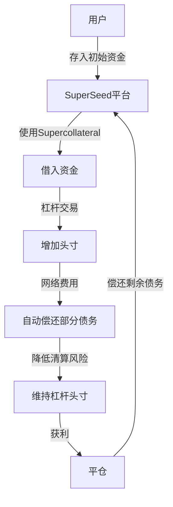

我需要分析 SuperSeed 网站，从多个维度进行详细解析。让我先搜索相关信息。

[4 tools called]

# SuperSeed.xyz 平台分析报告

## 1. 抵押借贷与借贷协议

SuperSeed 提出了创新的"自偿还贷款"(Supercollateral)机制，与传统 DeFi 借贷协议有本质区别：

- **传统借贷协议**：需要提供超额抵押品，有固定还款期限
- **Supercollateral**：无需抵押，通过网络费用自动偿还债务

### 技术实现

```solidity
// Supercollateral 合约示例
pragma solidity ^0.8.0;

contract Supercollateral {
    mapping(address => uint256) public debts;
    mapping(address => uint256) public lastRepaymentTime;
    
    // 借款函数
    function borrow(uint256 amount) external {
        // 无需检查抵押品
        debts[msg.sender] += amount;
        lastRepaymentTime[msg.sender] = block.timestamp;
        payable(msg.sender).transfer(amount);
    }
    
    // 自动偿还函数 - 由系统调用
    function autoRepay(address borrower, uint256 networkFees) external {
        require(debts[borrower] > 0, "无债务");
        uint256 repayAmount = networkFees;
        if (repayAmount > debts[borrower]) {
            repayAmount = debts[borrower];
        }
        debts[borrower] -= repayAmount;
        lastRepaymentTime[borrower] = block.timestamp;
    }
}
```

## 2. 偿还证明(PoR)机制

PoR (Proof of Repayment) 是 SuperSeed 的核心创新之一，用于激励用户偿还贷款：

- 通过程序化方式奖励偿还 Supercollateral 借款的用户
- 根据偿还行为分配奖励，提高整体系统的稳定性

### 技术实现

```solidity
pragma solidity ^0.8.0;

contract ProofOfRepayment {
    mapping(address => uint256) public repaymentPoints;
    mapping(address => uint256) public rewards;
    
    // 记录偿还行为
    function recordRepayment(address borrower, uint256 amount) external {
        // 计算偿还积分
        uint256 points = calculatePoints(amount);
        repaymentPoints[borrower] += points;
        
        // 计算奖励
        uint256 reward = calculateReward(points);
        rewards[borrower] += reward;
    }
    
    // 计算积分函数
    function calculatePoints(uint256 amount) internal pure returns (uint256) {
        return amount / 10**18; // 简化示例
    }
    
    // 计算奖励函数
    function calculateReward(uint256 points) internal pure returns (uint256) {
        return points * 2; // 简化示例
    }
    
    // 领取奖励
    function claimRewards() external {
        uint256 reward = rewards[msg.sender];
        require(reward > 0, "无奖励可领取");
        rewards[msg.sender] = 0;
        payable(msg.sender).transfer(reward);
    }
}
```

## 3. 闪电贷功能

虽然 SuperSeed 官方文档未明确提及闪电贷，但基于其架构，可能支持类似功能：

### 技术实现

```solidity
pragma solidity ^0.8.0;

import "@openzeppelin/contracts/token/ERC20/IERC20.sol";

interface IFlashLoanReceiver {
    function executeOperation(
        address asset,
        uint256 amount,
        uint256 fee,
        bytes calldata params
    ) external returns (bool);
}

contract SuperSeedFlashLoan {
    mapping(address => uint256) public reserves;
    
    // 闪电贷费率 (0.09%)
    uint256 public constant FLASH_LOAN_FEE = 9;
    uint256 public constant FLASH_LOAN_FEE_PRECISION = 10000;
    
    // 执行闪电贷
    function flashLoan(
        address receiver,
        address asset,
        uint256 amount,
        bytes calldata params
    ) external {
        uint256 balanceBefore = IERC20(asset).balanceOf(address(this));
        require(balanceBefore >= amount, "余额不足");
        
        // 计算费用
        uint256 fee = amount * FLASH_LOAN_FEE / FLASH_LOAN_FEE_PRECISION;
        
        // 转账给接收者
        IERC20(asset).transfer(receiver, amount);
        
        // 执行接收者的回调函数
        require(
            IFlashLoanReceiver(receiver).executeOperation(
                asset, amount, fee, params
            ),
            "闪电贷执行失败"
        );
        
        // 验证还款
        uint256 balanceAfter = IERC20(asset).balanceOf(address(this));
        require(balanceAfter >= balanceBefore + fee, "还款不足");
    }
}
```

## 4. 杠杆交易

SuperSeed 通过 Supercollateral 机制支持杠杆交易，使用户可以在无需额外资本的情况下获得杠杆效应：

### 流程图



## 5. 多链支持

SuperSeed 基于 Optimism 的 OP-stack 构建，具有以下特点：

- 原生支持 EVM (以太坊虚拟机)
- 以太坊应用可无缝部署到 SuperSeed
- 使用相同的工具和基础设施

### 技术实现

```solidity
// 多链部署配置示例
const config = {
  ethereum: {
    rpc: "https://mainnet.infura.io/v3/YOUR_API_KEY",
    chainId: 1,
    contracts: {
      supercollateral: "0x...",
      por: "0x..."
    }
  },
  optimism: {
    rpc: "https://mainnet.optimism.io",
    chainId: 10,
    contracts: {
      supercollateral: "0x...",
      por: "0x..."
    }
  },
  superseed: {
    rpc: "https://rpc.superseed.xyz",
    chainId: 999, // 示例
    contracts: {
      supercollateral: "0x...",
      por: "0x..."
    }
  }
};
```

## 6. 跨链功能

SuperSeed 提供桥接(Bridge)功能，允许用户在不同区块链之间转移资产：

### 跨链桥实现

```solidity
pragma solidity ^0.8.0;

import "@openzeppelin/contracts/token/ERC20/IERC20.sol";

contract SuperSeedBridge {
    mapping(uint256 => mapping(address => address)) public tokenMappings;
    mapping(bytes32 => bool) public processedTransfers;
    
    event DepositInitiated(
        address indexed sender,
        address indexed token,
        uint256 amount,
        uint256 targetChainId
    );
    
    event WithdrawalCompleted(
        address indexed receiver,
        address indexed token,
        uint256 amount,
        uint256 sourceChainId,
        bytes32 transferId
    );
    
    // 存款函数 - 从源链发起跨链转账
    function deposit(
        address token,
        uint256 amount,
        uint256 targetChainId
    ) external {
        require(tokenMappings[targetChainId][token] != address(0), "目标链上无对应代币");
        
        // 转入代币
        IERC20(token).transferFrom(msg.sender, address(this), amount);
        
        // 发出事件，由跨链预言机监听
        emit DepositInitiated(msg.sender, token, amount, targetChainId);
    }
    
    // 提款函数 - 在目标链上完成跨链转账
    function withdraw(
        address receiver,
        address token,
        uint256 amount,
        uint256 sourceChainId,
        bytes32 transferId,
        bytes memory signature
    ) external {
        // 验证转账未处理过
        require(!processedTransfers[transferId], "转账已处理");
        
        // 验证签名 (简化示例)
        require(verifySignature(receiver, token, amount, sourceChainId, transferId, signature), "签名无效");
        
        // 标记为已处理
        processedTransfers[transferId] = true;
        
        // 转出代币
        IERC20(token).transfer(receiver, amount);
        
        // 发出事件
        emit WithdrawalCompleted(receiver, token, amount, sourceChainId, transferId);
    }
    
    // 验证签名 (简化示例)
    function verifySignature(
        address receiver,
        address token,
        uint256 amount,
        uint256 sourceChainId,
        bytes32 transferId,
        bytes memory signature
    ) internal pure returns (bool) {
        // 实际实现中需要验证预言机签名
        return true;
    }
}
```

### 跨链操作流程图

```mermaid
sequenceDiagram
    参与者 用户
    参与者 源链桥
    参与者 预言机
    参与者 目标链桥
    
    用户->>源链桥: deposit(token, amount, targetChainId)
    源链桥->>源链桥: 锁定代币
    源链桥-->>预言机: 发出DepositInitiated事件
    预言机->>预言机: 验证事件
    预言机->>预言机: 生成签名
    预言机-->>用户: 提供签名和transferId
    用户->>目标链桥: withdraw(receiver, token, amount, sourceChainId, transferId, signature)
    目标链桥->>目标链桥: 验证签名
    目标链桥->>目标链桥: 检查transferId未使用
    目标链桥->>用户: 转账目标链代币
    目标链桥-->>预言机: 发出WithdrawalCompleted事件
```

## 7. 总结

SuperSeed.xyz 通过创新的 Supercollateral 和 PoR 机制，提供了一种全新的自偿还贷款模式，具有以下优势：

1. **无需抵押**：降低了用户参与门槛
2. **自动偿还**：通过网络费用自动减少债务
3. **激励机制**：PoR 机制鼓励及时偿还
4. **多链支持**：基于 OP-stack，兼容以太坊生态
5. **跨链功能**：提供资产桥接，增强流动性

该平台在 DeFi 领域引入了创新的金融原语，有潜力改变传统的借贷模式，提高资金利用效率，并为用户提供更灵活的金融服务。
