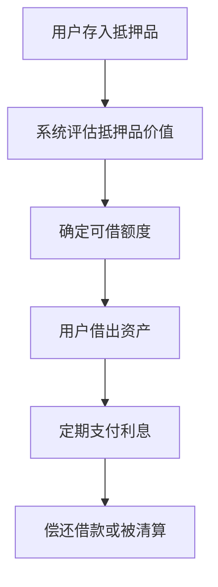
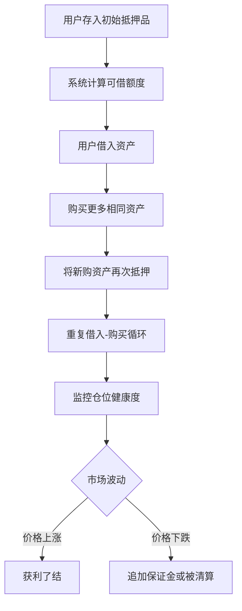
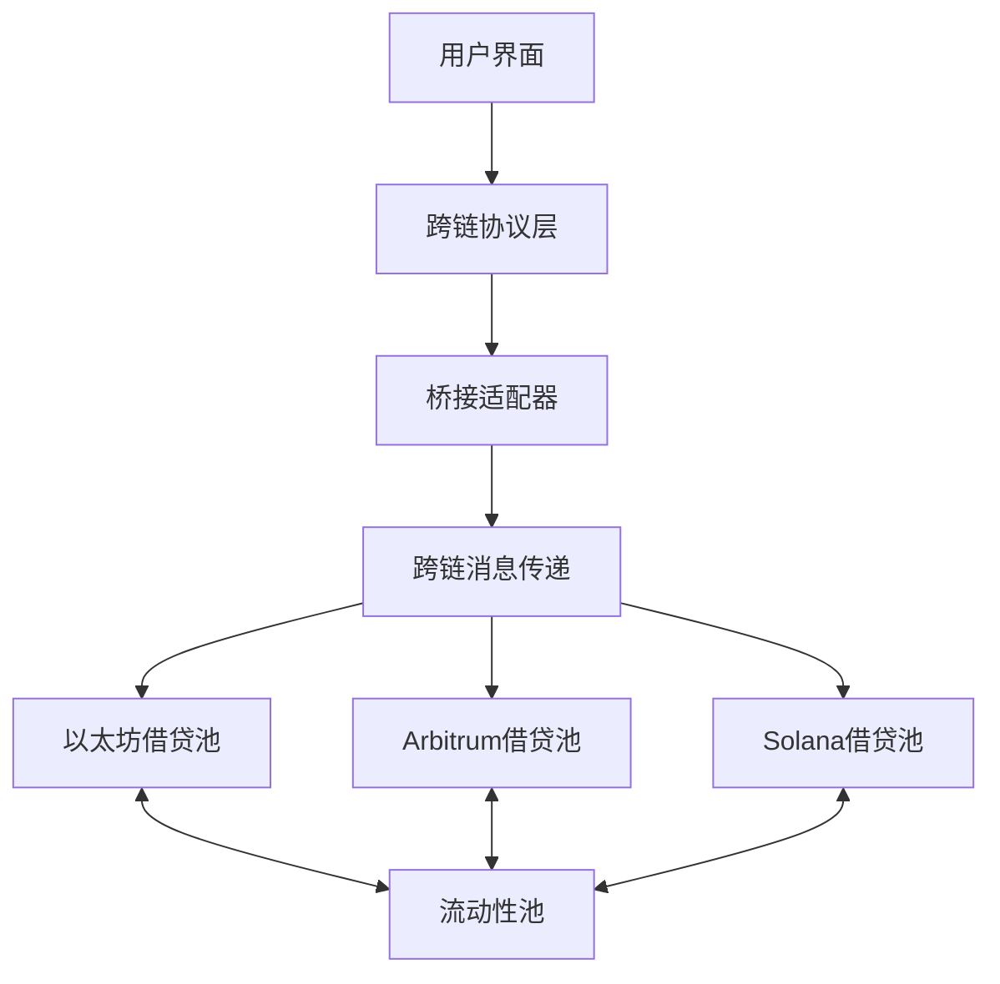
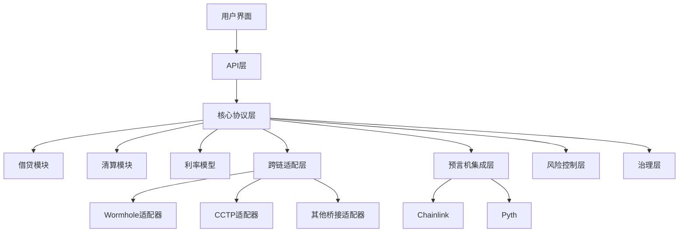

我将帮您分析Syno Finance网站，从多个维度进行详细分析。让我先获取网站的相关信息。

[3 tools called]

# Syno Finance 详细分析

## 1. 抵押借贷机制

Syno Finance 作为新一代跨虚拟机（Cross-VM）借贷市场，提供了创新的抵押借贷机制：

- **跨链抵押**：用户可以在一个区块链上存入资产，在另一个区块链上借出资产
- **资产利用率提升**：通过跨链机制，提高了用户资产的利用效率
- **贷款价值比(LTV)控制**：设定合理的抵押率，确保系统安全性
- **清算机制**：当抵押品价值下降至特定阈值时，触发清算程序保护系统

### 抵押借贷流程：



## 2. AAVE V3借贷协议集成

Syno Finance 借鉴了AAVE V3协议的多项创新功能：

- **高效模式(E-mode)**：允许用户在相关资产类别内以更高LTV借贷
- **隔离模式(Isolation Mode)**：限制某些风险资产的借贷范围，提高系统安全性
- **门户(Portal)功能**：实现不同网络间资产的无缝流动

### 代码示例（高效模式）：

```solidity
// 高效模式设置
function setEModeCategory(
    uint8 categoryId,
    uint16 ltv,
    uint16 liquidationThreshold,
    uint16 liquidationBonus,
    address oracle,
    string memory label
) external onlyPoolAdmin {
    // 验证参数
    require(ltv <= liquidationThreshold, "INVALID_EMODE_PARAMS");
    require(liquidationThreshold <= 10000, "INVALID_EMODE_PARAMS");
    
    // 更新高效模式类别
    EModeCategories[categoryId] = EModeCategory({
        ltv: ltv,
        liquidationThreshold: liquidationThreshold,
        liquidationBonus: liquidationBonus,
        oracle: oracle,
        label: label
    });
    
    emit EModeConfigured(categoryId, ltv, liquidationThreshold, liquidationBonus, oracle, label);
}
```

## 3. 闪电贷功能

Syno Finance 提供闪电贷服务，允许用户无需抵押即可借入资金，但必须在同一交易中归还：

- **无抵押借贷**：用户可以临时借入大量资金
- **交易原子性**：借贷、操作和还款必须在同一区块内完成
- **应用场景**：套利交易、债务重组、清算套利等
- **费用结构**：收取0.05%的交易费用

### 闪电贷代码示例：

```solidity
function flashLoan(
    address receiverAddress,
    address[] calldata assets,
    uint256[] calldata amounts,
    uint256[] calldata interestRateModes,
    address onBehalfOf,
    bytes calldata params,
    uint16 referralCode
) external override {
    // 验证参数
    require(assets.length == amounts.length, "INCONSISTENT_PARAMS");
    
    // 计算总借款金额和费用
    uint256 totalAmount = 0;
    uint256 fee = 0;
    
    for (uint256 i = 0; i < assets.length; i++) {
        totalAmount += amounts[i];
        fee += amounts[i] * 5 / 10000; // 0.05% 费用
    }
    
    // 转移资金给接收者
    for (uint256 i = 0; i < assets.length; i++) {
        IERC20(assets[i]).transfer(receiverAddress, amounts[i]);
    }
    
    // 调用接收者的执行函数
    IFlashLoanReceiver(receiverAddress).executeOperation(
        assets,
        amounts,
        fee,
        onBehalfOf,
        params
    );
    
    // 验证资金已归还
    for (uint256 i = 0; i < assets.length; i++) {
        uint256 amountToReturn = amounts[i] + fee;
        require(
            IERC20(assets[i]).balanceOf(address(this)) >= amountToReturn,
            "FLASH_LOAN_NOT_RETURNED"
        );
    }
}
```

## 4. 杠杆交易

Syno Finance 支持杠杆交易，允许用户放大投资收益：

- **借入放大**：用户可借入资金增加投资规模
- **风险控制**：设置严格的清算阈值，防止系统风险
- **自动化管理**：智能合约自动监控仓位健康度
- **多资产支持**：支持多种加密资产的杠杆操作

### 杠杆交易流程：



## 5. 多链支持

Syno Finance 支持多个区块链生态系统：

- **多链部署**：在多个区块链上部署借贷协议
- **统一接口**：提供统一的用户界面访问多链资产
- **链特定优化**：针对不同链的特性进行优化
- **资产多样性**：支持各链上的原生资产和代币

### 支持的区块链：
- Ethereum
- Arbitrum
- 即将支持Solana
- 其他EVM兼容链

## 6. 跨链功能

Syno Finance 的核心创新在于其跨链借贷能力：

- **技术栈**：整合Wormhole、Arbitrum、Pyth、Chainlink和Circle CCTP
- **跨链桥接**：实现不同区块链间的资产和信息传递
- **预言机集成**：通过Chainlink和Pyth确保跨链价格一致性
- **安全机制**：多重验证确保跨链操作安全性

### 跨链借贷架构：



### 跨链借贷代码示例：

```solidity
// 跨链借贷合约
contract SynoCrossChainLending {
    // 桥接适配器接口
    IBridgeAdapter public bridgeAdapter;
    // 借贷池接口
    ILendingPool public pool;
    // 支持的目标链ID
    mapping(uint16 => bool) public supportedChains;
    
    // 设置支持的目标链
    function enableBridge(uint16 chainId, bool enabled) external onlyAdmin {
        supportedChains[chainId] = enabled;
        emit BridgeStatusUpdated(chainId, enabled);
    }
    
    // 检查目标链是否支持
    function isBridgeEnabled(uint16 chainId) public view returns (bool) {
        return supportedChains[chainId];
    }
    
    // 跨链借贷函数
    function bridgeCredit(
        address asset,
        uint256 amount,
        uint16 destinationChainId
    ) external {
        // 验证目标链是否支持
        require(isBridgeEnabled(destinationChainId), "目标链不支持");
        
        // 在源链上销毁债务代币
        pool.burnCredit(asset, amount, msg.sender);
        
        // 通过桥接适配器将资产跨链转移
        bridgeAdapter.bridge(asset, amount, destinationChainId, msg.sender);
        
        emit CreditBridged(asset, amount, msg.sender, destinationChainId);
    }
    
    // 接收跨链消息并在目标链上铸造债务代币
    function receiveMessage(
        uint16 sourceChainId,
        address asset,
        uint256 amount,
        address recipient
    ) external onlyBridgeAdapter {
        // 验证源链是否支持
        require(isBridgeEnabled(sourceChainId), "源链不支持");
        
        // 在目标链上铸造债务代币
        pool.mintCredit(asset, amount, recipient);
        
        emit CreditReceived(asset, amount, recipient, sourceChainId);
    }
}
```

## 7. 技术架构

Syno Finance 的技术架构由多层组成：

- **核心协议层**：实现借贷、清算等基础功能
- **跨链适配层**：整合不同的跨链桥接技术
- **预言机集成层**：接入多个预言机确保价格准确性
- **风险控制层**：监控系统风险，执行安全策略
- **治理层**：管理协议参数和升级

### 系统架构图：



## 8. 安全机制

Syno Finance 采用多重安全机制保障平台安全：

- **多重预言机**：集成多个预言机源，避免单点故障
- **紧急暂停**：在异常情况下可暂停特定功能
- **时间锁**：关键参数变更需经过时间锁延迟
- **跨链验证**：跨链操作需多重验证确认
- **审计与测试**：代码经过专业安全审计和全面测试

## 9. 用户体验优化

为提升用户体验，Syno Finance 提供：

- **统一界面**：一站式访问多链资产
- **Gas优化**：降低交易成本
- **操作简化**：复杂的跨链操作被抽象为简单步骤
- **风险提示**：实时显示仓位健康度和风险警告

## 总结

Syno Finance 作为新一代跨虚拟机借贷市场，通过创新的跨链技术和借鉴AAVE V3协议的优势，为用户提供了高效、安全的跨链借贷服务。其核心优势在于：

1. 实现真正的跨链借贷，提高资产利用率
2. 整合多种领先技术，确保系统安全性和可靠性
3. 支持闪电贷和杠杆交易，满足多样化金融需求
4. 多链部署和统一界面，提升用户体验
5. 严格的风险控制和安全机制，保障平台稳定运行

随着更多区块链的支持（如即将支持的Solana），Syno Finance有望成为连接多个区块链生态系统的重要DeFi基础设施。
