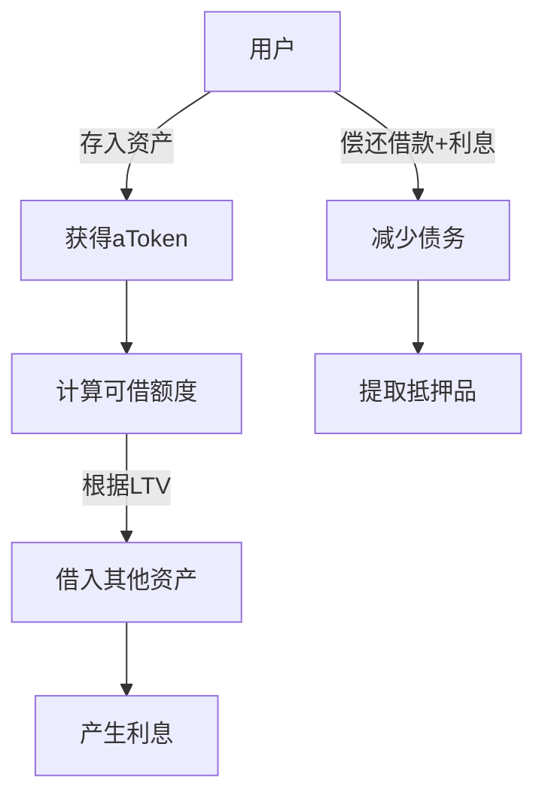
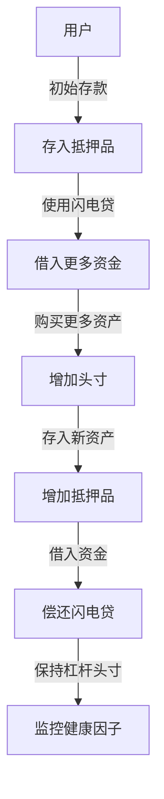
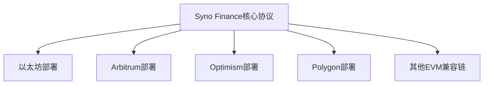
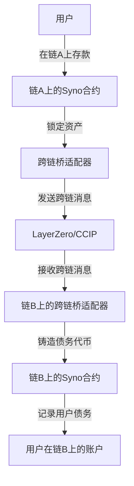
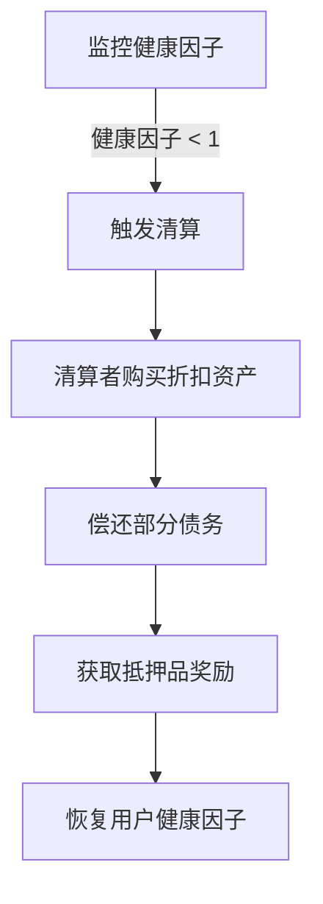

我将帮您分析Syno Finance网站，从多个维度进行详细分析。首先，让我搜索有关这个平台的最新信息。

[3 tools called]

# Syno Finance平台详细分析

## 1. 抵押借贷系统

Syno Finance作为跨链货币市场平台，提供了完善的抵押借贷功能。用户可以将加密资产存入平台作为抵押品，借入其他资产获取流动性。

### 核心流程：



### 代码示例：

```solidity
// 存款操作
function deposit(address asset, uint256 amount) external {
    // 批准资产转移
    IERC20(asset).approve(address(pool), amount);
    // 调用池合约的存款功能
    pool.deposit(asset, amount, msg.sender, 0);
}

// 借款操作
function borrow(address asset, uint256 amount) external {
    // 调用池合约的借款功能
    // 参数2表示使用可变利率
    pool.borrow(asset, amount, 2, 0, msg.sender);
}

// 偿还借款
function repay(address asset, uint256 amount) external {
    // 批准资产转移
    IERC20(asset).approve(address(pool), amount);
    // 偿还借款
    pool.repay(asset, amount, 2, msg.sender);
}

// 提取抵押品
function withdraw(address asset, uint256 amount) external {
    // 提取存款
    pool.withdraw(asset, amount, msg.sender);
}
```

## 2. AAVE V3借贷协议集成

Syno Finance集成了AAVE V3协议，借鉴其先进的借贷机制和风险管理策略。

### 主要特性：

#### 高效模式（E-Mode）
允许用户在相关性高的资产之间以更高的LTV进行借贷，提高资本效率。

```solidity
// 启用高效模式
function enableEMode(uint8 categoryId) external {
    pool.setUserEMode(categoryId);
}
```

#### 隔离模式（Isolation Mode）
允许新资产以受控方式添加到平台，限制风险传播。

```solidity
// 在隔离模式下借款
function borrowInIsolationMode(address asset, uint256 amount) external {
    // 确保资产支持隔离模式
    require(pool.getReserveConfiguration(asset).getDebtCeiling() > 0, "不支持隔离模式");
    pool.borrow(asset, amount, 2, 0, msg.sender);
}
```

#### 跨链功能（Portal）
通过跨链桥实现不同网络间的资产转移。


## 3. 闪电贷功能

Syno Finance提供闪电贷服务，允许用户在同一交易中借入和偿还资金，无需提前抵押。

### 流程图：

```mermaid
sequenceDiagram
    参与者 用户
    参与者 Syno闪电贷
    参与者 用户合约
    
    用户->>用户合约: 调用闪电贷
    用户合约->>Syno闪电贷: 请求闪电贷
    Syno闪电贷->>用户合约: 转移资金
    用户合约->>用户合约: 执行套利/清算等操作
    用户合约->>Syno闪电贷: 归还资金+费用
    Syno闪电贷->>用户: 返回操作结果
```

### 代码示例：

```solidity
// 闪电贷合约示例
contract SynoFlashLoan is IFlashLoanSimpleReceiver {
    IPool private pool;
    
    constructor(address _pool) {
        pool = IPool(_pool);
    }
    
    // 执行闪电贷
    function executeFlashLoan(address asset, uint256 amount) external {
        address receiver = address(this);
        bytes memory params = "";
        uint16 referralCode = 0;
        
        pool.flashLoanSimple(receiver, asset, amount, params, referralCode);
    }
    
    // 闪电贷回调函数
    function executeOperation(
        address asset,
        uint256 amount,
        uint256 premium,
        address initiator,
        bytes calldata params
    ) external override returns (bool) {
        // 执行套利、清算等操作
        
        // 计算需要归还的总金额
        uint256 totalDebt = amount + premium;
        
        // 批准资产转移以归还闪电贷
        IERC20(asset).approve(address(pool), totalDebt);
        
        // 返回true表示操作成功
        return true;
    }
}
```

## 4. 杠杆交易

Syno Finance支持杠杆交易，用户可以通过闪电贷放大交易头寸。

### 杠杆交易流程：



### 代码示例：

```solidity
// 杠杆交易合约
contract LeverageTrading is IFlashLoanSimpleReceiver {
    IPool private pool;
    ISwapRouter private swapRouter; // 假设使用Uniswap V3进行交易
    
    constructor(address _pool, address _swapRouter) {
        pool = IPool(_pool);
        swapRouter = ISwapRouter(_swapRouter);
    }
    
    // 执行杠杆交易
    function executeLeverageTrade(
        address collateralAsset, // 抵押资产
        address borrowAsset,     // 借入资产
        uint256 leverageAmount   // 杠杆金额
    ) external {
        // 使用闪电贷借入资金
        pool.flashLoanSimple(
            address(this),
            borrowAsset,
            leverageAmount,
            abi.encode(collateralAsset, msg.sender),
            0
        );
    }
    
    // 闪电贷回调函数
    function executeOperation(
        address asset,
        uint256 amount,
        uint256 premium,
        address initiator,
        bytes calldata params
    ) external override returns (bool) {
        // 解码参数
        (address collateralAsset, address user) = abi.decode(params, (address, address));
        
        // 1. 使用借入的资金交换为抵押资产
        IERC20(asset).approve(address(swapRouter), amount);
        // 执行交换
        uint256 amountOut = _swap(asset, collateralAsset, amount);
        
        // 2. 将获得的抵押资产存入协议
        IERC20(collateralAsset).approve(address(pool), amountOut);
        pool.deposit(collateralAsset, amountOut, user, 0);
        
        // 3. 以用户名义借入资产以偿还闪电贷
        pool.borrow(asset, amount + premium, 2, 0, user);
        
        // 4. 批准资产转移以归还闪电贷
        IERC20(asset).approve(address(pool), amount + premium);
        
        return true;
    }
    
    // 简化的交换函数
    function _swap(address tokenIn, address tokenOut, uint256 amountIn) internal returns (uint256) {
        // 这里应该是实际的交换逻辑，使用如Uniswap等DEX
        // 简化示例
        return amountIn * 95 / 100; // 假设5%的滑点
    }
}
```

## 5. 多链支持

Syno Finance支持在多个区块链网络上运行，包括以太坊、Arbitrum、Optimism、Polygon等。

### 多链部署架构：



每个链上的部署都有独立的流动性池，但共享相同的治理和代币经济模型。

## 6. 跨链功能

Syno Finance通过集成LayerZero或Chainlink CCIP等跨链协议，实现不同区块链之间的无缝资产转移和借贷。

### 跨链架构：



### 代码示例：

```solidity
// 跨链借贷合约
contract CrossChainLending is ILayerZeroReceiver {
    ILayerZeroEndpoint private endpoint;
    mapping(uint16 => address) public remoteContracts;
    
    constructor(address _endpoint) {
        endpoint = ILayerZeroEndpoint(_endpoint);
    }
    
    // 设置远程合约地址
    function setRemoteContract(uint16 chainId, address contractAddress) external onlyOwner {
        remoteContracts[chainId] = contractAddress;
    }
    
    // 发起跨链借贷
    function bridgeCredit(
        address asset,
        uint256 amount,
        uint16 destinationChainId
    ) external payable {
        // 确保目标链已配置
        require(remoteContracts[destinationChainId] != address(0), "目标链未配置");
        
        // 1. 在源链上锁定资产
        pool.burnCredit(asset, amount, msg.sender);
        
        // 2. 构建跨链消息
        bytes memory payload = abi.encode(
            msg.sender,  // 用户地址
            asset,       // 资产地址
            amount       // 金额
        );
        
        // 3. 发送跨链消息
        endpoint.send{value: msg.value}(
            destinationChainId,           // 目标链ID
            abi.encodePacked(remoteContracts[destinationChainId]), // 目标地址
            payload,                      // 消息内容
            payable(msg.sender),          // 退款地址
            address(0),                   // 回调地址
            bytes("")                     // 参数
        );
    }
    
    // 接收跨链消息
    function lzReceive(
        uint16 _srcChainId,
        bytes memory _srcAddress,
        uint64 _nonce,
        bytes memory _payload
    ) external override {
        // 验证发送者
        require(msg.sender == address(endpoint), "非法调用者");
        
        // 解码消息
        (address user, address asset, uint256 amount) = abi.decode(
            _payload,
            (address, address, uint256)
        );
        
        // 在目标链上铸造债务代币
        pool.mintCredit(asset, amount, user);
    }
}
```

## 7. 风险管理

Syno Finance采用多层次风险管理机制，确保平台安全。

### 风险控制措施：

1. **健康因子监控**：实时监控用户头寸的健康因子，低于阈值时触发清算
2. **价格预言机**：使用Chainlink等去中心化预言机获取可靠价格数据
3. **流动性风险管理**：设置借款上限和利率模型，平衡供需
4. **跨链风险隔离**：不同链上的风险相互隔离，防止系统性风险

### 清算流程：



## 总结

Syno Finance作为跨链货币市场平台，通过集成AAVE V3借贷协议，提供了全面的抵押借贷、闪电贷、杠杆交易和跨链功能。其技术架构支持多链部署和跨链操作，使用户能够在不同区块链网络之间无缝转移和利用资产。平台的风险管理机制确保了系统的安全性和稳定性，为用户提供了高效、灵活的去中心化金融服务。

通过LayerZero或Chainlink CCIP等跨链技术，Syno Finance实现了真正的跨链DeFi体验，使用户能够充分利用不同区块链网络的优势，实现资产的最优配置。
