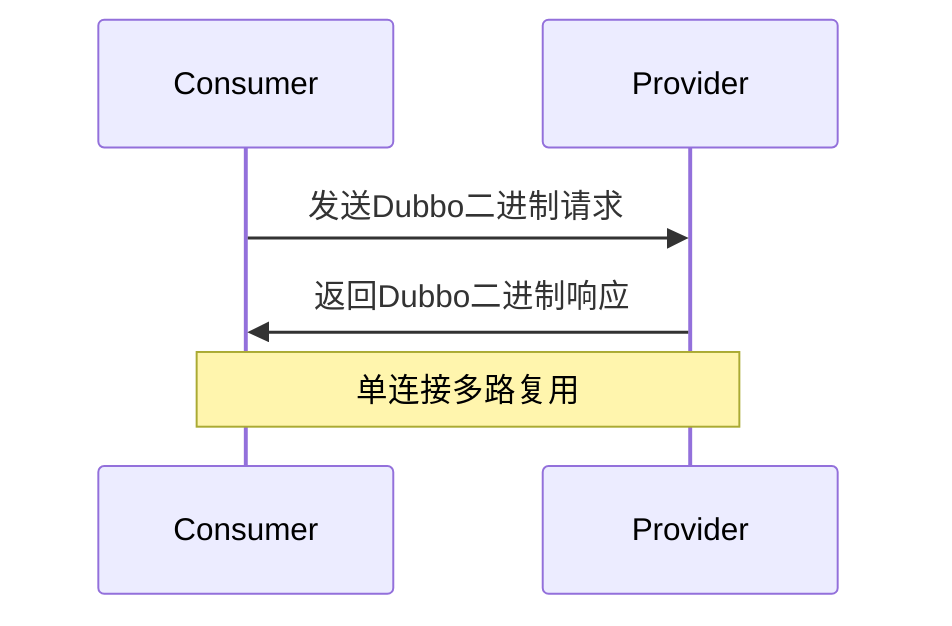

# 一、dubbo中涉及到哪些协议，这些协议是做什么的

# Dubbo协议详解

## 一、Dubbo支持的主要协议

Dubbo作为一个高性能RPC框架，支持多种通信协议，每种协议有特定的应用场景和特性：

| 协议类型 | 协议名称 | 底层传输 | 序列化 | 适用场景 | 特点 |
|---------|---------|---------|--------|----------|------|
| **默认协议** | dubbo | Netty/NIO | Hessian2 | 常规远程调用 | 高性能、二进制协议 |
| **RMI协议** | rmi | Java RMI | Java序列化 | 与原生RMI系统交互 | 跨语言支持差 |
| **HTTP协议** | http | HTTP/1.1 | JSON/XML | 跨语言调用 | 通用性强 |
| **Hessian协议** | hessian | HTTP | Hessian | 多语言系统集成 | 二进制web服务协议 |
| **WebService** | webservice | HTTP | SOAP | 遗留系统对接 | 基于XML的WS标准 |
| **Thrift协议** | thrift | TCP | Thrift | 多语言环境 | Facebook开发的跨语言协议 |
| **gRPC协议** | grpc | HTTP/2 | Protobuf | 云原生应用 | 支持流式通信 |
| **Rest协议** | rest | HTTP | JSON | RESTful接口 | 前后端分离架构 |

## 二、核心协议深度解析

### 1. Dubbo协议（默认协议）

**协议头格式（12字节）**：
```
0-1: 魔数
2: 序列化类型
3: 请求/响应标志
4-11: 请求ID
12-15: 数据长度
```

**工作流程**：


**特点**：
- 单一长连接（减少握手开销）
- NIO异步通信
- 默认端口20880
- 适合小数据包高并发场景

### 2. HTTP协议实现原理

**配置示例**：
```xml
<dubbo:protocol name="http" port="8080" server="jetty"/>
```

**通信过程**：
1. 消费者通过HTTP Client发送请求
2. 服务端使用Servlet容器接收请求
3. 默认使用JSON序列化

**优势场景**：
- 需要穿透防火墙
- 与前端JavaScript直接通信
- 对接已有的HTTP监控系统

## 三、协议选型决策矩阵

| 考量因素 | 推荐协议 | 理由 |
|----------|---------|------|
| 性能优先 | dubbo | 二进制协议，单连接多路复用 |
| 多语言支持 | http/rest | HTTP协议通用性好 |
| 流式通信 | grpc | HTTP/2支持双向流 |
| 旧系统整合 | webservice | 兼容SOAP标准 |
| 内部微服务 | dubbo | 延迟低、吞吐高 |
| 云原生环境 | grpc | 与k8s服务体系集成好 |

## 四、协议扩展机制

Dubbo支持自定义协议扩展：
1. 实现`org.apache.dubbo.rpc.Protocol`接口
2. 在META-INF/dubbo目录下添加SPI配置
3. 配置使用自定义协议：
   ```xml
   <dubbo:protocol name="myprotocol" />
   ```

**示例自定义协议要素**：
- 编解码器
- 线程模型
- 序列化方式
- 传输层实现

## 五、最新版本协议演进

Dubbo 3.x重要改进：
1. **Triple协议**（基于gRPC的协议）：
   - 完全兼容gRPC
   - 支持Streaming通信
   - 默认使用Protobuf序列化

2. **应用级服务发现**：
   - 替代接口级发现
   - 减少注册中心压力

3. **多协议同时暴露**：
   ```xml
   <!-- 同时暴露dubbo和grpc协议 -->
   <dubbo:protocol name="dubbo" port="20880"/>
   <dubbo:protocol name="tri" port="50051"/>
   ```


# 一、dubbo中涉及到哪些协议，这些协议是做什么的

在 Apache Dubbo 中，**协议（Protocol）** 是服务暴露和调用的核心组件，决定了服务如何在网络中进行通信。Dubbo 支持多种协议，每种协议适用于不同的场景，具有不同的性能特点和适用范围。

以下是 Dubbo 中常见的协议及其作用：

---

## 1. `dubbo` 协议（默认协议）

### ✅ 特点：
- 基于 **Netty** 的 **TCP 自定义二进制协议**
- 使用 **NIO 异步通信**，性能高
- 支持长连接、多路复用
- 默认端口：`20880`

### 📌 作用：
- 是 Dubbo 的**默认协议**，适用于**内部服务间高性能调用**
- 传输数据序列化方式默认为 **Hessian2**，也可扩展为 JSON、Kryo 等

### ✅ 适用场景：
- 同一数据中心内的微服务调用（如订单服务调用用户服务）
- 对性能、延迟敏感的场景

### ⚠️ 注意：
- 不支持跨语言调用（需使用其他协议如 gRPC）

---

## 2. `http` 协议

### ✅ 特点：
- 基于标准 HTTP 协议
- 可使用 Spring Web MVC 或嵌入式 Jetty 作为服务器
- 传输格式通常为 JSON

### 📌 作用：
- 提供 **RESTful 风格的服务暴露**
- 支持跨语言调用（浏览器、Python、Go 等均可访问）

### ✅ 适用场景：
- 需要被外部系统或前端直接调用的接口
- 对性能要求不高，但需要兼容性好的场景

---

## 3. `rest` 协议

### ✅ 特点：
- 基于 **JAX-RS**（Java API for RESTful Web Services）
- 使用 REST 风格暴露服务
- 支持 JSON/XML 格式
- 底层可基于 Netty 或 Tomcat 实现

### 📌 作用：
- 实现 **标准 REST 接口**，便于与非 Java 系统集成
- 支持注解（如 `@GET`, `@Path`）定义接口

### ✅ 适用场景：
- 需要与外部系统（如移动端、第三方平台）对接
- 希望使用标准 HTTP 方法（GET/POST/PUT/DELETE）

---

## 4. `gRPC` 协议（推荐用于跨语言）

### ✅ 特点：
- 基于 Google 的 **gRPC 框架**
- 使用 **HTTP/2** 传输
- 数据格式为 **Protocol Buffers（protobuf）**，高效且跨语言
- 支持双向流、服务端流、客户端流

### 📌 作用：
- 实现 **高性能、跨语言** 的服务调用
- 适合构建多语言微服务架构（Java + Go + Python 等混合部署）

### ✅ 适用场景：
- 跨语言服务调用
- 对性能和传输效率要求高的场景
- 需要流式通信（如实时消息推送）

> 🔧 Dubbo 从 2.7.5 版本开始原生支持 gRPC 协议

---

## 5. `hessian` 协议

### ✅ 特点：
- 基于 **Hessian 二进制序列化协议** 的轻量级 HTTP 协议
- 支持跨语言（Java、PHP、Python 等）
- 使用 HTTP 传输，简单易用

### 📌 作用：
- 提供一种轻量级的远程调用方式
- 适合对外提供开放 API

### ✅ 适用场景：
- 跨语言调用，且不想引入复杂框架
- 与 PHP、Python 等系统集成

---

## 6. `thrift` 协议（需集成 Apache Thrift）

### ✅ 特点：
- 基于 **Apache Thrift** 框架
- 使用二进制协议，性能高
- 支持多语言（Java、C++、Python、Go 等）

### 📌 作用：
- 实现高性能、跨语言服务通信
- 适合已有 Thrift 架构的系统迁移

### ✅ 适用场景：
- 已使用 Thrift 的团队希望接入 Dubbo
- 对性能和跨语言有双重需求

---

## 7. `rmi` 协议（较少使用）

### ✅ 特点：
- 基于 Java 原生 RMI（Remote Method Invocation）
- 使用 Java 序列化
- 仅支持 Java 语言

### 📌 作用：
- 兼容传统 Java RMI 应用
- 不推荐用于新项目

---

## 8. `webservice` / `ws` 协议（已过时）

### ✅ 特点：
- 基于 SOAP 和 WSDL 的 Web 服务
- 使用 XML 传输
- 性能低，配置复杂

### 📌 作用：
- 与传统企业级系统（如 ERP、银行系统）对接
- 现代微服务中已基本被淘汰

---

## 各协议对比总结

| 协议 | 传输方式 | 序列化 | 跨语言 | 性能 | 适用场景 |
|------|----------|--------|--------|------|----------|
| `dubbo` | TCP（Netty） | Hessian2 | ❌ | ⭐⭐⭐⭐⭐ | 内部高性能调用 |
| `http` | HTTP | JSON | ✅ | ⭐⭐⭐ | 外部系统调用 |
| `rest` | HTTP | JSON/XML | ✅ | ⭐⭐⭐ | RESTful 接口 |
| `gRPC` | HTTP/2 | Protobuf | ✅ | ⭐⭐⭐⭐⭐ | 跨语言高性能 |
| `hessian` | HTTP | Hessian | ✅ | ⭐⭐⭐⭐ | 轻量级跨语言 |
| `thrift` | TCP | Thrift | ✅ | ⭐⭐⭐⭐ | 高性能跨语言 |
| `rmi` | RMI | Java | ❌ | ⭐⭐ | Java 内部调用 |
| `webservice` | SOAP | XML | ✅ | ⭐ | 传统系统对接 |

---

## 如何配置协议？

### 示例：在 `application.yml` 中配置多个协议

```yaml
dubbo:
  protocols:
    dubbo:
      name: dubbo
      port: 20880
    rest:
      name: rest
      port: 8080
    grpc:
      name: grpc
      port: 8888
```

### 指定服务使用某个协议：

```java
@DubboService(protocol = "dubbo")  // 使用 dubbo 协议暴露
public class UserServiceImpl implements UserService {
    // ...
}
```

---

## 总结

- **`dubbo` 协议**：默认、高性能、适合内部调用
- **`gRPC` 协议**：跨语言、高性能、推荐用于多语言环境
- **`http` / `rest`**：兼容性好，适合对外暴露接口
- **`hessian` / `thrift`**：轻量级跨语言方案
- **避免使用 `rmi` 和 `webservice`**

> ✅ **现代推荐组合**：
> - 内部服务：`dubbo` 协议（高性能）
> - 跨语言服务：`gRPC` 协议
> - 对外 API：`rest` 或 `http` 协议

合理选择协议，是构建高性能、可扩展微服务架构的关键一步。
