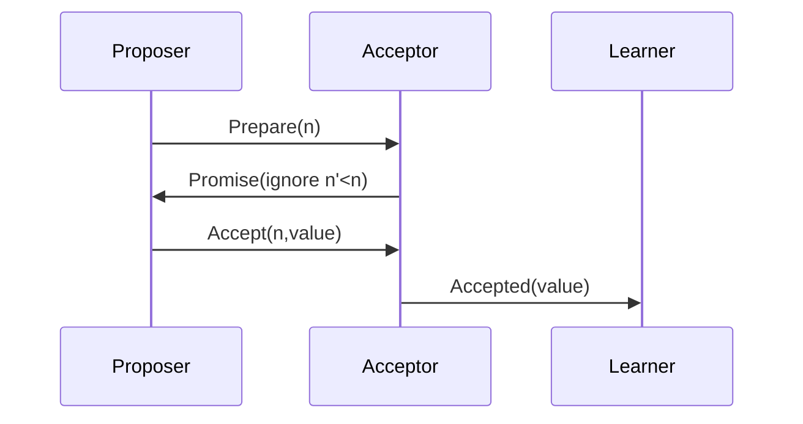

# 一、  共识机制涉及到哪些协议，分别详细介绍下这些协议，并进行对比


共识机制是分布式系统和区块链技术的核心，用于确保节点间数据一致性和系统可靠性。根据应用场景（传统分布式系统 vs. 区块链），共识协议可分为两类：**传统分布式系统协议**（如 Paxos、Raft、ZAB）和 **区块链协议**（如 PoW、PoS、PBFT）。以下是详细分类介绍及对比：

---

### **一、传统分布式系统共识协议**
#### **1. Paxos**
- **原理**：  
  通过多轮协商（Prepare/Promise、Accept/Accepted）达成共识，支持 **非拜占庭容错**（仅处理节点宕机，不处理恶意行为）。  
  - **角色**：Proposer（提议者）、Acceptor（接受者）、Learner（学习者）。  
  - **流程**：Proposer 提出提案 → Acceptor 批准 → 半数以上接受后提交。
- **特点**：  
  - 高可用性，但实现复杂（如 Multi-Paxos 需选主优化）。  
  - 适用于强一致性场景（如 Google Chubby 锁服务）。

#### **2. Raft**
- **原理**：  
  基于 **Leader-Follower 模型**，通过选举 Leader 并由其协调日志复制达成共识。  
  - **阶段**：Leader 选举 → 日志复制 → 安全性检查。  
  - **心跳机制**：Follower 等待 Leader 心跳超时后发起选举。
- **特点**：  
  - 易于理解与实现（相比 Paxos）。  
  - 强一致性，但性能依赖 Leader 节点（如 etcd、Consul 使用）。

#### **3. ZAB（ZooKeeper Atomic Broadcast）**
- **原理**：  
  专为 ZooKeeper 设计，结合 Leader 选举与原子广播。  
  - **阶段**：崩溃恢复（选主）→ 消息广播（事务提交）。  
  - **事务 ID**：通过 epoch（任期）和 counter（递增计数）保证顺序。
- **特点**：  
  - 强一致性，支持崩溃容错。  
  - 适用于协调服务（如分布式锁、配置管理）。

---

### **二、区块链共识协议**
#### **1. PoW（Proof of Work，工作量证明）**
- **原理**：  
  节点通过算力竞争解决哈希难题，首个解出者广播区块，其他节点验证后追加。  
  - **示例**：比特币、以太坊（2022 年前）。  
  - **特点**：  
    - 高安全性（需控制 51% 算力才能攻击），但能耗极高。  
    - 去中心化程度高，但吞吐量低（如比特币 7 TPS）。

#### **2. PoS（Proof of Stake，权益证明）**
- **原理**：  
  根据持币量和币龄（Stake）选择出块节点，避免算力浪费。  
  - **示例**：以太坊 2.0、Cardano。  
  - **特点**：  
    - 能耗低，但可能加剧富者愈富（Staking 集中化）。  
    - 支持分片技术提升性能（如以太坊 2.0 目标 100,000 TPS）。

#### **3. DPoS（Delegated Proof of Stake，委托权益证明）**
- **原理**：  
  代币持有者投票选出超级节点（如 21 个），由超级节点轮流出块。  
  - **示例**：EOS、TRON。  
  - **特点**：  
    - 高性能（秒级出块），但中心化程度较高（依赖超级节点信任）。

#### **4. PBFT（Practical Byzantine Fault Tolerance，实用拜占庭容错）**
- **原理**：  
  通过多轮消息交换（Pre-Prepare、Prepare、Commit）达成共识，容忍 **拜占庭错误**（恶意节点）。  
  - **容错阈值**：系统需 $3f+1$ 个节点，可容忍 $f$ 个恶意节点。  
  - **示例**：Hyperledger Fabric（早期版本）。  
  - **特点**：  
    - 高一致性，但通信复杂度高（$O(n^2)$），适合小型联盟链。

#### **5. DAG（Directed Acyclic Graph，有向无环图）**
- **原理**：  
  非链式结构，交易直接关联其他交易（如 IOTA 的 Tangle）。  
  - **特点**：  
    - 高并发性（无需等待区块确认），但安全性依赖交易密度。  
    - 适用于物联网、微支付场景。

---

### **三、协议对比**
| **协议**   | **容错类型**       | **性能（TPS）** | **能耗** | **去中心化程度** | **适用场景**               |
|------------|--------------------|----------------|----------|------------------|----------------------------|
| **Paxos**  | 非拜占庭（宕机）   | 高（万级）     | 低       | 中等             | 分布式数据库、协调服务     |
| **Raft**   | 非拜占庭（宕机）   | 高（千级）     | 低       | 中等             | 服务发现、配置管理         |
| **ZAB**    | 非拜占庭（宕机）   | 高（千级）     | 低       | 中等             | ZooKeeper 协调服务         |
| **PoW**    | 拜占庭（51% 攻击）| 低（个位数）   | 极高     | 高               | 公有链（如比特币）         |
| **PoS**    | 拜占庭（经济惩罚）| 中（百级）     | 低       | 中               | 公有链（如以太坊 2.0）     |
| **DPoS**   | 拜占庭（依赖节点）| 高（千级）     | 低       | 低               | 联盟链（如 EOS）           |
| **PBFT**   | 拜占庭（f < n/3）  | 低（百级）     | 低       | 低               | 联盟链（如 Hyperledger）   |
| **DAG**    | 拜占庭（概率安全）| 高（万级）     | 低       | 高               | 物联网、微支付             |

---

### **四、关键区别**
1. **容错能力**：  
   - 传统协议（Paxos/Raft）仅处理宕机，区块链协议（PBFT/PoS）支持拜占庭容错。  
2. **性能与扩展性**：  
   - 链式协议（PoW/PoS）吞吐量低，DAG 和分片技术（如以太坊 2.0）可提升性能。  
3. **能耗与环保**：  
   - PoW 能耗极高，PoS/DAG 更环保。  
4. **去中心化程度**：  
   - PoW/PoS（公有链）去中心化高，DPoS/PBFT（联盟链）依赖可信节点。

根据需求选择协议：若需强一致性且节点可信，选 Raft/ZAB；若需去中心化且容忍恶意行为，选 PoS/PBFT；若追求高性能且弱中心化，选 DAG 或 DPoS。


# 一、  共识机制涉及到哪些协议，分别详细介绍下这些协议，并进行对比


以下是分布式系统中主要的共识协议对比分析：

---

### **1. ZAB协议（ZooKeeper Atomic Broadcast）**
**设计目标**：高吞吐量、强一致性、快速故障恢复  
**核心机制**：
- **两阶段提交**：
  1. Leader发起Proposal（携带zxid）
  2. Follower持久化后回复ACK
  3. 收到半数以上ACK后发送Commit
- **epoch机制**：每个新Leader产生时递增epoch值，防止旧Leader"诈尸"
- **恢复模式**：新Leader会补全所有未提交的提案

**特点**：
```text
• 保证事务的全局有序（zxid单调递增）
• 写性能瓶颈在Leader（所有写需经Leader）
• 默认容忍f个故障需要2f+1个节点
```

---

### **2. Paxos协议**
**经典场景**：分布式系统的基础理论模型  
**核心角色**：
- **Proposer**：发起提案
- **Acceptor**：接受/拒绝提案
- **Learner**：学习最终决议

**阶段流程**：


**变种对比**：
| 类型        | 特点                          | 应用案例         |
|-------------|-----------------------------|----------------|
| Classic Paxos | 单值决议，理论模型            | Chubby底层设计 |
| Multi-Paxos  | 优化连续提案性能              | Spanner早期版本|
| Fast Paxos   | 减少通信轮次（需3f+1节点）    | 较少使用       |

---

### **3. Raft协议**
**设计目标**：可理解性高于Paxos  
**核心改进**：
- **强Leader模式**：所有写请求必须经过Leader
- **日志复制规则**：
  ```go
  // Leader追加日志规则
  if prevLogTerm == currentTerm {
      append new entries
      update commitIndex
  }
  ```

**选举流程**：
1. Candidate发起投票请求（term+lastLogIndex）
2. 其他节点检查日志完备性后投票
3. 获得多数票即当选Leader

**对比Paxos**：
```text
           Paxos            vs           Raft
┌───────────────────────┐ ┌───────────────────────┐
│ 多角色（Proposer/Acceptor） │ │ 固定Leader/Follower角色 │
│ 允许并行提案             │ │ 强制串行化提案          │
│ 理论证明复杂            │ │ 工程实现友好           │
└───────────────────────┘ └───────────────────────┘
```

---

### **4. 其他协议对比**

| 协议         | 容错能力 | 通信复杂度 | 典型延迟 | 适用场景                |
|--------------|----------|------------|----------|-------------------------|
| **ZAB**      | N/2      | O(n)       | 2 RTT    | 高吞吐协调服务（ZooKeeper）|
| **Raft**     | N/2      | O(n)       | 2 RTT    | 易理解的通用共识（Etcd）  |
| **PBFT**     | N/3      | O(n²)      | 3 RTT    | 拜占庭容错（联盟链）      |
| **Paxos**    | N/2      | O(n²)      | 2-3 RTT  | 理论基础（Chubby）        |
| **Kafka-ISR**| 动态容忍  | O(n)       | 1 RTT    | 高吞吐消息队列           |

---

### **深入对比分析**
1. **性能维度**：
   - **吞吐量**：ZAB ≈ Raft > PBFT
   - **延迟**：ISR < ZAB ≈ Raft < PBFT

2. **一致性保证**：
   ```python
   # 各协议的一致性级别
   protocols = {
       'ZAB': '线性一致性',
       'Raft': '线性一致性', 
       'PBFT': '顺序一致性',
       'Paxos': '可配置一致性'
   }
   ```

3. **工程实践差异**：
   - ZooKeeper的ZAB对快速恢复做了优化（zxid+epoch）
   - Etcd的Raft实现了日志压缩（Snapshot）
   - PBFT需要节点身份认证（不适合公链）

---

**如何选择**：
- **需要拜占庭容错** → PBFT/Tendermint
- **强一致性协调服务** → ZAB/Raft
- **理论研究和教学** → Paxos
- **高吞吐最终一致** → Gossip协议

各协议本质都是CAP定理下的不同权衡，实际系统中常会组合使用（如Kafka用ISR做数据同步，用ZooKeeper做元数据共识）。
