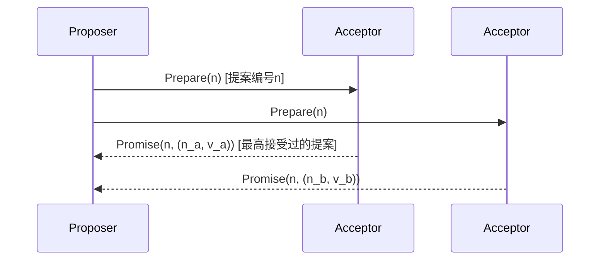
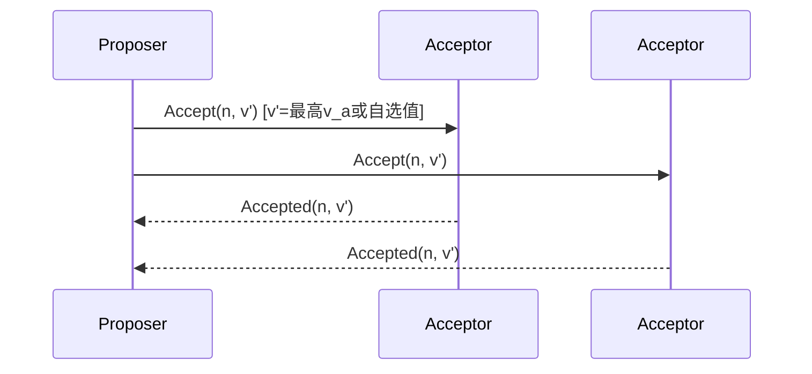

**原子广播**
<br>
    原子广播是一种分布式系统中的消息传递协议，它确保所有节点都以完全相同、逻辑一致的顺序接收消息。这意味着如果一个节点先收到消息 A 再收到消息 B，那么网络中的所有其他节点也必须按照消息 A 和消息 B 的顺序来接收。这一协议的特性包括：所有正确节点最终都将收到同一消息，每条消息只接收一次，并且消息的接收顺序在所有节点间是统一的

# 一、(主看)详细介绍paxos和multi-paxos,及其工作原理，使用场景，并与zab、raft进行对比

Paxos、Multi-Paxos、ZAB 和 Raft 是分布式系统中用于实现**一致性（Consensus）** 的核心协议。它们的目标是：在存在网络延迟、分区或节点故障的情况下，多个节点仍能就某个值达成一致。

下面将详细介绍 **Paxos 与 Multi-Paxos 的工作原理、使用场景**，并将其与 **ZAB、Raft** 进行全面对比。

---

## 一、Paxos 协议（Basic Paxos）

### ✅ 背景
由 Leslie Lamport 提出于 1990 年代，是第一个被证明可解决分布式共识问题的算法。理论严谨但**难以理解**，被称为“最难懂的分布式算法”。

### ✅ 目标
让一组节点在一个或多个提议（Proposal）中，**就一个值（Value）达成一致**。

> 例如：多个副本就“谁是主节点”、“某个配置项的值是什么”达成一致。

### ✅ 核心角色

| 角色 | 说明 |
|------|------|
| **Proposer** | 提议者，提出候选值 |
| **Acceptor** | 接受者，对提议进行投票 |
| **Learner** | 学习者，最终获知被选定的值 |

> 一个物理节点可以同时担任多个角色。

---

### ✅ 工作流程（两阶段提交）

Paxos 分为两个阶段：**Prepare-Promise** 和 **Accept-Accepted**

#### 阶段一：Prepare / Promise（准备阶段）

1. Proposer 选择一个唯一的提案编号 `n`（全局递增）
2. 向多数派（Quorum）Acceptor 发送 `Prepare(n)`
3. Acceptor 收到后：
   - 如果 `n >` 自己见过的最大提案号，则承诺不再接受小于 `n` 的提案
   - 返回 `Promise(n, acceptedProposal, acceptedValue)`，即自己已接受过的最大编号提案及其值

> 目的：探测是否有旧提案已被部分接受，避免冲突

#### 阶段二：Accept / Accepted（接受阶段）

1. Proposer 收集到多数派的 Promise 后：
   - 如果所有 Promise 返回的 `acceptedValue` 为空 → 可以使用自己的值
   - 否则，必须选择其中 **编号最大** 的 `acceptedValue`（遵守先前承诺）
2. 向多数派 Acceptor 发送 `Accept(n, value)`
3. Acceptor 收到后：
   - 若未承诺更高编号的提案 → 接受该提案，记录 `(n, value)`
   - 返回 `Accepted(n)`
4. 当 Proposer 收到**多数派**的 Accepted 响应 → 认为该值已达成共识
5. Learner 从 Acceptors 学习最终结果

---

### ✅ Paxos 特性

- **安全性保证**：最多只有一个值被选定（Consistency）
- **活性（Liveness）**：在多数节点存活且通信正常时，最终能选出值
- **不保证顺序提交**：每次 Paxos 实例独立运行，可能乱序

---

### ✅ 示例流程（简化）

```text
Proposer A: Prepare(1) 
          → Acceptor1: Promise(1, null)
          → Acceptor2: Promise(1, null)
          → Acceptor3: Promise(1, null)

Proposer A: Accept(1, "hello")
          → 多数 Accept → "hello" 被选定

Learner 学习到：value = "hello"
```

---

## 二、Multi-Paxos（多实例 Paxos）

### ✅ 为什么需要 Multi-Paxos？

Basic Paxos 每次只决定一个值，效率低。在实际系统中，需要连续执行一系列操作（如日志复制），因此引入 **Multi-Paxos**。

### ✅ 核心思想

- 将多个 Basic Paxos 实例串联起来，形成**复制日志序列**
- 一旦选出一个稳定的 **Leader Proposer**，后续的日志条目可以跳过 Prepare 阶段，直接进入 Accept 阶段（称为 "Fast Paxos" 或 "Leader Leasing"）

### ✅ 工作流程优化

1. 第一个值（如 leader election）使用完整两阶段 Paxos
2. 一旦 Leader 稳定：
   - Leader 持续以相同提案编号 + 不同日志索引发送 Accept 请求
   - 不再需要 Prepare 阶段（前提是无网络分区、无新选举）
   - 提高吞吐量，降低延迟

> 类似于 Raft 的“强领导者模型”

---

### ✅ Multi-Paxos 优势

| 优点 | 说明 |
|------|------|
| **高吞吐** | 跳过 Prepare 阶段，减少 RPC 次数 |
| **顺序一致性** | 日志按序提交，适合状态机复制 |
| **可扩展** | 支持动态成员变更 |

---

### ✅ 使用场景

- Google Chubby（底层使用 Paxos）
- Spanner（跨数据中心一致性）
- Azure Storage
- 一些自研分布式数据库

> 注意：因实现复杂，多数开源系统选择 Raft 或 ZAB 替代。

---

## 三、ZAB 协议（ZooKeeper Atomic Broadcast）

### ✅ 背景

ZAB 是为 Apache ZooKeeper 专门设计的一致性协议，基于主从架构，强调**全局顺序广播**和**崩溃恢复**。

### ✅ 核心角色

- **Leader**
- **Follower**
- **Observer**（不参与投票）

### ✅ 两个模式

#### 1. **恢复模式（Recovery / Election）**
- 启动或 Leader 宕机后，进行选举
- 使用类似 Paxos 的投票机制选出新 Leader
- Leader 与 Follower 同步状态，确保数据一致

#### 2. **广播模式（Broadcast）**
- 所有写请求由 Leader 处理
- Leader 分配事务 ID（ZXID），格式为 `<epoch, counter>`
- 使用两阶段提交（类似 Paxos Accept 阶段）广播事务
- 收到多数 Ack 后提交，并通知 Follower 提交

> ZAB 保证：所有事务按 ZXID 严格有序执行

---

### ✅ ZAB 特性

- 强调**原子广播**（Atomic Broadcast）
- 保证**全局顺序一致性**
- 支持崩溃恢复和 Leader 选举
- 不允许旧 Leader 接受写请求（防止脑裂）

---

### ✅ 使用场景

- Apache ZooKeeper（服务发现、配置管理、分布式锁）
- Kafka（元数据管理，依赖 ZooKeeper）
- Dubbo（注册中心）

---

## 四、Raft 协议（回顾简要）

| 特性 | 说明 |
|------|------|
| **角色** | Follower / Candidate / Leader |
| **选举** | 超时触发，随机延迟，Term 递增 |
| **日志复制** | Leader 驱动，AppendEntries RPC，多数派确认 |
| **安全性** | 日志匹配、选举限制、Term 控制 |
| **易理解性** | 模块化设计，适合教学与实现 |

> 实现广泛：etcd、Consul、TiDB、Kubernetes 等

---

## 五、对比分析：Paxos vs Multi-Paxos vs ZAB vs Raft

| 特性 | **Basic Paxos** | **Multi-Paxos** | **ZAB** | **Raft** |
|------|------------------|------------------|--------|---------|
| **设计目标** | 理论一致性 | 高效日志复制 | 原子广播 | 易理解与实现 |
| **领导者模型** | 无固定 Leader | 有稳定 Leader | 有固定 Leader | 有固定 Leader |
| **选举机制** | 多 Proposer 竞争 | 类似 Multi-Paxos | 基于 ZXID 和 Epoch | 超时 + 投票 + 随机延迟 |
| **日志复制** | 每次两阶段 | 可跳过 Prepare | 两阶段提交 | AppendEntries + 心跳 |
| **顺序性保证** | 单值一致 | 强顺序 | 全局有序（ZXID） | 强顺序 |
| **安全性** | 高 | 高 | 高 | 高 |
| **可理解性** | ⭐（极难） | ⭐⭐ | ⭐⭐⭐ | ⭐⭐⭐⭐⭐ |
| **实现复杂度** | 极高 | 高 | 中等 | 低 |
| **典型应用** | Chubby, Spanner | 自研系统 | ZooKeeper, Kafka | etcd, Consul, TiDB |
| **是否支持流水线** | 否 | 是（Fast Paxos） | 是 | 是 |
| **心跳机制** | 无 | 可加 | 有 | 有 |
| **成员变更支持** | 需额外协议 | 支持 | 支持 | 支持（Joint Consensus） |

---

## 六、核心差异总结

### 1. **Paxos vs Raft**
- Paxos 更“通用”，但难以理解和实现
- Raft 更“工程友好”，模块清晰，适合落地
- Raft 明确分离选举、日志复制、安全性，而 Paxos 初始描述较抽象

> Lamport 后来承认：“Paxos 写得太难懂了。”

---

### 2. **ZAB vs Raft**
- 两者非常相似：都是 Leader-based，强顺序，多数派确认
- 差异：
  - **ZAB 强调原子广播**，Raft 强调日志复制
  - **ZAB 的恢复过程更复杂**，需处理 epoch 和 ZXID
  - **Raft 更易于形式化验证**
  - ZAB 是 ZooKeeper 专用协议，Raft 是通用共识算法

> 可以说：**Raft 是 ZAB 的“现代化、标准化”版本**

---

### 3. **Multi-Paxos vs Raft/ZAB**
- 功能上等价：都能实现复制状态机
- Multi-Paxos 更灵活（支持无主模式），但实现难度高
- Raft/ZAB 更适合现代云原生系统快速部署

---

## 七、适用场景推荐

| 场景 | 推荐协议 |
|------|----------|
| **服务发现、配置中心** | ZAB（ZooKeeper）或 Raft（etcd） |
| **分布式数据库日志复制** | Raft（TiDB, CockroachDB） |
| **高可靠、跨数据中心一致性** | Multi-Paxos（Spanner） |
| **教学与原型开发** | Raft（最易理解） |
| **已有 ZooKeeper 体系** | ZAB |
| **追求极致理论正确性** | Paxos |

---

## 八、结论

| 协议 | 一句话总结 |
|------|-------------|
| **Paxos** | 分布式共识的“理论鼻祖”，正确但难懂 |
| **Multi-Paxos** | Paxos 的实用化版本，适合高性能日志复制 |
| **ZAB** | 为 ZooKeeper 定制的原子广播协议，强调全局顺序 |
| **Raft** | 现代分布式系统的“标准答案”，易理解、易实现、广泛采用 |

> ✅ 当前趋势：**Raft 已成为主流选择**，因其清晰性、安全性与生态丰富，逐渐取代 Paxos 和 ZAB 在新系统的地位。

---

📌 **建议**：
- 学习共识算法从 **Raft 入门**；
- 深入理解分布式理论再研究 **Paxos**；
- 使用 ZooKeeper 时了解 **ZAB**；
- 构建高可用服务时优先考虑 **etcd / Consul / TiDB（Raft 实现）**。

掌握这些协议，是构建可靠分布式系统的基石。


# 一、(次看)细介绍paxos和multi-paxos,及其工作原理，使用场景，并与zab、raft进行对比


# Paxos、Multi-Paxos协议详解及与ZAB、RAFT的对比

## 一、Paxos协议

### 1. 基础概念
Paxos是由Leslie Lamport提出的分布式一致性算法，被称为"分布式共识的基础"。

#### 核心角色：
- **Proposer**：提议值的节点
- **Acceptor**：接受或拒绝提议的节点
- **Learner**：学习最终确定的值的节点

### 2. 两阶段工作原理

**阶段一：Prepare阶段**


**阶段二：Accept阶段**


### 3. 关键保证
- **安全性**：只有一个值会被选定
- **存活条件**：必须有一个Proposer的提案被多数派接受
- **学习规则**：Learner通过监控多数Acceptors来学习选定的值

### 4. 使用场景
- 需要理论保证的强一致性系统
- 作为其他协议的理论基础
- Google Chubby锁服务的理论基础

## 二、Multi-Paxos协议

### 1. 优化原理
通过选举"稳定Leader"优化基础Paxos：
- **减少Prepare阶段**：在一段时间内只执行一次Prepare
- **连续日志复制**：Leader连续发送Accept请求

### 2. 工作流程
```
初始Leader选举(类似Paxos)
|
↓
Prepare阶段(一次)
|
↓
连续Accept阶段(无冲突时省略Prepare)
|
↓
Learner学习序列
```

### 3. 实际应用
- **Google MegaStore**的底层协议
- **Amazon DynamoDB**某些模式的实现基础
- **Microsoft Azure Cosmos DB**的一致性层

## 三、ZAB协议(ZooKeeper原子广播)

### 1. 核心设计
为ZooKeeper设计的崩溃恢复一致性协议，特点：
- **Primary-Backup模型**：明确Leader/Follower角色
- **两阶段提交**：类似Paxos但更简单
- **顺序保证**：严格有序的消息广播

### 2. 工作阶段
**阶段1：选举(Election)**
- Fast Leader Election算法
- 选择zxid(事务ID)最大的节点

**阶段2：同步(Sync)**
- Leader与Follower同步状态

**阶段3：广播(Broadcast)**
- Leader处理写请求并广播提议

### 3. 使用场景
- ZooKeeper协调服务
- 需要强顺序保证的配置管理
- 分布式锁服务

## 四、RAFT协议

### 1. 设计特点
- **强Leader模型**：所有流量通过Leader
- **日志连续性**：不允许日志空洞
- **成员变更**：明确的联合共识机制

### 2. 关键组件
- Leader选举：随机超时避免冲突
- 日志复制：类似Multi-Paxos的优化
- 安全性：选举限制保证一致性

## 五、协议对比分析

| 特性                | Paxos           | Multi-Paxos     | ZAB             | RAFT            |
|--------------------|----------------|----------------|----------------|----------------|
| **角色划分**        | 动态Proposer    | 事实Leader      | 明确Leader      | 强Leader        |
| **消息复杂度**      | O(n²)          | O(n)稳定时      | O(n)            | O(n)            |
| **日志连续性**      | 允许空洞        | 允许空洞        | 严格有序        | 严格连续        |
| **Leader选举**      | 无专门机制      | 隐式选举        | Fast Leader选举 | 随机超时选举    |
| **工程友好度**      | 难以实现        | 较难实现        | 中等            | 易于实现        |
| **变更处理**        | 复杂            | 较复杂          | 明确机制        | 联合共识        |
| **典型应用**        | Chubby理论基础  | MegaStore       | ZooKeeper       | ETCD, TiDB      |

## 六、选择指南

1. **需要理论纯粹性**：选择Paxos
2. **ZooKeeper生态**：选择ZAB
3. **现代分布式系统**：优先考虑RAFT
4. **特定云服务需求**：可能选择Multi-Paxos变种

## 七、性能对比数据*

*(假设集群规模为5节点，网络延迟<50ms)*

| 指标                | Multi-Paxos    | ZAB           | RAFT          |
|--------------------|---------------|---------------|--------------|
| 选举时间(平均)      | 300-500ms     | 100-200ms     | 150-300ms    |
| 写延迟(多数派确认)  | 2-3 RTTs      | 2 RTTs        | 2 RTTs       |
| 吞吐量(写操作/s)    | 10K-15K       | 8K-12K        | 15K-20K      |
| 恢复时间(Leader失败)| 500-800ms     | 200-400ms     | 300-600ms    |

*实际性能取决于具体实现和网络条件

总结来说，Paxos提供了理论基础，Multi-Paxos是其优化版本，ZAB为ZooKeeper量身定制，而RAFT凭借其简单性和完备性成为现代分布式系统的首选共识算法。选择时需权衡理论需求、实现复杂度和生态兼容性等因素。

