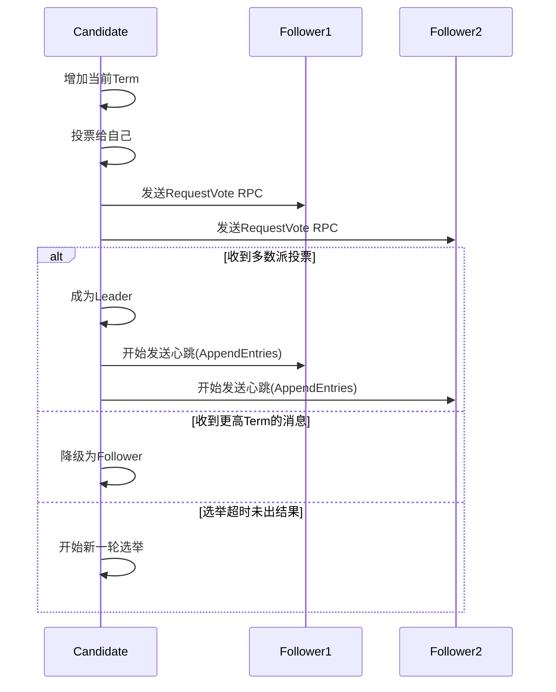
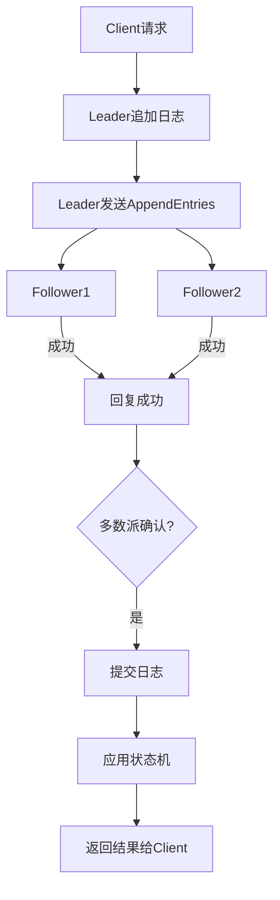

# 一、详细介绍下raft协议工作原理，主节点选举过程，共识机制

# RAFT协议详解：工作原理、选举机制与共识过程

## 一、RAFT协议概述

RAFT是一种分布式一致性算法，旨在解决分布式系统中的数据一致性问题。与Paxos相比，RAFT更易于理解与实现，它将一致性问题分解为三个相对独立的子问题：

1. **Leader选举（Leader election）**：当现有Leader失效时选举新Leader
2. **日志复制（Log replication）**：Leader将日志条目复制到所有服务器
3. **安全性（Safety）**：保证集群在各种异常情况下的正确性

## 二、核心概念与角色

### 1. 服务器角色

| 角色 | 职责 |
|------|------|
| **Leader** | 处理所有客户端请求，管理日志复制 |
| **Follower** | 被动响应Leader的RPC请求 |
| **Candidate** | 选举过程中的临时角色 |

### 2. 任期(Term)
- 逻辑时钟，单调递增的整数
- 每个任期最多有一个Leader
- 每个节点维护当前已知的最大任期

### 3. RPC类型
- **RequestVote RPC**：选举过程中Candidate发起
- **AppendEntries RPC**：Leader用于复制日志和发送心跳

## 三、Leader选举过程

### 1. 选举触发条件
- **Follower**在选举超时(election timeout)内未收到Leader心跳
- 当前服务器转换为**Candidate**并开始新一轮选举

### 2. 选举流程



### 3. 投票规则
1. **一个任期内**每个节点只能投**一票**（先到先得）
2. 只有Candidate的日志至少和投票者一样新（比较最后日志的Term和Index）才能获得投票
3. 收到**更高Term**的请求立即转为Follower

### 4. 选举超时设计
- **随机化**：150-300ms之间随机值，减少冲突可能性
- **心跳间隔** < **选举超时** << **平均故障间隔时间**（MTBF）

## 四、日志复制与共识机制

### 1. 日志结构
```plaintext
索引:  1     2     3     4     5
Term: 1     1     2     2     2
命令: x=1  y=2  x=3  y=4  z=5
```

- 每个日志条目包含：
  - 命令(Command)
  - Term号(创建时的Leader Term)
  - 索引(Log Index)

### 2. 日志复制流程



### 3. 一致性检查
在发送AppendEntries RPC时，Leader包含：
- prevLogIndex：前一条日志的索引
- prevLogTerm：前一条日志的Term

Follower检查：
1. 自己日志中prevLogIndex处的Term是否匹配prevLogTerm
2. 如不匹配，拒绝请求，Leader递减nextIndex重试

### 4. 提交规则
- Leader**只提交当前任期**的日志条目（避免已提交日志被覆盖）
- 当日志条目被**复制到多数派**且属于当前任期时，标记为已提交

## 五、安全性保证

### 1. 选举限制(Election Restriction)
- 只有包含**所有已提交日志**的节点才可能成为Leader
- 通过RequestVote RPC中的日志比较保证：
  - 最后一个日志Term更大的Candidate胜出
  - Term相同时，日志更长的Candidate胜出

### 2. 集群成员变更（安全关键）
使用**联合共识**（Joint Consensus）两阶段变更：
1. 先切换到Cold ∪ Cnew的过渡配置
2. 多数派确认后再切换到Cnew配置

```plaintext
例子：从3节点扩展到5节点
阶段1：旧配置(1,2,3) + 新配置(1,2,3,4,5)
阶段2：仅新配置(1,2,3,4,5)
```

## 六、实战中的RAFT

### 1. 关键参数调优
```python
# 典型配置（ETCD实现）
heartbeat_interval = 100ms  # 心跳间隔
election_timeout = 1000-2000ms  # 选举超时
max_append_entries = 64    # 单次追加日志最大数量
snapshot_threshold = 10000 # 日志压缩阈值
```

### 2. 典型应用场景
1. **分布式键值存储**（如ETCD）
2. **分布式数据库**（如TiDB的PD组件）
3. **服务发现系统**（如Consul）

### 3. 异常处理
```java
// 伪代码：处理过期的Leader请求
void handleAppendEntries(AppendEntriesRequest request) {
    if (request.term < currentTerm) {
        return AppendEntriesResponse(currentTerm, false); // 拒绝过期的Leader
    }
    // ...正常处理
}
```

## 七、与Paxos的对比

| 特性            | RAFT                          | Paxos               |
|-----------------|-------------------------------|---------------------|
| **理解难度**    | 较简单，分解为子问题          | 较复杂              |
| **Leader角色**  | 强Leader，简化日志复制        | 无永久Leader        |
| **日志连续性**  | 严格要求顺序一致              | 允许日志空洞        |
| **实现复杂度**  | 易于实现                      | 工程实现困难        |
| **成员变更**    | 明确的联合共识机制            | 需要额外扩展        |

RAFT通过引入强Leader和分治思想，显著降低了理解与实现分布式一致性的难度，同时保持了与Paxos相当的安全性保证，已成为现代分布式系统实现共识的首选算法。


# 一、详细介绍下raft协议工作原理，主节点选举过程，共识机制

Raft 协议是一种用于管理**复制日志（Replicated Log）** 的一致性算法，其设计目标是**易于理解、安全性高、可实现性强**，广泛应用于分布式系统中，如 etcd、Consul、TiDB、Kubernetes（etcd 依赖）等。

与 Paxos 相比，Raft 将问题分解为多个子问题（如领导选举、日志复制、安全性），使得理解和实现更加清晰。

---

## 一、Raft 协议核心概念

### 1. **节点角色（Node Roles）**

Raft 集群中的每个节点在任意时刻只能处于以下三种角色之一：

| 角色 | 说明 |
|------|------|
| **Follower（跟随者）** | 被动接收消息，不主动发送请求。初始状态。 |
| **Candidate（候选者）** | 在选举期间发起投票请求，争取成为 Leader。 |
| **Leader（领导者）** | 唯一可以处理客户端请求并复制日志的节点，周期性发送心跳维持权威。 |

> 正常情况下，只有一个 Leader，其余为 Follower；当 Leader 失效时，进入选举产生新 Leader。

---

### 2. **任期（Term）**

- Raft 将时间划分为一系列**单调递增的任期（Term）**，每个 Term 从一次选举开始。
- 每个节点维护当前的 `currentTerm`，并通过 Term 来判断信息的新旧。
- Term 是逻辑时钟，用于保证一致性：**高 Term 的日志和消息优先级更高**。

---

### 3. **选举超时（Election Timeout）**

- Follower 等待 Leader 心跳的时间。
- 如果在超时时间内未收到心跳，Follower 转为 Candidate 并发起选举。
- 超时时间随机（如 150ms ~ 300ms），避免多个节点同时选举导致分裂投票。

---

## 二、主节点选举（Leader Election）过程

当 Follower 发现长时间没有收到 Leader 的心跳（即选举超时），就会触发选举流程：

### 🔁 选举流程步骤：

1. **状态转换**：
   - Follower → Candidate
   - 增加自己的 `currentTerm`（发起新一届选举）
   - 给自己投票
   - 重置选举定时器

2. **发送 RequestVote RPC**：
   - Candidate 向其他所有节点发送 `RequestVote` 请求，内容包括：
     - 自己的 Term
     - 自己的 ID
     - 自己日志的最后一条 Term 和 Index（用于判断是否足够新）

3. **其他节点响应投票（Voting Rules）**：
   - 接收方仅在满足以下条件时才投票：
     - 请求的 Term ≥ 自己的 currentTerm
     - 自己在此 Term 还未投过票
     - 候选者的日志“至少和自己一样新”（见后文日志匹配规则）

4. **赢得选举**：
   - 如果 Candidate 收到**超过半数节点**的投票（包括自己），则赢得选举。
   - 立即转为 **Leader**，并向所有节点发送心跳以阻止新选举。

5. **选举失败或分裂投票**：
   - 若没有节点获得多数票（分裂投票），则所有 Candidate 超时后重新发起选举（使用新的 Term 和随机延迟）。

> ✅ 举例：5 个节点集群，至少需要 3 票才能成为 Leader。

---

### 🌟 为什么能避免脑裂？

- **多数派机制**：任何两个 Leader 不可能同时获得超过半数的支持。
- **Term 递增**：旧 Leader 的消息会被新 Term 的节点拒绝。
- **心跳控制**：Leader 定期发送心跳，防止不必要的选举。

---

## 三、日志复制与共识机制（Log Replication）

一旦 Leader 被选出，它就负责接收客户端请求，并将操作以日志条目（Log Entry）的形式复制到大多数节点上，确保数据一致。

### 1. 日志结构（Log Structure）

每个日志条目包含：

- **Index**：日志索引（位置）
- **Term**：该条目被创建时的任期号
- **Command**：客户端请求的操作命令（如 set x=1）

```text
Index:  1    2    3    4    5
Term:   1    1    2    3    3
Cmd:   set  del  set  set  inc
```

> Raft 保证：**相同 Index 的日志条目，其 Term 和 Command 相同（通过一致性检查）**

---

### 2. 日志复制流程（Leader-driven）

1. **客户端发送请求给 Leader**
   - 若客户端连错节点（如 Follower），该节点会将请求重定向给 Leader。

2. **Leader 将命令写入本地日志**
   - 状态：`uncommitted`（未提交）

3. **Leader 并发发送 AppendEntries RPC 给所有 Follower**
   - 包含新日志条目以及前一条日志的 Index 和 Term（用于一致性检查）

4. **Follower 一致性检查**
   - 检查 `prevLogIndex` 和 `prevLogTerm` 是否与本地日志匹配：
     - 如果匹配 → 接受新日志，追加到本地
     - 如果不匹配 → 拒绝该请求

5. **Follower 返回确认（ACK）**

6. **Leader 等待多数节点成功写入**
   - 一旦某个日志条目被**多数节点复制成功**，即视为 **已提交（committed）**
   - Leader 标记该日志为 committed，并应用到状态机（执行命令）
   - 同时通知所有 Follower 提交该日志（通过后续 AppendEntries）

7. **返回结果给客户端**

> ✅ 提交后保证：即使 Leader 宕机，该日志也不会丢失（因为多数节点已有）

---

### 3. 心跳机制（Heartbeat）

- Leader 周期性（如每 100ms）向所有 Follower 发送空的 `AppendEntries` 作为心跳。
- 目的：
  - 维持领导权威
  - 同步日志
  - 防止其他节点因超时而发起选举

---

## 四、安全性（Safety Mechanisms）

Raft 在选举和日志复制中引入多项安全机制，确保系统不会出现不一致状态。

### 1. **选举限制（Election Restriction）**
- 只有日志“**至少和大多数节点一样新**”的 Candidate 才能当选。
- 判断标准：比较日志最后一条的 `(lastLogTerm, lastLogIndex)`：
  - Term 更大 → 更新
  - Term 相同 → Index 更大 → 更新

> 防止旧数据覆盖新数据。

---

### 2. **Leader 完整性（Leader Append-Only）**
- Leader 只能追加日志，**不能修改或删除已有日志**。
- 所有更改必须通过 AppendEntries RPC 由 Leader 推送。

---

### 3. **日志匹配性质（Log Matching Property）**
- 如果两个日志在相同 Index 有相同 Term，则它们在此 Index 之前的所有条目也都相同。
- 保证了复制的一致性。

---

### 4. **状态机安全（State Machine Safety）**
- 任何节点都只应用已提交的日志条目到状态机。
- 不同节点上的状态机以相同顺序执行相同命令 → 最终状态一致。

---

## 五、异常处理场景

| 场景 | Raft 如何处理 |
|------|---------------|
| **Leader 宕机** | Follower 超时 → 发起选举 → 新 Leader 接管 |
| **Follower 宕机** | Leader 持续重试 AppendEntries，恢复后同步日志 |
| **网络分区** | 多数派一侧可能选出新 Leader；少数派无法提交新日志 |
| **慢节点** | Leader 会不断重发日志直到其追上 |

---

## 六、Raft 协议优点总结

| 特性 | 说明 |
|------|------|
| **强领导模型** | 所有写操作由 Leader 处理，简化了协调逻辑 |
| **易于理解** | 模块化设计（选举 + 日志复制 + 安全） |
| **安全性保证** | 不会出现脑裂、数据不一致等问题 |
| **高可用性** | 支持自动故障转移（failover） |
| **可扩展性** | 支持成员变更（动态增删节点） |

---

## 七、图解 Raft 工作流程（文字描述）

```text
[ Follower A ]     [ Follower B ]     [ Follower C ]
      |                   |                   |
      |<--- 选举超时 ---->|                   |
      |                   |                   |
      v                   v                   v
[Candidate A]       [Candidate B]       [Candidate C]
      |                   |                   |
      |-- RequestVote -->|                   |
      |<-- Vote for A ----|                   |
      |-------------------------------------->|
      |<------------- Votes received --------|
      |
      v
   [Leader A] → 向 B、C 发送心跳和日志
```

---

## 八、代码示例（简化逻辑示意）

```java
// 伪代码：Leader 处理客户端请求
void handleClientRequest(Command cmd) {
    LogEntry entry = new LogEntry(currentTerm, log.size(), cmd);
    log.append(entry);  // 写入本地日志

    int ackCount = 1; // 自己已写入

    for (Node node : followers) {
        go sendAppendEntries(node, entry, (response) -> {
            if (response.success) {
                ackCount++;
                if (ackCount > totalNodes / 2) {
                    entry.committed = true;
                    applyToStateMachine(entry); // 提交并执行
                }
            } else {
                // 日志不一致，尝试回退重试
                retryInstallSnapshotOrLogs(node);
            }
        });
    }
}
```

---

## 九、总结：Raft 的三大核心机制

| 机制 | 功能 |
|------|------|
| **Leader 选举** | 保证任何时候最多一个 Leader，通过 Term 和投票机制实现 |
| **日志复制** | Leader 推送日志到多数节点，保证数据一致性 |
| **安全性** | 通过 Term、日志匹配、投票限制等机制防止错误决策 |

---

📌 **适用场景**：
- 分布式键值存储（etcd、Consul）
- 分布式数据库（TiDB、CockroachDB）
- 配置中心、服务发现
- 分布式锁服务

✅ **结论**：Raft 是一种清晰、可靠、易于实现的共识算法，是现代分布式系统的基石之一。掌握 Raft 原理，有助于深入理解高可用、容错、数据一致性等关键问题。
