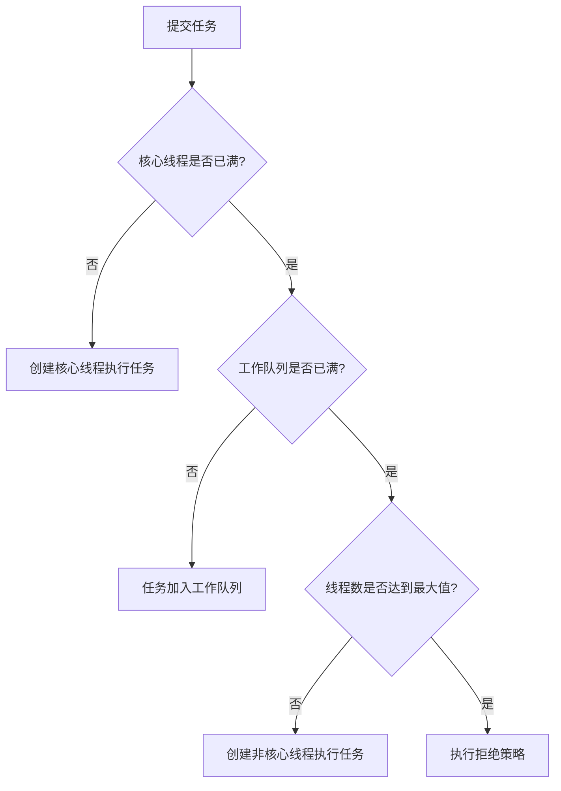

# 一、详细介绍java线程池内部结构，工作原理；写出代码实现线程池对任务的并发处理

# Java线程池详解与实现

## 一、线程池内部结构

### 1. 核心组件

线程池(ThreadPoolExecutor)主要由以下核心组件构成：

| 组件                | 作用                                                                 |
|---------------------|----------------------------------------------------------------------|
| **核心线程池(corePool)** | 常驻的工作线程，即使空闲也不会被回收                                |
| **工作队列(workQueue)**  | 用于存放待处理任务的阻塞队列                                        |
| **最大线程池(maximumPool)** | 当工作队列满了之后可以创建的最大线程数                              |
| **线程工厂(threadFactory)** | 创建新线程的工厂类                                                  |
| **拒绝策略(rejectedPolicy)** | 当线程池和工作队列都满时的处理策略                                  |
| **存活时间(keepAliveTime)** | 非核心线程空闲时的存活时间                                          |

### 2. 核心数据结构

```java
public class ThreadPoolExecutor extends AbstractExecutorService {
    // 控制状态和线程数的原子整数
    private final AtomicInteger ctl = new AtomicInteger(ctlOf(RUNNING, 0));
    
    // 工作队列
    private final BlockingQueue<Runnable> workQueue;
    
    // 工作线程集合
    private final HashSet<Worker> workers = new HashSet    
    // 线程工厂
    private volatile ThreadFactory threadFactory;
    
    // 拒绝策略
    private volatile RejectedExecutionHandler handler;
    
    // ...
}
```

## 二、线程池工作原理

### 1. 任务提交流程



### 2. 关键工作步骤

1. **任务提交**：调用`execute()`或`submit()`方法
2. **线程创建**：
   - 当前线程数 < corePoolSize → 创建新线程(即使有空闲线程)
   - 队列已满且线程数 < maximumPoolSize → 创建新线程
3. **任务排队**：线程数 ≥ corePoolSize时，任务进入工作队列
4. **任务拒绝**：队列和线程池都满时，执行拒绝策略
5. **线程回收**：非核心线程空闲超过keepAliveTime后被回收

## 三、线程池实现代码示例

### 1. 自定义线程池实现

```java
import java.util.HashSet;
import java.util.concurrent.BlockingQueue;
import java.util.concurrent.LinkedBlockingQueue;
import java.util.concurrent.TimeUnit;
import java.util.concurrent.atomic.AtomicInteger;

public class CustomThreadPool {
    // 线程池状态
    private volatile boolean isRunning = true;
    
    // 核心参数
    private final int corePoolSize;
    private final int maximumPoolSize;
    private final long keepAliveTime;
    private final TimeUnit unit;
    private final BlockingQueue<Runnable> workQueue;
    
    // 工作线程集合
    private final HashSet<Worker> workers = new HashSet    private final AtomicInteger threadCount = new AtomicInteger(0);
    
    // 构造方法
    public CustomThreadPool(int corePoolSize, int maximumPoolSize,
                          long keepAliveTime, TimeUnit unit,
                          BlockingQueue<Runnable> workQueue) {
        this.corePoolSize = corePoolSize;
        this.maximumPoolSize = maximumPoolSize;
        this.keepAliveTime = keepAliveTime;
        this.unit = unit;
        this.workQueue = workQueue;
    }
    
    // 执行任务
    public void execute(Runnable task) {
        if (task == null) throw new NullPointerException();
        if (!isRunning) throw new IllegalStateException("ThreadPool not running");
        
        // 1. 当前线程数 < corePoolSize → 创建新线程
        if (threadCount.get() < corePoolSize) {
            if (addWorker(task, true)) {
                return;
            }
        }
        
        // 2. 尝试将任务加入队列
        if (workQueue.offer(task)) {
            // 检查线程池状态
            if (!isRunning && workQueue.remove(task)) {
                rejectTask(task);
            } else if (threadCount.get() == 0) {
                addWorker(null, false); // 创建新的非核心线程
            }
        }
        // 3. 队列已满 → 尝试创建非核心线程
        else if (!addWorker(task, false)) {
            // 4. 线程数已达max → 拒绝任务
            rejectTask(task);
        }
    }
    
    // 添加工作线程
    private boolean addWorker(Runnable firstTask, boolean core) {
        if (threadCount.get() >= (core ? corePoolSize : maximumPoolSize)) {
            return false;
        }
        
        boolean workerStarted = false;
        boolean workerAdded = false;
        Worker worker = new Worker(firstTask);
        Thread thread = worker.thread;
        
        if (thread != null) {
            synchronized (workers) {
                if (isRunning) {
                    workers.add(worker);
                    workerAdded = true;
                }
            }
            
            if (workerAdded) {
                thread.start();
                workerStarted = true;
                threadCount.incrementAndGet();
            } else {
                worker.thread.interrupt();
            }
        }
        return workerStarted;
    }
    
    // 工作线程类
    private final class Worker implements Runnable {
        final Thread thread;
        Runnable firstTask;
        
        Worker(Runnable firstTask) {
            this.firstTask = firstTask;
            this.thread = new Thread(this);
        }
        
        @Override
        public void run() {
            runWorker(this);
        }
    }
    
    // 运行工作线程
    private void runWorker(Worker worker) {
        Runnable task = worker.firstTask;
        worker.firstTask = null;
        
        while (task != null || (task = getTask()) != null) {
            try {
                task.run();
            } finally {
                task = null; // 帮助GC
            }
        }
        
        synchronized (workers) {
            workers.remove(worker);
            threadCount.decrementAndGet();
        }
    }
    
    // 从队列获取任务
    private Runnable getTask() {
        boolean timed = threadCount.get() > corePoolSize;
        
        try {
            return timed ? 
                workQueue.poll(keepAliveTime, unit) :
                workQueue.take();
        } catch (InterruptedException e) {
            return null;
        }
    }
    
    // 拒绝任务策略
    private void rejectTask(Runnable task) {
        System.out.println("Task rejected: " + task.toString());
    }
    
    // 关闭线程池
    public void shutdown() {
        isRunning = false;
        synchronized (workers) {
            for (Worker worker : workers) {
                worker.thread.interrupt();
            }
        }
    }
}
```

### 2. 使用示例

```java
public class ThreadPoolDemo {
    public static void main(String[] args) {
        // 创建自定义线程池
        CustomThreadPool pool = new CustomThreadPool(
            2,  // 核心线程数
            4,  // 最大线程数
            60, // 空闲时间
            TimeUnit.SECONDS,
            new LinkedBlockingQueue<>(10) // 任务队列
        );
        
        // 提交20个任务
        for (int i = 0; i < 20; i++) {
            final int taskId = i;
            pool.execute(() -> {
                System.out.println(Thread.currentThread().getName() + 
                    " executing task " + taskId);
                try {
                    Thread.sleep(1000); // 模拟任务执行
                } catch (InterruptedException e) {
                    Thread.currentThread().interrupt();
                }
            });
        }
        
        // 关闭线程池
        try {
            Thread.sleep(5000);
            pool.shutdown();
        } catch (InterruptedException e) {
            e.printStackTrace();
        }
    }
}
```

## 四、标准线程池使用

Java通过`Executors`提供了几种常用线程池：

### 1. 固定大小线程池

```java
ExecutorService fixedPool = Executors.newFixedThreadPool(5);
fixedPool.execute(() -> {
    System.out.println("Task running in fixed thread pool");
});
```

### 2. 可缓存线程池

```java
ExecutorService cachedPool = Executors.newCachedThreadPool();
Future<String> future = cachedPool.submit(() -> {
    return "Result from cached thread pool";
});
```

### 3. 单线程池

```java
ExecutorService singlePool = Executors.newSingleThreadExecutor();
singlePool.submit(() -> {
    System.out.println("Task running in single thread executor");
});
```

### 4. 定时任务线程池

```java
ScheduledExecutorService scheduledPool = Executors.newScheduledThreadPool(3);
scheduledPool.scheduleAtFixedRate(() -> {
    System.out.println("Periodic task running");
}, 1, 1, TimeUnit.SECONDS);
```

## 五、关键注意事项

1. **线程池大小设置**：
   - CPU密集型：`核心数 + 1`
   - IO密集型：`核心数 * (1 + 平均等待时间/平均计算时间)`

2. **任务队列选择**：
   - `LinkedBlockingQueue`：无界队列(小心OOM)
   - `ArrayBlockingQueue`：有界队列
   - `SynchronousQueue`：直接传递队列

3. **拒绝策略**：
   - AbortPolicy(默认)：抛出RejectedExecutionException
   - CallerRunsPolicy：由调用线程执行
   - DiscardOldestPolicy：丢弃队列最旧任务
   - DiscardPolicy：静默丢弃新任务

4. **资源关闭**：
   - `shutdown()`：温和关闭，处理完队列任务
   - `shutdownNow()`：立即中断所有线程

通过合理配置线程池参数，可以优化系统性能并防止资源耗尽问题。


# 一、详细介绍java线程池内部结构，工作原理；写出代码实现线程池对任务的并发处理

Java 线程池是并发编程中的核心组件之一，它通过复用线程、控制资源消耗、提高响应速度，极大地提升了多线程程序的性能和稳定性。下面将从 **线程池的内部结构、工作原理** 出发，并结合 **代码实现一个简单的任务并发处理示例**，全面讲解。

---

## 一、Java 线程池的内部结构

Java 中的线程池主要由 `java.util.concurrent.ThreadPoolExecutor` 类实现，其核心结构包括以下几个关键组成部分：

### 1. **核心线程数（corePoolSize）**
- 线程池中**长期保留的线程数量**。
- 即使这些线程空闲，也不会被销毁（除非设置了 `allowCoreThreadTimeOut(true)`）。

### 2. **最大线程数（maximumPoolSize）**
- 线程池中允许存在的**最大线程数量**。
- 当任务队列已满且核心线程都在工作时，会创建新线程，直到达到此值。

### 3. **任务队列（workQueue）**
- 存放待执行任务的阻塞队列。
- 常见实现：
  - `LinkedBlockingQueue`：无界队列（默认）
  - `ArrayBlockingQueue`：有界队列
  - `SynchronousQueue`：不存储元素，每个插入必须等待取出

### 4. **非核心线程空闲存活时间（keepAliveTime）**
- 超过 `corePoolSize` 的线程在空闲时的存活时间。
- 超时后会被回收。

### 5. **线程工厂（ThreadFactory）**
- 用于创建新线程。
- 可自定义线程名称、是否为守护线程等。

### 6. **拒绝策略（RejectedExecutionHandler）**
- 当线程池关闭或任务队列和线程数都达到上限时，新提交的任务将被拒绝。
- 常见策略：
  - `AbortPolicy`：抛出 `RejectedExecutionException`（默认）
  - `CallerRunsPolicy`：由调用者线程直接执行任务
  - `DiscardPolicy`：静默丢弃任务
  - `DiscardOldestPolicy`：丢弃队列中最老的任务，然后重试提交

---

## 二、线程池的工作原理（任务调度流程）

当调用 `execute(Runnable command)` 提交任务时，线程池按以下顺序处理：

```text
1. 如果当前线程数 < corePoolSize：
   → 创建新线程执行任务（即使有空闲线程）

2. 否则，如果 workQueue 未满：
   → 将任务加入队列等待空闲线程处理

3. 否则，如果当前线程数 < maximumPoolSize：
   → 创建“非核心线程”立即执行任务

4. 否则：
   → 执行拒绝策略
```

### 🔄 工作流程图（文字描述）：

```
提交任务
   ↓
线程数 < corePoolSize？ → 是 → 创建核心线程执行
   ↓否
队列未满？             → 是 → 入队等待
   ↓否
线程数 < max？         → 是 → 创建非核心线程执行
   ↓否
执行拒绝策略
```

> ⚠️ 注意：使用 `SynchronousQueue` 时，任务不会入队，而是直接尝试交给空闲线程；若无空闲线程且线程数未达上限，则新建线程。

---

## 三、Java 线程池代码实现：并发处理任务

下面是一个完整的示例，使用 `ThreadPoolExecutor` 实现多任务并发处理。

### ✅ 场景说明：
模拟多个用户请求下载文件，每个任务独立执行。

```java
import java.util.concurrent.*;
import java.util.Random;

public class ThreadPoolExample {

    public static void main(String[] args) {
        // 自定义线程工厂，便于调试
        ThreadFactory threadFactory = new ThreadFactory() {
            private int counter = 0;

            @Override
            public Thread newThread(Runnable r) {
                return new Thread(r, "CustomThread-" + (++counter));
            }
        };

        // 拒绝策略：由主线程执行
        RejectedExecutionHandler handler = new ThreadPoolExecutor.CallerRunsPolicy();

        // 创建线程池
        ThreadPoolExecutor executor = new ThreadPoolExecutor(
                2,              // corePoolSize: 核心线程数 2
                4,              // maximumPoolSize: 最大线程数 4
                60L,            // keepAliveTime: 非核心线程空闲 60 秒后回收
                TimeUnit.SECONDS,// 时间单位
                new ArrayBlockingQueue10), // 任务队列：最多容纳 10 个等待任务
                threadFactory,  // 线程工厂
                handler         // 拒绝策略
        );

        // 模拟提交 20 个任务
        Random random = new Random();
        for (int i = 1; i <= 20; i++) {
            final int taskId = i;
            Runnable task = () -> {
                String threadName = Thread.currentThread().getName();
                System.out.println("任务 " + taskId + " 正在由线程 " + threadName + " 执行...");

                // 模拟任务耗时（1~3秒）
                try {
                    Thread.sleep(1000 + random.nextInt(2000));
                } catch (InterruptedException e) {
                    Thread.currentThread().interrupt();
                    System.out.println("任务 " + taskId + " 被中断");
                }

                System.out.println("任务 " + taskId + " 执行完成");
            };

            // 提交任务
            executor.execute(task);
        }

        // 关闭线程池（不再接收新任务，等待已提交任务完成）
        executor.shutdown();

        // 可选：等待所有任务完成（最多等待 10 分钟）
        try {
            if (!executor.awaitTermination(10, TimeUnit.MINUTES)) {
                System.out.println("线程池未在规定时间内终止");
            }
        } catch (InterruptedException e) {
            executor.shutdownNow();
            Thread.currentThread().interrupt();
        }

        System.out.println("所有任务已处理完毕，主线程退出。");
    }
}
```

---

## 四、运行结果示例（部分输出）

```text
任务 1 正在由线程 CustomThread-1 执行...
任务 2 正在由线程 CustomThread-2 执行...
任务 3 正在由线程 CustomThread-3 执行...
任务 4 正在由线程 CustomThread-4 执行...
任务 5 正在由线程 CustomThread-1 执行...
...
任务 1 执行完成
任务 3 执行完成
任务 5 执行完成
...
所有任务已处理完毕，主线程退出。
```

> 说明：可以看到线程被复用，任务并发执行，体现了线程池的优势。

---

## 五、常见线程池工具类（Executors）

Java 提供了 `Executors` 工具类来快速创建常用线程池，但**生产环境建议手动创建 `ThreadPoolExecutor`**，避免潜在风险。

| 方法 | 说明 | 风险 |
|------|------|------|
| `newFixedThreadPool(n)` | 固定大小线程池 | 使用无界队列，可能导致 OOM |
| `newCachedThreadPool()` | 缓存线程池，线程空闲 60s 回收 | 线程数无上限，可能创建过多线程 |
| `newSingleThreadExecutor()` | 单线程池 | 适合顺序执行任务 |
| `newScheduledThreadPool(n)` | 支持定时/周期性任务 | 适用于调度任务 |

> ✅ 推荐：**始终使用 `ThreadPoolExecutor` 显式构造**，便于控制资源。

---

## 六、最佳实践建议

1. **合理设置核心参数**：
   - CPU 密集型任务：`corePoolSize = CPU 核心数 + 1`
   - IO 密集型任务：`corePoolSize = 2 * CPU 核心数` 或更高

2. **使用有界队列**：防止内存溢出（OOM）

3. **监控线程池状态**：
   - `getActiveCount()`：当前活跃线程数
   - `getQueue().size()`：等待任务数
   - `getCompletedTaskCount()`：已完成任务数

4. **优雅关闭线程池**：
   - 使用 `shutdown()` + `awaitTermination()`
   - 避免 `shutdownNow()` 强制中断（除非必要）

5. **记录日志或集成监控系统**（如 Prometheus）

---

## 七、总结

| 组件 | 作用 |
|------|------|
| `corePoolSize` | 保持的最小线程数 |
| `workQueue` | 存放待处理任务 |
| `maximumPoolSize` | 最大可扩容线程数 |
| `keepAliveTime` | 非核心线程空闲存活时间 |
| `RejectedExecutionHandler` | 任务拒绝时的处理策略 |

✅ **线程池本质是一个“生产者-消费者”模型**：
- 生产者：提交任务的线程
- 消费者：工作线程从队列取任务执行

通过合理配置，线程池能有效平衡资源使用与并发性能，是高并发系统的基石。

---

📌 **结语**：掌握线程池的原理与使用，是 Java 工程师进阶的必经之路。建议在实际项目中结合监控、日志和压测不断优化线程池参数。
