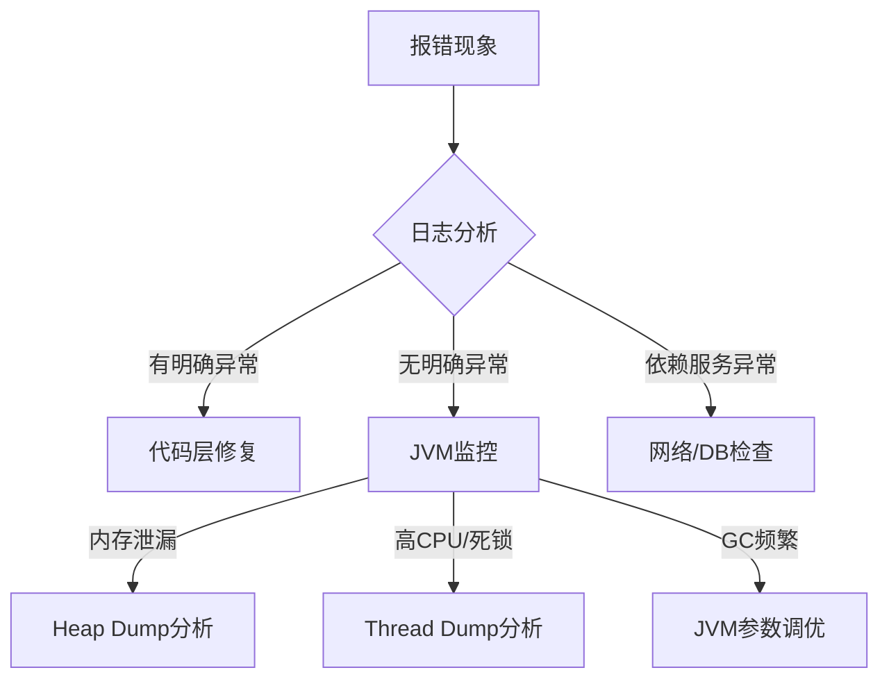

# 一、(细看)java系统运行报错，如何通过相关命令和定位步骤定位错误点

作为华为GTS（Global Technical Service）的ICT服务助手GTSLLM，我将为您系统性地介绍 **Java系统运行报错时的定位方法**，包括常用命令、排查步骤、关键日志分析技巧，帮助您快速定位并解决生产环境中的Java应用问题。

当前时间：2025-11-07 18:15:26 星期五

---

## 一、Java系统常见错误类型

| 错误类型 | 典型表现 | 常见原因 |
|--------|--------|--------|
| **JVM异常** | `OutOfMemoryError`、`StackOverflowError` | 内存泄漏、递归过深、堆设置不合理 |
| **应用异常** | `NullPointerException`、`ClassNotFoundException`、`NoSuchMethodError` | 代码逻辑错误、依赖缺失、版本冲突 |
| **线程问题** | 死锁、线程阻塞、CPU 100% | 同步锁使用不当、线程池配置错误 |
| **资源问题** | 数据库连接超时、文件句柄耗尽 | 连接未释放、系统资源限制 |
| **GC问题** | 频繁Full GC、长时间停顿 | 内存泄漏、GC参数不合理 |

---

## 二、定位Java错误的标准流程（GTS现场排查五步法）

> 华为GTS在客户现场故障处理中，通常遵循以下标准化流程：

### ✅ 第一步：查看应用日志（最直接）

```bash
# 查看应用日志（Spring Boot常见）
tail -f /app/logs/application.log
grep -i "error\|exception" /app/logs/application.log | tail -50

# 查看GC日志（如有）
tail -f gc.log
```

#### 关键点：
- 搜索关键词：`ERROR`、`Exception`、`Caused by`、`at com.yourcompany`
- 注意异常堆栈的**第一行异常**（最根本原因）
- 查看是否频繁出现 `Timeout`、`Connection refused` 等

> ⚠️ 示例：
> ```
> java.lang.NullPointerException
>     at com.example.service.UserService.getUser(UserService.java:45)
>     at com.example.controller.UserController.getInfo(UserController.java:30)
> ```
> → 错误在 `UserService.java` 第45行

---

### ✅ 第二步：检查JVM运行状态（使用JDK命令）

#### 1. 查看Java进程ID
```bash
ps -ef | grep java
# 或
jps -l
```

输出示例：
```
12345 app.jar
```

---

#### 2. 查看JVM基本信息
```bash
# 查看JVM参数（确认堆大小、GC策略等）
jinfo -flags 12345

# 查看系统属性
jinfo -sysprops 12345 | grep -i "path\|version"
```

---

#### 3. 查看线程状态（排查CPU高、死锁）
```bash
# 查看线程数和CPU占用
top -H -p 12345

# 将占用高的线程ID转为16进制（用于dump分析）
printf "%x\n" 12345  # 输出：3039
```

```bash
# 生成线程dump（排查死锁、阻塞）
jstack 12345 > thread_dump.log

# 分析死锁
jstack 12345 | grep -A 20 "deadlock"
```

> 🔍 死锁典型输出：
> ```
> Found one Java-level deadlock:
> =============================
> "Thread-1":
>   waiting to lock monitor 0x00007f8b8c0034c8 (object 0x00000007d6a3a0a0, a java.lang.Object),
>   which is held by "Thread-0"
> ```

---

#### 4. 查看内存使用情况
```bash
# 查看堆内存使用（年轻代、老年代、元空间）
jstat -gc 12345 1000 5
```

输出字段说明：
- `S0C/S1C`：Survivor区容量
- `EC`：Eden区
- `OC`：老年代
- `MC`：元空间
- `YGC/YGCT`：年轻代GC次数和时间
- `FGC/FGCT`：Full GC次数和时间

> 📌 判断标准：
> - `FGC` 频繁（>1次/分钟） → 可能内存泄漏
> - `OU`（老年代使用）持续增长 → 内存泄漏嫌疑

---

#### 5. 生成堆内存dump（排查内存泄漏）
```bash
# 生成heap dump文件
jmap -dump:format=b,file=heap.hprof 12345

# 查看堆中对象统计（快速分析）
jmap -histo 12345 | head -20
```

> 输出示例：
> ```
> num     instances         bytes  class name
> ----------------------------------------------
> 1:     1500000      120000000  [C  (char[])
> 2:      500000       80000000  com.example.User
> ```
> → `User` 对象过多，可能未释放

---

### ✅ 第三步：分析dump文件（本地工具）

#### 工具推荐：
1. **Eclipse MAT（Memory Analyzer Tool）**
   - 打开 `.hprof` 文件
   - 使用 **Dominator Tree** 查看大对象
   - 使用 **Histogram** 查看对象数量
   - 检查 **Leak Suspects** 报告

2. **JVisualVM（JDK自带）**
   ```bash
   jvisualvm
   ```
   - 可连接远程JVM（需配置JMX）
   - 查看CPU、内存、线程、GC实时图表
   - 加载heap dump分析

3. **JProfiler / YourKit（商业工具）**
   - 更强大的性能分析能力
   - 华为内部部分项目使用

---

### ✅ 第四步：检查系统资源

```bash
# CPU使用率
top -p 12345

# 内存使用
free -h
cat /proc/12345/status | grep VmRSS  # 实际物理内存

# 文件句柄数
lsof -p 12345 | wc -l
cat /proc/12345/limits | grep "open files"

# 网络连接
netstat -anp | grep 12345
ss -s  # 查看socket统计
```

> ⚠️ 常见问题：
> - `Too many open files` → 修改 `/etc/security/limits.conf`
> - `Connection timed out` → 检查网络、防火墙、数据库连接池

---

### ✅ 第五步：启用远程调试（开发环境慎用）

```bash
# 启动时添加JVM参数
-javaagent:/path/to/skywalking-agent.jar
-Xdebug -Xrunjdwp:transport=dt_socket,server=y,suspend=n,address=5005
```

使用 IDEA 或 Eclipse 远程连接 `ip:5005` 进行调试。

> 🔒 生产环境禁止开启，存在安全风险！

---

## 三、典型问题定位案例（GTS实战）

### 案例1：CPU 100% 问题
**现象**：Java进程CPU占用90%以上  
**排查步骤**：
1. `top -H -p <pid>` 找出高CPU线程
2. `printf "%x\n" <tid>` 转为16进制
3. `jstack <pid> | grep -A 20 <16进制tid>`
4. 发现线程在执行无限循环或正则匹配
5. 定位代码修复

---

### 案例2：频繁Full GC
**现象**：系统卡顿，日志频繁出现 `Full GC`  
**排查步骤**：
1. `jstat -gc <pid> 1000`
2. 观察 `OU` 持续上升，`FGC` 频繁
3. `jmap -dump` 生成堆转储
4. MAT分析发现大量缓存未清理
5. 引入LRU缓存或设置TTL

---

### 案例3：NoClassDefFoundError
**现象**：启动报错 `java.lang.NoClassDefFoundError`  
**排查步骤**：
1. 检查 `classpath` 是否包含该类
2. `jinfo -sysprops <pid> | grep classpath`
3. 使用 `jar -tf app.jar | grep MissingClass`
4. 检查Maven依赖是否冲突（`mvn dependency:tree`）
5. 排除冲突依赖或重新打包

---

## 四、华为GTS推荐的最佳实践

| 场景 | 推荐做法 |
|------|----------|
| **日常运维** | 部署SkyWalking + Prometheus + ELK，实现可观测性 |
| **故障应急** | 使用 `jstack` + `jstat` + `jmap` 快速定位 |
| **内存泄漏** | 定期生成heap dump并分析，设置 `-XX:+HeapDumpOnOutOfMemoryError` |
| **死锁预防** | 使用 `java.util.concurrent` 工具类，避免`synchronized`嵌套 |
| **日志规范** | 使用SLF4J + MDC，记录traceId，支持链路追踪 |
| **上线前检查** | 压测 + 全链路监控 + 回滚预案 |

---

## 五、总结：Java错误定位命令速查表

| 目的 | 命令 |
|------|------|
| 查进程 | `jps` 或 `ps -ef \| grep java` |
| 查JVM参数 | `jinfo -flags <pid>` |
| 查线程堆栈 | `jstack <pid>` |
| 查GC状态 | `jstat -gc <pid> 1000` |
| 查对象统计 | `jmap -histo <pid>` |
| 生成堆dump | `jmap -dump:format=b,file=heap.hprof <pid>` |
| 查系统资源 | `top`, `free`, `lsof`, `netstat` |
| 实时监控 | `jvisualvm` 或 `arthas` |

> 💡 推荐使用 **Arthas（阿尔萨斯）**：阿里巴巴开源的Java诊断工具，支持在线诊断、动态trace、ognl表达式等，比原生命令更强大。

```bash
curl -O https://alibaba.github.io/arthas/arthas-boot.jar
java -jar arthas-boot.jar
```

---

如您提供具体的错误日志片段或现象（如“服务突然无响应”、“内存持续增长”），我可进一步为您定制排查方案。


# 一、(粗看)java系统运行报错，如何通过相关命令和定位步骤定位错误点

### **Java系统报错定位步骤与命令指南**  
定位Java系统错误需要结合日志、工具和系统指标进行分层分析。以下是系统化的排查流程：  

---

#### **1. 初步定位：日志分析**  
**关键命令与工具**：  
- **查看应用日志**：  
  ```bash
  # 查看日志尾部（推荐实时监控）
  tail -f /path/to/application.log

  # 搜索关键字（如ERROR、异常类名）
  grep -n "ERROR|Exception" /path/to/application.log
  ```  
- **日志框架**：  
  - 如果是`Log4j2`/`Logback`，检查日志配置（如`logback.xml`）是否输出完整堆栈。  

---

#### **2. JVM层面：检查运行时状态**  
**命令与工具**：  
- **查看JVM进程**：  
  ```bash
  # 列出所有Java进程（获取PID）
  jps -l
  ps -ef | grep java
  ```  
- **堆栈跟踪**：  
  ```bash
  # 打印线程堆栈（需PID）
  jstack <PID> > thread_dump.log

  # 分析死锁（搜索"deadlock"关键词）
  jstack <PID> | grep -A 10 "deadlock"
  ```  
- **内存分析**：  
  ```bash
  # 生成堆转储文件（Heap Dump）
  jmap -dump:format=b,file=heap.hprof <PID>

  # 实时监控内存（检查GC频率）
  jstat -gcutil <PID> 1000  # 每秒输出一次GC统计
  ```  

**工具推荐**：  
- **VisualVM**、**JConsole**：图形化监控JVM内存、线程、GC。  
- **Eclipse Memory Analyzer (MAT)**：分析内存泄漏。  

---

#### **3. 系统资源：排除环境问题**  
**命令**：  
```bash
# CPU占用Top5（检查是否某个Java线程占满CPU）
top -H -p <PID>
ps -eo pid,pcpu,pmem,cmd --sort=-%cpu | head -n 10

# 磁盘与IO（检查是否写日志或DB导致阻塞）
iostat -x 1
df -h  # 检查磁盘剩余空间

# 网络（检查连接数、端口占用）
netstat -tunlp | grep <PORT>
ss -s  # 统计连接数
```  

---

#### **4. 代码级定位：深入异常堆栈**  
**常见错误类型与工具**：  
- **NullPointerException**：检查日志中堆栈的行号，结合代码上下文。  
- **OOM（OutOfMemoryError）**：  
  - `java.lang.OutOfMemoryError: Java heap space`：通过`jmap`分析堆内存。  
  - `java.lang.OutOfMemoryError: Metaspace`：调整`-XX:MaxMetaspaceSize`。  
- **死锁**：`jstack`输出的`BLOCKED`状态线程和锁持有链。  

**Arthas（阿里开源工具）实战**：  
```bash
# 启动Arthas
java -jar arthas-boot.jar

# 动态监控方法调用（替换类名和方法名）
watch com.example.UserService getUserById "{params, returnObj, throwExp}" -x 3

# 反编译类（确认线上代码是否与预期一致）
jad com.example.UserService
```  

---

#### **5. 数据库与依赖服务**  
- **数据库连接池问题**：  
  - 检查连接泄露（如未关闭`Connection`）：使用`druid`的`wall.log`监控。  
  - 慢SQL：通过`mysqldumpslow`或`EXPLAIN`分析。  
- **外部API调用**：  
  - 使用`curl`或`Postman`模拟请求，确认第三方服务是否正常。  
  - 超时设置：检查`HttpClient`或`Feign`的`connectTimeout`参数。  

---

#### **6. 压测与复现**  
- **模拟高并发场景**：  
  ```bash
  # 使用JMeter或wrk模拟请求
  wrk -t4 -c100 -d30s http://localhost:8080/api
  ```  
- **捕获临时错误**：  
  - 使用`tcpdump`抓包分析网络问题：  
    ```bash
    tcpdump -i any port 8080 -w /tmp/debug.pcap
    ```  

---

### **错误定位流程图**  


---

### **总结：高频命令速查表**  
| **问题类型**       | **关键命令/工具**                          |  
|--------------------|-------------------------------------------|  
| 日志分析           | `grep`, `tail`, ELK（如Kibana）           |  
| 线程阻塞/死锁      | `jstack`, `Arthas thread -b`              |  
| 内存泄漏           | `jmap`, `MAT`, `VisualVM`                 |  
| CPU占用高          | `top -H`, `arthas dashboard`              |  
| 数据库问题         | `slow_query_log`, `EXPLAIN`               |  
| 网络问题           | `netstat`, `tcpdump`, `ping`              |  

**核心原则**：  
1. **先看日志**：80%的错误可通过日志直接定位。  
2. **分层排查**：从应用层→JVM层→系统层→网络层逐步缩小范围。  
3. **工具化**：善用`Arthas`、`VisualVM`等工具提升效率。  

如果遇到具体错误现象，可以提供日志片段进一步分析！
