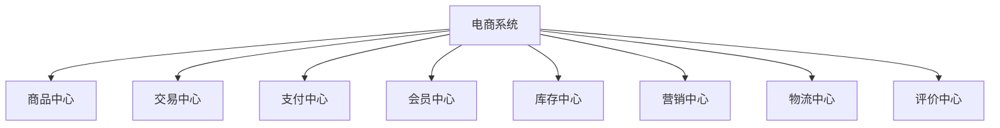
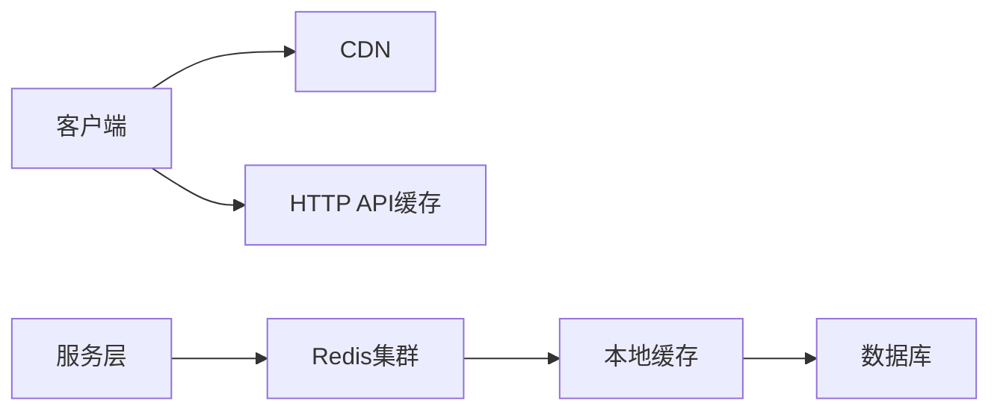
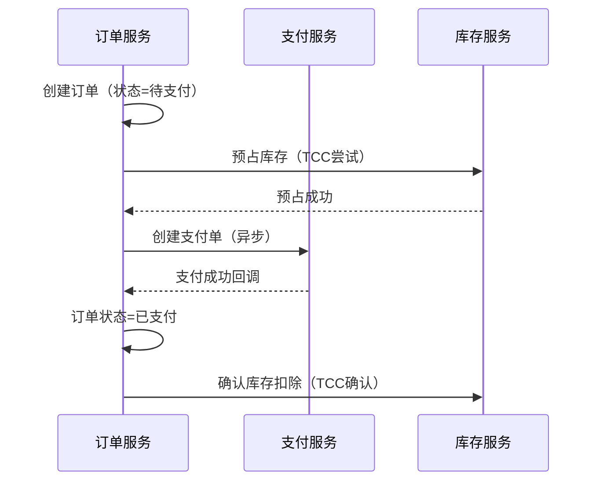

## MySQL MHA


    MySQL MHA (Master High Availability) 是一个开源的高可用性解决方案，
	用于在 MySQL 主从复制架构中提供自动化的主库故障转移和数据一致性保障。
	当主库发生故障时，MHA 可以在极短的时间内（通常 0-30 秒）自动将一个数据最完整的从库提升为新的主库，
	并将其他从库重新指向新的主库，以保证数据库服务的连续性。 
**主要组成部分**
<br>


    MHA Manager (管理节点): 部署在独立的服务器上，负责监控集群状态、检测主库故障并执行切换操作。
    MHA Node (数据节点): 运行在每台 MySQL 服务器上，负责保存和同步 binlog 日志，并在故障转移时修复从库之间的差异，确保数据一致性。 

**工作原理**
<br>


    **监控**: MHA Manager 持续监控主从复制集群中的节点状态。
    **故障检测**: 当 MHA Manager 连续多次无法连接到主库时，会判定主库发生故障。
    **故障转移**:
    MHA 会尝试从原主库保存未同步的 binlog。
    在从库中选择一个拥有最新数据的节点作为新的主库。
    MHA 会将原主库的 binlog 同步到新主库。
    然后，MHA 会将其他从库的复制源更改为新主库。
    在线切换: 除了自动故障转移，MHA 还支持按需进行主从切换。 

**主要优势**
<br>


    **自动化**: 能够自动完成故障检测和切换，减少人工干预。
    **快速切换**: 可以在 0-30 秒内完成故障转移，显著减少服务中断时间。
    **数据一致性**: 通过修复从库之间的差异日志，最大程度地保证所有从库的数据一致性。
    **透明性**: 整个故障转移过程对应用程序是透明的，不影响现有应用
	
<br>


# 一、(细读)如何拆分设计微服务、设计缓存、设计消息中间件、设计mysql数据库，满足高并发、高性能、高可用；以电商系统为例

在电商系统中，面对**高并发、高性能、高可用**（3H）的挑战，必须从 **微服务拆分、缓存设计、消息中间件、MySQL 数据库架构** 四个核心维度进行系统性设计。以下以典型电商系统（如京东、淘宝级别）为例，详细说明如何构建一个支撑千万级用户、百万级 QPS 的现代化电商架构。

---

## 一、微服务拆分设计（Microservices Architecture）

### ✅ 拆分原则
- **领域驱动设计（DDD）**：按业务边界划分服务
- **高内聚、低耦合**：每个服务职责单一
- **数据自治**：每个服务拥有独立数据库
- **可独立部署与弹性伸缩**

### ✅ 电商系统典型微服务拆分

| 微服务 | 职责 | 关键能力 |
|--------|------|----------|
| **用户服务（User Service）** | 注册、登录、权限、个人信息 | JWT/OAuth2、Redis 缓存会话 |
| **商品服务（Product Service）** | 商品信息、分类、品牌、上下架 | Elasticsearch 支持搜索 |
| **库存服务（Inventory Service）** | 库存查询、扣减、回滚、预警 | 分布式锁、Redis 原子操作 |
| **订单服务（Order Service）** | 创建订单、状态管理、查询 | 分库分表、幂等控制 |
| **支付服务（Payment Service）** | 支付请求、回调、对账 | 第三方支付对接（微信/支付宝） |
| **购物车服务（Cart Service）** | 添加商品、修改数量、删除 | Redis 存储（高性能读写） |
| **优惠券/促销服务（Promotion Service）** | 优惠券发放、使用、满减规则 | 限流防刷、库存预占 |
| **物流服务（Logistics Service）** | 发货、物流跟踪、签收 | 对接快递100等API |
| **搜索服务（Search Service）** | 商品全文检索、筛选、排序 | Elasticsearch + RabbitMQ 同步 |
| **通知服务（Notification Service）** | 短信、邮件、站内信 | 异步发送，消息队列解耦 |
| **配置中心（Config Service）** | 统一配置管理 | Nacos / Apollo |
| **API 网关（Gateway Service）** | 路由、鉴权、限流、熔断 | Spring Cloud Gateway / Kong |

> ✅ 示例：下单流程涉及多个服务协同：
```
用户 → 网关 → 订单服务 → 库存服务（扣库存）→ 支付服务（发起支付）→ 物流服务（发货）
```

---

## 二、缓存设计（Cache Design）

缓存是电商系统性能的核心保障，用于加速读取、减少数据库压力。

### ✅ 缓存使用场景与策略

| 场景 | 缓存方案 | 说明 |
|------|----------|------|
| **商品信息** | Redis String / Hash | TTL 缓存，热点商品预热 |
| **库存** | Redis + DB 双写 | 扣减用 Lua 脚本保证原子性 |
| **购物车** | Redis Hash | `HSET cart:uid pid count` |
| **会话（Session）** | Redis | 支持集群登录 |
| **用户信息** | Redis | 减少用户服务调用 |
| **秒杀库存** | Redis 预减库存 | 防止超卖，配合消息队列 |
| **推荐商品** | Redis ZSet | 按热度排序 |
| **分布式锁** | Redis SETNX / Redlock | 扣库存、创建订单时使用 |

### ✅ 缓存高可用设计
- 使用 **Redis Cluster** 实现数据分片与故障转移
- 开启 **持久化（AOF + RDB）** 防止重启丢数据
- 设置合理 **TTL**，避免内存爆炸
- **缓存穿透**：布隆过滤器 + 空值缓存
- **缓存击穿**：热点 key 加互斥锁
- **缓存雪崩**：随机过期时间 + 多级缓存（本地 + Redis）

---

## 三、消息中间件设计（Message Queue）

消息队列用于**解耦、异步、削峰、最终一致性**，是电商系统的“中枢神经”。

### ✅ 使用场景

| 场景 | MQ 作用 |
|------|--------|
| **异步下单** | 下单成功后，异步扣库存、发优惠券、通知物流 |
| **订单状态变更** | 订单关闭、支付成功等事件广播 |
| **日志收集** | 操作日志、交易日志异步写入 Kafka + ELK |
| **库存回滚** | 支付超时 → 消息触发库存回滚 |
| **数据同步** | 商品变更 → 同步到搜索、推荐系统 |

### ✅ 消息中间件选型对比

| 中间件 | 适用场景 | 优点 | 缺点 |
|--------|----------|------|------|
| **RocketMQ** | 金融级可靠消息 | 事务消息、顺序消息、低延迟 | 运维复杂 |
| **Kafka** | 高吞吐、日志类 | 百万级 QPS，持久化好 | 延迟略高 |
| **RabbitMQ** | 中小规模、灵活路由 | 易用、插件丰富 | 吞吐量较低 |

> ✅ **推荐：RocketMQ**（支持事务消息、顺序消息、高吞吐）

### ✅ 消息可靠性保障

| 问题 | 解决方案 |
|------|----------|
| **消息丢失** | 生产者 ACK + Broker 持久化 + 消费者手动 ACK |
| **重复消费** | 消费端幂等（如 `order_id` 去重表） |
| **顺序消息** | 使用 RocketMQ 顺序消息（同一订单 ID 分到同一队列） |
| **消息积压** | 扩容消费者 + 批量消费 + 死信队列 |

---

## 四、MySQL 数据库设计（满足 3H）

### ✅ 1. 数据库垂直拆分（按服务分库）

| 服务 | 数据库 |
|------|--------|
| 用户服务 | `db_user` |
| 商品服务 | `db_product` |
| 订单服务 | `db_order` |
| 库存服务 | `db_inventory` |
| 支付服务 | `db_payment` |
| 促销服务 | `db_promotion` |

> ✅ 避免跨库 JOIN，服务间通过 API 调用获取数据

---

### ✅ 2. 数据库水平拆分（分库分表）

#### 典型大表：订单表 `t_order`

- 单表数据量大（亿级）
- 写多读少，查询多按 `user_id`、`order_no`、`create_time`

#### 分库分表策略

| 策略 | 说明 | 推荐 |
|------|------|
| **按用户 ID 哈希** | `user_id % 1024` → 分 1024 张表 | 查询用户订单快 |
| **按订单号分片** | 订单号包含分片位（如 `202511070001_03`） | 路由明确 |
| **时间分片** | 按月建表（`t_order_202511`） | 便于归档 |

> ✅ 推荐组合策略：
- 先按 `user_id % 64` 分库
- 再按 `create_time` 分表（每月一张）

#### 工具支持
- **Apache ShardingSphere**：支持分库分表、读写分离、分布式主键
- **自研分片中间件**（如阿里 TDDL）

---

### ✅ 3. 读写分离

- 主库（Master）：处理写入（下单、支付）
- 从库（Slave）：多个只读副本，处理查询（订单列表、商品详情）
- 使用 **MySQL 主从复制 + GTID** 保证一致性
- 中间件自动路由读写（ShardingSphere）

> ⚠️ 注意：主从延迟 → 查询可能读到旧数据 → 业务容忍最终一致性

---

### ✅ 4. 索引优化

```sql
-- 订单表关键索引
CREATE INDEX idx_user_time ON t_order(user_id, create_time DESC);
CREATE UNIQUE INDEX uk_order_no ON t_order(order_no);
CREATE INDEX idx_status_time ON t_order(status, create_time DESC);
```

> ✅ 避免 SELECT *，只查必要字段

---

### ✅ 5. 冷热分离与归档

- **热数据**：最近 6 个月订单 → 在线 MySQL
- **冷数据**：6 个月前 → 归档到 **HBase / Tidb / Hive**
- 提供“历史订单”功能，支持跨年查询

---

## 五、典型高并发场景设计（以“秒杀”为例）

### 场景需求：
- 瞬时百万请求抢购 1000 件商品
- 要求：不超卖、高性能、可用

### 设计方案：

1. **前置拦截**：
   - 网关层限流（如 10万 QPS）
   - 用户身份校验（登录态 + 验证码）

2. **缓存预热**：
   - 商品信息、库存提前加载到 Redis

3. **库存扣减**：
   - Redis 原子操作 `DECR` 扣库存
   - 超卖则直接返回“已售罄”

4. **异步下单**：
   - 扣库存成功 → 发送 MQ 消息 → 订单服务异步创建订单
   - 用户看到“排队中”，提升体验

5. **数据库持久化**：
   - MQ 消费者将订单写入分库分表的 `t_order`

6. **防刷机制**：
   - 同一用户限购1件
   - IP/设备指纹限流

> ✅ 架构图简述：
```
用户 → 网关（限流）→ Redis（扣库存）→ MQ → 订单服务（异步落库）
```

---

## 六、高可用保障体系

| 层级 | 措施 |
|------|------|
| **接入层** | Nginx + Keepalived 高可用，LVS 负载均衡 |
| **服务层** | 无状态设计，K8s 自动扩缩容 |
| **缓存层** | Redis Cluster + 哨兵 |
| **数据库层** | MySQL MHA + 分库分表 |
| **消息层** | RocketMQ 多副本 + 主从切换 |
| **容灾** | 多机房部署（同城双活 + 异地容灾） |
| **监控** | Prometheus + ELK + SkyWalking 全链路追踪 |

---

## 七、性能优化建议

| 优化点 | 措施 |
|--------|------|
| **连接池** | 使用 HikariCP，合理设置最大连接数 |
| **SQL 优化** | 避免 SELECT *, 合理建索引，慢查询日志监控 |
| **批量操作** | 批量插入用 `INSERT INTO ... VALUES(...),(...)` |
| **连接复用** | HTTP Keep-Alive，减少建连开销 |
| **限流降级** | Sentinel 限流，异常时降级为静态页 |
| **CDN 加速** | 静态资源（图片、JS）走 CDN |

---

## 八、总结：电商系统 3H 架构全景图

```
+---------------------+
|     客户端（App/PC）   |
+----------+----------+
           |
           v
+---------------------+     +---------------------+
|   Nginx / LVS       |     |   限流 / 鉴权 / 路由    |
+----------+----------+     +----------+----------+
           |                           |
           v                           v
+---------------------------------------------------------+
|                微服务集群（Spring Cloud / Dubbo）         |
|  User  Product  Order  Inventory  Payment  Promotion     |
+---------------------------------------------------------+
           |        |        |         |          |
           v        v        v         v          v
+---------------------------------------------------------+
|                   消息中间件（RocketMQ / Kafka）           |
|                   异步解耦、削峰、广播、最终一致性             |
+---------------------------------------------------------+
           |
           v
+---------------------------------------------------------+
|                   MySQL 集群（分库分表 + 读写分离）         |
|   db_order_0~63   db_product   db_inventory   db_user     |
+---------------------------------------------------------+

+---------------------------------------------------------+
|                   高可用与监控体系                           |
|   Redis Cluster, MHA, Sentinel, 多机房, Prometheus      |
+---------------------------------------------------------+
```

---

## 九、结论与建议

| 目标 | 实现方式 |
|------|----------|
| **高并发** | 微服务 + 缓存 + 消息队列 + 分库分表 |
| **高性能** | Redis 加速 + 异步处理 + CDN + 分片 |
| **高可用** | 多副本 + 故障转移 + 限流降级 + 多机房容灾 |

✅ **最佳实践建议**：
1. **核心链路优先保障**：下单、支付、库存必须高可用
2. **缓存为王**：90% 的读请求应在缓存中解决
3. **异步化设计**：非核心操作走 MQ
4. 使用 **ShardingSphere** 管理分库分表
5. 建立 **全链路压测** 机制，模拟大促流量

> 🔚 **最终目标**：构建一个支持 **千万级用户、百万级 QPS、99.99% 可用性** 的现代化电商系统，具备应对“双11”级别大促的能力。


# 一、(粗读)如何拆分设计微服务、设计缓存、设计消息中间件、设计mysql数据库，满足高并发、高性能、高可用；以电商系统为例

# 电商系统高并发全栈架构设计指南

## 一、微服务精细化拆分（电商场景）

### 1. 领域模型划分



### 2. 服务分层设计

| 层级 | 服务示例 | 特点 | 扩展策略 |
|------|---------|------|---------|
| 基础服务 | 商品/会员 | 稳定 | 集群部署 |
| 核心交易 | 订单/支付 | 关键 | 多活部署 |
| 运营服务 | 营销/CRM | 多变 | 弹性扩缩 |
| 数据服务 | 推荐/分析 | 计算密集 | GPU节点 |

### 3. 关键拆分原则
- **订单服务**：
  - 拆分为正向订单（创建/支付）和逆向订单（退货/退款）
  - 使用不同数据库实例隔离
- **商品服务**：
  - 分离商品基础信息（低频变更）和商品实时数据（库存/价格）
- **库存服务**：
  - 单独部署防止雪崩
  - 采用预扣减+最终一致方案

## 二、缓存体系深度优化

### 1. 多级缓存架构



### 2. Redis详细设计

#### 2.1 业务分片方案
```plaintext
缓存集群1（16节点）：
  - 商品信息_cache
  - 类目树_cache
  
缓存集群2（8节点）：
  - 库存预扣_cache
  - 秒杀库存_cache
  
缓存集群3（4节点）：
  - 用户_session
  - 购物车_data
```

#### 2.2 热点缓存解决方案
```java
// 热点商品缓存方案
public Product getProduct(Long id) {
    // 布隆过滤器预检
    if (!bloomFilter.mightContain(id)) {
        return null;
    }
    
    // 本地缓存（1秒过期）
    Product product = caffeineCache.get(id);
    if (product == null) {
        // Redis集群访问（带随机过期时间）
        product = redis.get(productKey(id));
        if (product == null) {
            // 数据库查询+缓存重建
            product = db.get(id);
            redis.setex(productKey(id), 60 + random(30), product);
        }
        caffeineCache.put(id, product, 1, TimeUnit.SECONDS);
    }
    return product;
}
```

## 三、消息中间件设计

### 1. 消息拓扑设计

```plaintext
[订单创建] → [订单Topic] → [支付系统]
                          → [库存系统]
                          → [物流系统]
                          → [数据分析]

[用户行为] → [日志Topic] → [实时推荐]
                        → [风控系统]
```

### 2. RocketMQ最佳实践

#### 2.1 消息分类配置
| 消息类型 | 配置 | 特性 |
|---------|------|------|
| 订单消息 | 同步刷盘 | 零丢失 |
| 日志消息 | 异步刷盘 | 高吞吐 |
| 秒杀消息 | 内存模式 | 低延迟 |

#### 2.2 消费者组设计
```java
// 订单消费者示例
consumer.subscribe("order_topic", "*", new MessageListenerOrderly() {
    @Override
    public ConsumeOrderlyStatus consume(List<MessageExt> msgs, ConsumeOrderlyContext context) {
        // 保证相同订单号顺序处理
        processOrders(msgs);
        return ConsumeOrderlyStatus.SUCCESS;
    }
});

// 库存消费者（批量模式）
consumer.subscribe("inventory_topic", "*", new MessageListenerConcurrently() {
    @Override
    public ConsumeConcurrentlyStatus consume(List<MessageExt> msgs, ConsumeConcurrentlyContext context) {
        batchUpdateStock(msgs); // 批量处理
        return ConsumeConcurrentlyStatus.CONSUME_SUCCESS;
    }
});
```

## 四、MySQL高可用架构

### 1. 分库分表策略

#### 1.1 订单库拆分方案
```sql
-- 原始订单表
CREATE TABLE orders (
    order_id VARCHAR(32),
    user_id BIGINT,
    seller_id BIGINT,
    amount DECIMAL(10,2),
    created_time DATETIME
);

-- 拆分策略（64库×16表）
-- 分库键：user_id % 64
-- 分表键：FLOOR(UNIX_TIMESTAMP(created_time)/2592000) % 16 
-- （按月分表，2592000=30天秒数）
```

#### 1.2 全局ID生成方案
```java
// 雪花算法改进版
public class SnowflakeIdGenerator {
    private final long datacenterId;  // 数据中心ID
    private final long workerId;      // 机器ID
    private long sequence = 0L;
    private long lastTimestamp = -1L;
    
    public synchronized long nextId() {
        long timestamp = timeGen();
        if (timestamp < lastTimestamp) {
            throw new RuntimeException("时钟回拨异常");
        }
        
        if (lastTimestamp == timestamp) {
            sequence = (sequence + 1) & SEQUENCE_MASK;
            if (sequence == 0) {
                timestamp = tilNextMillis(lastTimestamp);
            }
        } else {
            sequence = 0L;
        }
        
        lastTimestamp = timestamp;
        
        return ((timestamp - TWEPOCH) << TIMESTAMP_SHIFT)
            | (datacenterId << DATACENTER_SHIFT)
            | (workerId << WORKER_SHIFT)
            | sequence;
    }
}
```

### 2. 主从架构优化

```plaintext
[主库集群]
  ├─ 写组1（订单库）→ [从库] → [从库]（跨机房）
  ├─ 写组2（商品库）→ [从库] 
  └─ 写组3（支付库）→ [从库] → [灾备库]

[流量调度]
  ├─ Atlas读写分离
  ├─ 故障自动切换
  └─ 秒级监控探测
```

## 五、高并发场景解决方案

### 1. 秒杀系统设计

#### 1.1 多级库存保护
```plaintext
[前端] → 静态化+答题 → 
[网关] → 令牌桶限流 → 
[Redis] → 预减库存 → 
[MQ] → 队列削峰 → 
[MySQL] → 最终扣减
```

#### 1.2 核心代码示例
```java
// Redis库存预减（Lua脚本）
String script =
    "local stock = tonumber(redis.call('get', KEYS[1])) " +
    "if stock > 0 then " +
    "   redis.call('decr', KEYS[1]) " +
    "   return 1 " +
    "end " +
    "return 0";

Long result = redisTemplate.execute(
    new DefaultRedisScript<>(script, Long.class),
    Collections.singletonList("seckill:stock:" + itemId));
```

### 2. 分布式事务方案

#### 2.1 订单创建流程


## 六、容灾与监控体系

### 1. 多活数据中心

```plaintext
[上海中心]                   [北京中心]
  ├─ 全量业务部署               ├─ 全量业务部署
  ├─ 数据双向同步               └─ 流量随时切换
  └─ 70%日常流量
  
[同步层]
  ├─ Canal实现MySQL增量同步
  ├─ Redis CRDT数据结构
  └→ 200ms内数据一致性
```

### 2. 监控大盘设计

#### 2.1 核心指标
- **数据库层**：
  - 主从延迟
  - 慢查询比例
  - QPS/TPS波动
  
- **服务层**：
  - 接口成功率
  - 平均/99线延迟
  - 线程池状态

#### 2.2 报警规则示例
```yaml
# Prometheus Alert Rules
- alert: HighDatabaseLatency
  expr: mysql_global_status_seconds_behind_master > 5
  for: 2m
  labels:
    severity: critical
  annotations:
    summary: "数据库主从延迟过高 ({{ $value }}秒)"
    
- alert: OrderServiceError
  expr: rate(order_service_errors_total[1m]) > 10
  for: 5m
  labels:
    severity: warning
```
