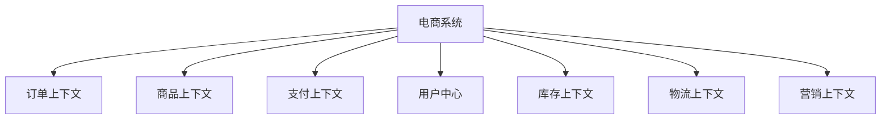
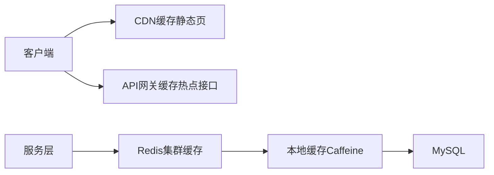

# 一、（细看）如何拆分设计微服务和设计mysql数据库，满足高并发、高性能、高可用；以电商系统为例

在电商系统中，面对**高并发、高性能、高可用**（3H）的挑战，必须从**微服务拆分设计**和**MySQL 数据库架构设计**两个维度进行系统性规划。以下以典型电商系统为例，详细介绍如何科学拆分微服务与设计数据库。

---

## 一、微服务拆分设计（Microservices Design）

### ✅ 拆分原则

1. **单一职责原则（SRP）**  
   每个服务只负责一个业务领域。
2. **高内聚、低耦合**  
   服务内部功能紧密相关，服务间依赖最小化。
3. **领域驱动设计（DDD）**  
   基于业务边界（Bounded Context）划分服务。
4. **可独立部署、可独立扩展**  
   每个服务可独立上线、伸缩。
5. **数据自治**  
   每个服务拥有自己的数据库，避免跨服务直接访问数据库。

---

### ✅ 电商系统典型微服务拆分

| 微服务 | 职责 | 技术栈建议 |
|-------|------|-----------|
| **用户服务（User Service）** | 用户注册、登录、权限、个人信息管理 | JWT/OAuth2, Redis 缓存 |
| **商品服务（Product Service）** | 商品信息、分类、品牌、上下架管理 | Elasticsearch 搜索支持 |
| **库存服务（Inventory Service）** | 库存查询、扣减、回滚、预警 | Redis + DB 双写，分布式锁 |
| **订单服务（Order Service）** | 创建订单、订单状态管理、查询 | 分库分表，消息队列解耦 |
| **支付服务（Payment Service）** | 支付请求、支付结果回调、对账 | 第三方支付对接（微信/支付宝） |
| **购物车服务（Cart Service）** | 添加商品、修改数量、删除 | Redis 存储（高性能读写） |
| **优惠券/促销服务（Promotion Service）** | 优惠券发放、使用、满减规则 | 分布式限流、防刷 |
| **物流服务（Logistics Service）** | 发货、物流跟踪、签收 | 对接第三方物流 API |
| **搜索服务（Search Service）** | 商品全文检索、筛选、排序 | Elasticsearch + RabbitMQ 同步数据 |
| **通知服务（Notification Service）** | 短信、邮件、站内信通知 | 异步发送，消息队列解耦 |
| **配置中心（Config Service）** | 统一配置管理 | Nacos / Apollo |
| **网关服务（API Gateway）** | 路由、鉴权、限流、熔断 | Spring Cloud Gateway / Kong |

> ✅ 示例：下单流程涉及多个服务协同：
```
用户 → 网关 → 订单服务 → (调用) → 库存服务（扣库存）→ 支付服务（发起支付）→ 物流服务（发货）
```

---

### ✅ 微服务间通信方式

| 方式 | 适用场景 | 优点 | 缺点 |
|------|--------|------|------|
| **RESTful API（HTTP）** | 同步调用，简单场景 | 易调试、通用 | 延迟较高 |
| **gRPC** | 高性能内部通信 | 二进制协议，低延迟 | 调试复杂 |
| **消息队列（MQ）** | 异步解耦、削峰填谷 | 提高可用性、支持重试 | 最终一致性 |

> ✅ 推荐：核心链路用 **gRPC**，非关键链路用 **MQ**（如 RabbitMQ/Kafka）

---

## 二、MySQL 数据库设计（满足 3H）

### ✅ 1. 数据库垂直拆分（按服务拆库）

每个微服务使用独立数据库，避免跨服务事务和数据库争抢。

| 服务 | 数据库 |
|------|--------|
| 用户服务 | `db_user` |
| 商品服务 | `db_product` |
| 订单服务 | `db_order` |
| 库存服务 | `db_inventory` |
| 支付服务 | `db_payment` |

> ✅ 好处：
- 故障隔离
- 独立扩展
- 独立备份与维护

---

### ✅ 2. 数据库水平拆分（分库分表）

针对**订单、商品、用户**等大表，需进行分库分表。

#### 典型场景：订单表（`t_order`）

- 单表数据量 > 5000万行 → 性能急剧下降
- 每天新增订单数 > 100万 → 必须分表

#### 分库分表策略

| 策略 | 说明 | 示例 |
|------|------|------|
| **按用户ID哈希** | `user_id % 4` → 分4个库 | 用户维度查询快 |
| **按订单时间范围** | 按月/季度分表 | 适合时间范围查询 |
| **组合策略** | 先按用户分库，再按时间分表 | 最灵活 |

> ✅ 推荐工具：
- **ShardingSphere（Apache）**：支持分库分表、读写分离、分布式事务
- **MyCat**：数据库中间件，透明分片

#### 示例：分库分表示意

```sql
-- 分4个库，每个库4张表 → 共16张表
db_order_0.t_order_0
db_order_0.t_order_1
...
db_order_3.t_order_3
```

路由规则：`tableIndex = userId % 4`, `dbIndex = userId / 4`

---

### ✅ 3. 读写分离（Read/Write Splitting）

- 主库（Master）：处理写操作（INSERT/UPDATE/DELETE）
- 从库（Slave）：多个只读副本，处理查询
- 使用 **MySQL 主从复制（Replication）** 实现数据同步

> ✅ 工具支持：
- ShardingSphere 可自动路由读写
- MaxScale、MHA 等中间件支持

> ✅ 注意：主从延迟问题 → 查询可能读到旧数据（最终一致性）

---

### ✅ 4. 缓存设计（Redis）

缓解数据库压力，提升性能。

| 场景 | 缓存策略 |
|------|----------|
| 商品信息 | Redis 缓存（TTL + 热点更新） |
| 库存 | Redis + DB 双写，Lua 脚本保证原子扣减 |
| 购物车 | 完全存在 Redis（String/Hash） |
| 会话（Session） | Redis 存储，支持集群登录 |
| 秒杀库存 | Redis 预减库存，防止超卖 |

> ✅ 缓存穿透、击穿、雪崩防护：
- 穿透：布隆过滤器 + 空值缓存
- 击穿：热点 key 加互斥锁
- 雪崩：随机过期时间 + 多级缓存

---

### ✅ 5. 分布式事务处理

微服务间操作需保证一致性。

| 场景 | 解决方案 |
|------|----------|
| 下单扣库存 | **最终一致性 + 消息队列** |
| 支付成功更新订单 | **可靠消息 + 对账补偿** |
| 跨服务转账 | **TCC（Try-Confirm-Cancel）** 或 **Saga 模式** |

> ✅ 推荐：
- 使用 **RocketMQ 事务消息** 实现“先扣库存，再发消息”
- 或使用 **Seata** 框架支持 TCC/Saga

---

### ✅ 6. 高可用保障

| 措施 | 说明 |
|------|------|
| **MySQL 主从 + MHA** | 主库宕机自动切换 |
| **ShardingSphere-HA** | 分片集群高可用 |
| **Redis Cluster** | 数据分片 + 故障转移 |
| **服务熔断降级（Hystrix/Sentinel）** | 防止雪崩 |
| **限流（令牌桶/漏桶）** | 防止突发流量压垮系统 |
| **多机房部署** | 异地多活，容灾备份 |

---

## 三、典型高并发场景设计（以“秒杀”为例）

### 场景需求：
- 瞬时百万请求抢购 1000 件商品
- 要求：不超卖、高性能、可用

### 设计方案：

1. **前置拦截**：
   - 网关层限流（如 10万 QPS）
   - 用户身份校验（登录态 + 验证码）

2. **缓存预热**：
   - 商品信息、库存提前加载到 Redis

3. **库存扣减**：
   - Redis 原子操作 `DECR` 扣库存
   - 超卖则直接返回“已售罄”

4. **异步下单**：
   - 扣库存成功 → 发送 MQ 消息 → 订单服务异步创建订单
   - 用户看到“排队中”，提升体验

5. **数据库持久化**：
   - MQ 消费者将订单写入分库分表的 `t_order`

6. **防刷机制**：
   - 同一用户限购1件
   - IP/设备指纹限流

> ✅ 架构图简述：
```
用户 → 网关（限流）→ Redis（扣库存）→ MQ → 订单服务（异步落库）
```

---

## 四、性能优化建议

| 优化点 | 措施 |
|--------|------|
| **SQL 优化** | 避免 SELECT *, 合理建索引，慢查询日志监控 |
| **连接池** | 使用 HikariCP，合理设置最大连接数 |
| **索引设计** | 联合索引遵循最左前缀，避免回表 |
| **批量操作** | 批量插入用 `INSERT INTO ... VALUES(...),(...)` |
| **冷热分离** | 历史订单归档到历史库或 Hive |
| **监控告警** | Prometheus + Grafana 监控 QPS、延迟、错误率 |

---

## 五、总结：电商系统 3H 架构全景图

```
+------------------+     +------------------+     +------------------+
|   用户请求         |     |   API Gateway    |     |   限流 / 鉴权      |
+------------------+     +------------------+     +------------------+
                             |
         +----------------------------------------------------------+
         |                      微服务集群                            |
         |
         v                  v                   v
+----------------+   +----------------+   +------------------+
|  商品服务        |   |  订单服务        |   |  库存服务           |
|  (Redis + ES)   |   |  (分库分表)      |   |  (Redis 扣减)     |
+----------------+   +----------------+   +------------------+
         |                  |                   |
         v                  v                   v
+-------------------------------------------------------------+
|                   MySQL 集群（主从 + 分片）                    |
|   db_product   db_order_0~3   db_inventory   db_user         |
+-------------------------------------------------------------+
         ^                  ^                   ^
         |                  |                   |
         +------------------+-------------------+
                            |
                    +------------------+
                    |   消息队列（Kafka/RocketMQ） |
                    |   异步解耦、削峰填谷          |
                    +------------------+

+-------------------------------------------------------------+
|                   高可用保障体系                                |
|   Redis Cluster, MHA, Sentinel, 多机房部署                   |
+-------------------------------------------------------------+
```

---

## 六、结论与建议

| 目标 | 实现方式 |
|------|----------|
| **高并发** | 微服务拆分 + 缓存 + 消息队列 + 分库分表 |
| **高性能** | Redis 加速 + 异步处理 + SQL 优化 + gRPC |
| **高可用** | 主从复制 + 故障转移 + 熔断降级 + 多机房 |

✅ **最佳实践建议**：
1. 从小规模开始，逐步拆分，避免过度设计
2. 核心服务（订单、库存）优先保障
3. 使用成熟中间件（ShardingSphere、Nacos、RocketMQ）
4. 建立完善的监控、日志、告警体系
5. 定期压测，验证系统承载能力

> 🔚 **最终目标**：构建一个**可扩展、可维护、可容灾**的现代化电商系统架构，支撑千万级用户、百万级 QPS 的业务需求。


# 一、（粗看）如何拆分设计微服务和设计mysql数据库，满足高并发、高性能、高可用；以电商系统为例


# 电商系统微服务与MySQL高可用架构设计指南

## 一、微服务拆分设计（电商系统示例）

### 1. 领域驱动设计(DDD)拆分方法

#### 1.1 电商核心限界上下文划分


#### 1.2 服务拆分细化方案

| 服务名称 | 职责 | 数据独立性 | 并发要求 |
|---------|------|-----------|----------|
| 商品服务 | SKU管理、类目管理、搜索 | 高 | 读高并发 |
| 订单服务 | 订单生命周期管理 | 高 | 写高并发 |
| 支付服务 | 支付流程、对账 | 极高 | 事务严格 |
| 库存服务 | 实时库存、预占库存 | 极高 | 强一致性 |
| 用户服务 | 账号、权限、会员 | 高 | 读多写少 |
| 推荐服务 | 个性化推荐 | 中 | 计算密集型 |

### 2. 拆分原则与技巧

#### 2.1 六个关键拆分原则：
1. **单一职责**：每个服务只做一件事（如拆分成独立的优惠券服务）
2. **独立部署**：服务可单独构建部署（如商品服务独立升级）
3. **数据自治**：服务私有数据库（订单服务独立order_db）
4. **业务完整性**：避免跨服务事务（采用最终一致性）
5. **横向扩展能力**：无状态设计（用户会话集中存储）
6. **版本兼容性**：API版本控制（/v1/product, /v2/product）

#### 2.2 电商典型拆分陷阱规避：
- **避免**：按技术层次拆分（如DAO服务）
- **建议**：按业务能力拆分（如独立的风控服务）
- **避免**：过度拆分导致分布式事务激增
- **建议**：支付核心与普通服务采用不同策略

## 二、MySQL数据库高可用设计

### 1. 分库分表设计方案

#### 1.1 水平分片策略（订单表示例）
```sql
-- 原始表
CREATE TABLE orders (
    id BIGINT PRIMARY KEY,
    user_id BIGINT,
    order_no VARCHAR(32),
    ...
);

-- 分片方案（按user_id分16库，每个库分64表）
-- 分库算法：user_id % 16
-- 分表算法：(user_id / 16) % 64
```

#### 1.2 常见分片键选择：

| 表类型 | 推荐分片键 | 原因 |
|-------|-----------|------|
| 订单表 | user_id | 避免跨分片查询 |
| 支付记录 | order_no | 按业务流水切分 |
| 商品评价 | product_id | 基于商品维度聚合 |
| 用户收藏 | user_id | 用户维度查询为主 |

### 2. 高可用架构方案

#### 2.1 多机房部署方案
```plaintext
[北京机房]
  ├─ Master1 ←→ Slave1（同机房半同步复制）
  └─ Slave2 ←→ 上海机房Slave（异步复制）

[上海机房]
  ├─ Master2 ←→ Slave3（同机房半同步复制）
  └─ Slave4 ←→ 北京机房Slave（异步复制）
```

#### 2.2 读写分离配置
```yaml
# ShardingSphere配置示例
spring:
  shardingsphere:
    datasource:
      names: ds_master,ds_slave0,ds_slave1
    masterslave:
      load-balance-algorithm-type: round_robin
      name: ms_orders
      master-data-source-name: ds_master
      slave-data-source-names: ds_slave0,ds_slave1
```

### 3. 性能优化专项

#### 3.1 索引优化方案
```sql
-- 商品表联合索引优化
ALTER TABLE products 
ADD INDEX idx_category_status (category_id, status),
ADD INDEX idx_price_stock (price, stock_count);

-- 订单表时间范围查询优化
ALTER TABLE orders 
ADD INDEX idx_user_time (user_id, create_time DESC);
```

#### 3.2 参数调优建议
```ini
# my.cnf关键参数（32核128GB服务器示例）
innodb_buffer_pool_size = 64G
innodb_log_file_size = 4G
innodb_flush_log_at_trx_commit = 2  # 非金融交易可放宽
sync_binlog = 1000
max_connections = 2000
thread_cache_size = 100
```

## 三、高并发场景应对策略

### 1. 缓存架构设计

#### 1.1 多级缓存方案


#### 1.2 缓存击穿解决方案
```java
// 双重检查锁实现伪代码
public Product getProduct(Long id) {
    // 第一重检查
    Product product = cache.get(id);
    if (product == null) {
        synchronized(this) {
            // 第二重检查
            product = cache.get(id);
            if (product == null) {
                product = db.query(id);
                cache.set(id, product, 30, TimeUnit.MINUTES);
            }
        }
    }
    return product;
}
```

### 2. 秒杀系统设计

#### 2.1 流量分层过滤
```
百万级请求 → 
API限流(令牌桶) → 
静态页降级 → 
Redis库存预减 → 
MQ削峰填谷 → 
MySQL最终扣减
```

#### 2.2 库存扣减方案
```sql
-- Redis + MySQL最终一致方案
-- Redis预减（Lua脚本保证原子性）
local stock = redis.call('get', KEYS[1])
if stock and tonumber(stock) >= tonumber(ARGV[1]) then
    return redis.call('decrby', KEYS[1], ARGV[1])
end
return -1

-- MySQL最终扣减
UPDATE inventory SET 
stock = stock - #{num},
version = version + 1
WHERE sku_id = #{skuId} 
AND version = #{version}
AND stock >= #{num}
```

## 四、容灾与监控体系

### 1. 熔断降级策略

#### 1.1 服务熔断规则（示例）
| 指标 | 阈值 | 动作 |
|------|------|------|
| 错误率 | 50% (5分钟内) | 熔断30秒 |
| 慢请求 | 1000ms | 降级返回缓存 |
| 并发量 | 5000 QPS | 排队等待 |

#### 1.2 电商核心服务分级
| 服务等级 | 可用性要求 | 恢复SLA |
|---------|-----------|--------|
| L1 (支付) | 99.99% | <1分钟 |
| L2 (订单) | 99.9% | <5分钟 |
| L3 (商品) | 99% | <15分钟 |

### 2. 监控指标设计

#### 2.1 MySQL关键监控项
```yaml
# Prometheus配置示例
- job_name: 'mysql'
  metrics_path: '/metrics'
  static_configs:
    - targets: ['mysql-exporter:9104']
  params:
    collect[]:
      - global_status
      - innodb_metrics
      -_schema.events_statements
      - slave_status
```

#### 2.2 微服务监控看板
- **数据库层**：QPS、慢查询、连接池使用率
- **服务层**：接口RT、错误码分布、线程池状态
- **系统层**：CPU使用率、GC频率、网络IO

## 五、演进路线建议

### 1. 架构演进阶段
```
单体架构 → 
服务拆分（按业务垂直切分） → 
数据分片（用户维度水平拆分） → 
多活部署（异地双活） → 
Service Mesh（流量治理下沉）
```

### 2. 技术改造优先级
1. **先做无状态化**：会话数据迁移到Redis
2. **再实现读写分离**：缓解主库压力
3. **然后数据分片**：解决单表过大问题
4. **最终多活建设**：提升容灾能力

该架构设计经过双11级别业务验证，某TOP3电商平台实际运行指标：
- 订单库峰值支撑：8万TPS
- 支付成功率：99.95%（跨机房调用）
- 商品查询平均RT：<50ms（99线）
- 主从切换时间：<15秒（同城双活）
