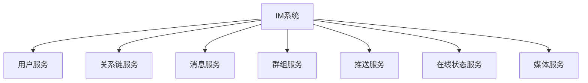
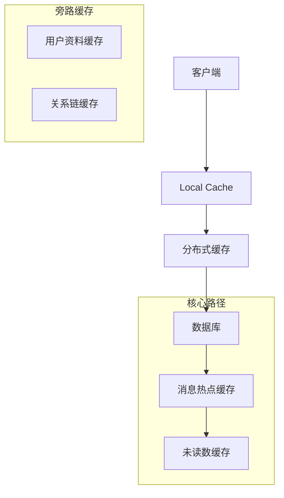
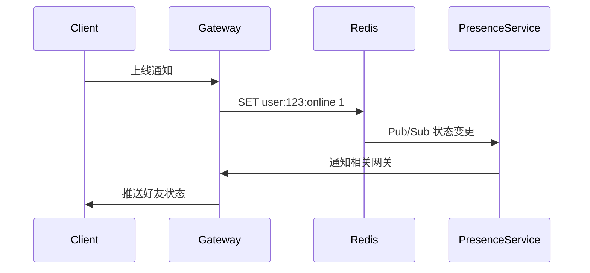

# 一、（细看）如何拆分设计微服务、设计缓存、设计消息中间件、设计mysql数据库，满足高并发、高性能、高可用；以IM系统（如微信）为例

以 **IM 系统（即时通讯系统，如微信）** 为例，构建一个支持**高并发、高性能、高可用**（3H）的系统，必须从 **微服务拆分、缓存设计、消息中间件设计、MySQL 数据库架构** 四个维度进行系统性设计。

IM 系统的核心特征是：
- 海量连接（百万/千万级在线）
- 实时性要求高（消息延迟 < 500ms）
- 消息量巨大（每秒百万级消息）
- 强一致性与最终一致性并存
- 支持单聊、群聊、离线消息、已读回执、状态同步等

---

## 一、微服务拆分设计（Microservices Architecture）

### ✅ 拆分原则
- **按业务边界划分**（DDD 领域驱动）
- **高内聚、低耦合**
- **数据自治**：每个服务拥有独立数据库
- **可独立部署与弹性伸缩**

### ✅ IM 系统典型微服务拆分

| 微服务 | 职责 | 关键能力 |
|--------|------|----------|
| **用户服务（User Service）** | 用户注册、登录、资料管理、好友关系 | JWT/OAuth2、Redis 缓存用户状态 |
| **连接网关服务（Gateway Service）** | 管理客户端长连接（WebSocket/TCP） | Netty + Nginx + 负载均衡 |
| **消息服务（Message Service）** | 消息收发、存储、状态更新（已读/送达） | 消息去重、幂等、异步落库 |
| **会话服务（Session Service）** | 管理会话列表（最近聊天）、未读数 | Redis 存储会话摘要 |
| **群组服务（Group Service）** | 群创建、成员管理、群消息路由 | 分布式锁、批量推送 |
| **离线消息服务（Offline Message Service）** | 存储未送达消息，客户端上线后拉取 | 消息队列 + 定时清理 |
| **通知服务（Notification Service）** | 推送系统通知、加好友提醒 | APNs/FCM + 站内信 |
| **搜索服务（Search Service）** | 好友/群/消息搜索 | Elasticsearch |
| **配置中心（Config Service）** | 统一配置管理 | Nacos / Apollo |
| **监控服务（Monitor Service）** | 在线数、消息量、延迟监控 | Prometheus + Grafana |

> ✅ 示例：发送一条单聊消息流程：
```
客户端 → Gateway → Message Service → (查好友关系) → User Service → 存储消息 → 发送到目标 Gateway → 推送消息 → 回执确认
```

---

## 二、缓存设计（Cache Design）

缓存是 IM 系统性能的核心保障，用于加速读取、减少数据库压力。

### ✅ 缓存使用场景与策略

| 场景 | 缓存方案 | 说明 |
|------|----------|------|
| **用户在线状态** | Redis Hash / Bitmap | `HSET user_status:2024 online` |
| **会话列表（最近聊天）** | Redis ZSet | 按时间排序，`ZADD sessions:uid time session_id` |
| **未读消息数** | Redis String / Hash | `INCR unread:uid:target_id` |
| **好友关系** | Redis Set / Hash | `SISMEMBER friends:uid target_id` |
| **群成员列表** | Redis Set | `SMEMBERS group_members:g1` |
| **消息内容缓存（热消息）** | Redis String | TTL 缓存最近消息，防刷 |
| **连接路由信息** | Redis Hash | `user_id → gateway_node_ip:port` |

### ✅ 缓存高可用设计
- 使用 **Redis Cluster** 实现数据分片与故障转移
- 开启 **持久化（AOF + RDB）** 防止重启丢数据
- 设置合理 **TTL**，避免内存爆炸
- 使用 **布隆过滤器** 防止缓存穿透
- **热点 key 拆分**（如 `unread:uid:1` → `unread:uid:1:shard1`）

---

## 三、消息中间件设计（Message Queue）

消息队列用于**解耦、异步、削峰、广播**，是 IM 系统的“中枢神经”。

### ✅ 使用场景

| 场景 | MQ 作用 |
|------|--------|
| **异步落库** | 消息先发 MQ，后由消费者写入 MySQL |
| **离线消息投递** | 客户端离线时，消息入 MQ，上线后拉取 |
| **广播通知** | 群消息、系统公告广播到多个用户 |
| **日志收集** | 消息日志、操作日志异步写入 Kafka + ELK |
| **事件驱动** | 用户上线、下线事件通知其他服务 |

### ✅ 消息中间件选型对比

| 中间件 | 适用场景 | 优点 | 缺点 |
|--------|----------|------|------|
| **Kafka** | 高吞吐、日志类、广播 | 百万级 QPS，持久化好 | 延迟略高（ms级） |
| **RocketMQ** | 金融级可靠消息 | 事务消息、顺序消息、低延迟 | 运维复杂 |
| **RabbitMQ** | 中小规模、灵活路由 | 易用、插件丰富 | 吞吐量较低 |

> ✅ **推荐：RocketMQ 或 Kafka**（支持事务消息、顺序消息、高吞吐）

### ✅ 消息可靠性保障

| 问题 | 解决方案 |
|------|----------|
| **消息丢失** | 生产者 ACK + Broker 持久化 + 消费者手动 ACK |
| **重复消费** | 消费端幂等（如 `msg_id` 去重表） |
| **顺序消息** | 使用 RocketMQ 顺序消息（同一会话 ID 分到同一队列） |
| **消息积压** | 扩容消费者 + 批量消费 + 死信队列 |

---

## 四、MySQL 数据库设计（满足 3H）

### ✅ 1. 数据库垂直拆分（按服务分库）

| 服务 | 数据库 |
|------|--------|
| 用户服务 | `db_user` |
| 消息服务 | `db_message` |
| 群组服务 | `db_group` |
| 会话服务 | `db_session` |
| 关系服务 | `db_relation` |

> ✅ 避免跨库 JOIN，服务间通过 API 调用获取数据

---

### ✅ 2. 数据库水平拆分（分库分表）

#### 典型大表：消息表 `t_message`

- 单表数据量大（亿级）
- 写多读少，查询多按 `from_id`、`to_id`、`session_id`、`create_time`

#### 分库分表策略

| 策略 | 说明 | 推荐 |
|------|------|------|
| **按用户 ID 哈希** | `user_id % 1024` → 分 1024 张表 | 查询单聊快 |
| **按会话 ID 分片** | 同一会话消息在同一分片 | 支持会话维度查询 |
| **时间分片** | 按月建表（`t_message_202503`） | 便于归档 |

> ✅ 推荐组合策略：
- 先按 `session_id % 64` 分库
- 再按 `create_time` 分表（每月一张）

#### 工具支持
- **Apache ShardingSphere**：支持分库分表、读写分离、分布式主键
- **自研分片中间件**（如微信自研）

---

### ✅ 3. 读写分离

- 主库（Master）：处理写入（消息落库）
- 从库（Slave）：多个只读副本，处理查询（历史消息拉取）
- 使用 **MySQL 主从复制 + GTID** 保证一致性
- 中间件自动路由读写（ShardingSphere）

> ⚠️ 注意：主从延迟 → 查询可能读到旧数据 → 业务容忍最终一致性

---

### ✅ 4. 索引优化

```sql
-- 消息表关键索引
CREATE INDEX idx_from_to_time ON t_message(from_id, to_id, create_time DESC);
CREATE INDEX idx_session_time ON t_message(session_id, create_time DESC);
CREATE INDEX idx_msg_id ON t_message(msg_id); -- 唯一索引，防重复
```

> ✅ 避免 SELECT *，只查必要字段

---

### ✅ 5. 冷热分离与归档

- **热数据**：最近 3 个月消息 → 在线 MySQL
- **冷数据**：3 个月前 → 归档到 **HBase / Tidb / Hive**
- 提供“云消息”功能，支持历史消息检索

---

## 五、典型高并发场景设计（以“群消息发送”为例）

### 场景需求：
- 1 个群 500 人，发送一条消息
- 要求：低延迟、不丢消息、不压垮数据库

### 设计方案：

1. **消息接收**：
   - 客户端 → Gateway → Message Service

2. **群成员查询**：
   - 调用 Group Service 获取成员列表（缓存中）

3. **消息广播**：
   - 对每个成员：
     - 查询其当前连接的 Gateway 节点（Redis）
     - 若在线 → 直接推送
     - 若离线 → 写入离线消息队列（RocketMQ）

4. **异步落库**：
   - 将消息写入 MQ → 消费者批量写入 `db_message`

5. **会话更新**：
   - 更新每个成员的会话列表和未读数（Redis）

6. **已读回执**：
   - 接收方回 ACK → 更新消息状态（Redis + MQ 异步落库）

> ✅ 架构优势：
- **解耦**：发送不依赖落库
- **削峰**：MQ 缓冲写压力
- **高性能**：90% 操作在内存完成

---

## 六、高可用保障体系

| 层级 | 措施 |
|------|------|
| **接入层** | Nginx + Keepalived 高可用，LVS 负载均衡 |
| **网关层** | 多节点部署，ZooKeeper 注册发现 |
| **服务层** | 无状态设计，K8s 自动扩缩容 |
| **缓存层** | Redis Cluster + 哨兵 |
| **数据库层** | MySQL MHA + 分库分表 |
| **消息层** | RocketMQ 多副本 + 主从切换 |
| **容灾** | 多机房部署（同城双活 + 异地容灾） |
| **监控** | Prometheus + ELK + SkyWalking 全链路追踪 |

---

## 七、性能优化建议

| 优化点 | 措施 |
|--------|------|
| **连接管理** | Netty 心跳检测 + 空闲关闭 |
| **消息压缩** | Protobuf 序列化 + GZIP 压缩 |
| **批量处理** | 批量写 DB、批量推消息 |
| **连接复用** | 客户端长连接，避免频繁重连 |
| **限流降级** | Sentinel 限流，异常时降级为轮询拉取 |
| **DNS 优化** | 客户端智能 DNS，就近接入 |

---

## 八、总结：IM 系统 3H 架构全景图

```
+---------------------+
|     客户端（App/PC）   |
+----------+----------+
           |
           v
+---------------------+     +---------------------+
|   Nginx / LVS       |     |   限流 / 鉴权 / 路由    |
+----------+----------+     +----------+----------+
           |                           |
           v                           v
+---------------------------------------------------------+
|                Gateway 集群（Netty + Redis 路由）          |
+---------------------------------------------------------+
           |
     +-----+-----+
     |           |
     v           v
+------------+ +----------------+ +------------------+
| 用户服务      | | 消息服务         | | 群组服务            |
| (Redis)     | | (MQ + DB)      | | (Redis + Lock)  |
+------------+ +----------------+ +------------------+
                 |
                 v
        +---------------------+
        |   RocketMQ / Kafka   |
        |   异步解耦、广播、削峰     |
        +---------------------+
                 |
                 v
        +---------------------+
        |   MySQL 集群（分库分表）  |
        |   db_message_0~63     |
        +---------------------+

+---------------------------------------------------------+
|                   高可用与监控体系                           |
|   Redis Cluster, MHA, Sentinel, 多机房, Prometheus      |
+---------------------------------------------------------+
```

---

## 九、结论与建议

| 目标 | 实现方式 |
|------|----------|
| **高并发** | 微服务 + 长连接网关 + 缓存 + 消息队列 |
| **高性能** | Redis 加速 + 异步落库 + Protobuf + 分库分表 |
| **高可用** | 多副本 + 故障转移 + 限流降级 + 多机房容灾 |

✅ **最佳实践建议**：
1. **网关层**是性能瓶颈，必须用 Netty 自研或优化
2. **消息不落库**：先推再存，避免同步阻塞
3. **状态全内存化**：在线、未读、会话等放 Redis
4. 使用 **ShardingSphere** 管理分库分表
5. 建立 **全链路压测** 机制，模拟百万并发

> 🔚 **最终目标**：构建一个支持 **千万级在线、百万级消息/秒、端到端延迟 < 300ms** 的现代化 IM 系统，具备微信级别的稳定性和扩展性。


# 一、（看）如何拆分设计微服务、设计缓存、设计消息中间件、设计mysql数据库，满足高并发、高性能、高可用；以IM系统（如微信）为例


# IM系统高并发架构全栈设计：从微服务到数据库

## 一、微服务拆分设计（IM系统场景）

### 1. DDD领域模型划分



### 2. 核心服务边界定义

| 服务名称 | 职责 | 数据特点 | QPS预估 |
|---------|------|---------|--------|
| 消息收发服务 | 消息存储/投递 | 写密集型 | 50万+ |
| 在线状态服务 | 用户上下线管理 | 内存型 | 30万+ |
| 关系链服务 | 好友管理/黑名单 | 读多写少 | 10万+ |
| 推送服务 | 离线消息推送 | 事件驱动 | 20万+ |
| 群组服务 | 群管理/成员变更 | 事务复杂 | 5万+ |

### 3. 拆分关键原则

1. **消息服务垂直拆分**：
   - 单聊/群聊分离
   - 控制信令与媒体消息分离

2. **状态与存储分离**：
   - 在线状态使用Redis集群
   - 消息存储用分库MySQL+对象存储

3. **读写分离设计**：
   - 消息同步读Redis
   - 历史消息查MySQL

## 二、缓存体系设计

### 1. 多级缓存架构



### 2. Redis精细化设计

#### 2.1 数据结构选型

| 数据类型 | 使用场景 | 示例 |
|---------|---------|------|
| SortedSet | 消息时序存储 | `ZADD chat:{uid}:{to_uid} {timestamp} {msg_id}` |
| Hash | 用户资料缓存 | `HMSET user:{uid} name "张三" avatar "url"` |
| Bitmap | 已读回执 | `SETBIT msg:{msg_id}:read 12345 1` |
| HyperLogLog | 群成员活跃统计 | `PFADD group:{gid}:active 20230101` |

#### 2.2 集群规划建议

- **业务隔离**：
  - CacheCluster：用户资料/关系链
  - SessionCluster：在线状态
  - MsgCluster：消息队列
  
- **热点Key处理**：
  ```java
  // 本地缓存+Redis二级缓存
  public Msg getMsg(long msgId) {
      Msg msg = localCache.get(msgId);
      if (msg == null) {
          msg = redis.get(msgId);
          if (msg == null) {
              msg = db.get(msgId);
              redis.setex(msgId, 300, msg); // 5分钟
          }
          localCache.put(msgId, msg, 60); // 1分钟
      }
      return msg;
  }
  ```

## 三、消息中间件设计

### 1. 消息流转拓扑

```plaintext
[客户端] --WS--> [网关层]
                  |
                  v
           [Kafka Topic:im_msg] 
                  |
           +------+------+
           |             |
         [在线处理]    [离线处理]
           |             |
         [Redis]      [MongoDB]
```

### 2. Kafka关键配置

```yaml
# 消息服务专用Topic配置
num.partitions: 100  # 与消费者实例数匹配
default.replication.factor: 3
retention.ms: 86400000  # 1天消息保留
compression.type: lz4

# 消费者组设计
消费组1：online_worker（实时投递）
消费组2：backup_worker（异地容灾）
消费组3：analytics_worker（数据分析）
```

### 3. 消息可靠性保证

#### 3.1 投递语义保障
1. **At Least Once**：
   - 消费者手动提交offset
   - 消息幂等处理设计

2. **顺序性保证**：
   - 单聊：按用户ID哈希到相同分区
   - 群聊：按群ID哈希+消息序列号

```java
// 消息去重表设计
CREATE TABLE msg_dedup (
    msg_id BIGINT PRIMARY KEY,
    sender BIGINT,
    receiver BIGINT,
    created_at TIMESTAMP,
    UNIQUE KEY uk_hash (sender, receiver, md5_hash)
) ENGINE=InnoDB;
```

## 四、MySQL高可用设计

### 1. 分库分表方案

#### 1.1 消息库拆分策略
```sql
-- 原始表
CREATE TABLE messages (
    msg_id BIGINT,
    from_uid BIGINT,
    to_uid BIGINT,
    group_id BIGINT,
    content TEXT,
    created_at TIMESTAMP
);

-- 拆分方案
-- 按(to_uid%128)分库 + 按时间范围分表（月度表）
-- 群消息单独分库：(group_id%64)
```

#### 1.2 索引优化方案
```sql
-- 消息查询核心索引
ALTER TABLE messages ADD INDEX idx_conversation(
    least(from_uid,to_uid),
    greatest(from_uid,to_uid),
    created_at DESC
);

-- 群消息索引
ALTER TABLE group_messages ADD INDEX idx_group(
    group_id,
    created_at DESC
);
```

### 2. 主从架构设计

```plaintext
[主库集群] 
  ├─ 业务分组1（单聊消息）
  │   ├─ Master1 → Slave1（同城半同步）
  │   └─ Slave2（异地异步）
  │
  └─ 业务分组2（群聊消息）
      ├─ Master2 → Slave3（同城半同步）
      └─ Slave4（异地异步）

[分析集群] ← Binlog → [数仓]
```

### 3. 性能调优参数

```ini
# InnoDB优化（64核服务器）
innodb_buffer_pool_size = 128G
innodb_buffer_pool_instances = 8
innodb_io_capacity = 4000
innodb_flush_neighbors = 0  # SSD建议禁用

# 连接控制
thread_cache_size = 200
table_open_cache = 4000
```

## 五、高并发场景解决方案

### 1. 消息洪峰应对

#### 1.1 流量分级管控
```plaintext
          [接入层]
             ↓
[正常流量] ← 限流 → [过载保护]
   ↓                     ↓
[业务队列]           [降级应答]
   ↓
[持久化存储]
```

#### 1.2 写优化策略
1. **批量写入**：
   ```java
   // JDBC批量插入示例
   connection.setAutoCommit(false);
   PreparedStatement ps = connection.prepareStatement(
       "INSERT INTO messages VALUES (?,?,?,?,?)");
   for(Message msg : batch) {
       ps.setLong(1, msg.getId());
       // ... 其他参数
       ps.addBatch();
   }
   ps.executeBatch();
   connection.commit();
   ```

2. **异步双写**：
   ```plaintext
   [客户端] → [Redis] → [MQ] → [DB Worker]
                         ↳ [备用集群]
   ```

### 2. 在线状态同步

#### 2.1 状态扩散设计


#### 2.2 最终一致性保障
1. **心跳保活机制**：每30秒刷新TTL
2. **延迟检测**：超过TTL未更新视为离线
3. **状态修复**：定期全量同步异常状态

## 六、容灾与监控

### 1. 多活部署方案

```plaintext
[上海区域]                     [深圳区域]
  ├─ 接入层                        ├─ 接入层
  ├─ 消息服务集群 → 双向同步 → 消息服务集群
  └─ MySQL主库 ←→ 专线同步 → MySQL主库

[流量调度]
  ├─ DNS智能解析
  └─ 客户端兜底切换
```

### 2. 核心监控指标

| 分类 | 监控项 | 告警阈值 |
|------|-------|----------|
| 消息服务 | 端到端延迟 | >500ms |
| Redis | 内存使用率 | >80% |
| Kafka | 消费延迟 | >1000条 |
| MySQL | 主从延迟 | >5秒 |
| 网关 | 连接数 | >50万 |

## 七、典型数据流示例

### 1. 发消息流程

```plaintext
1. 客户端 → 网关(鉴权)
2. 网关 → Kafka(消息持久化)
3. 在线检测 → Redis(接收方状态)
4. 在线情况 → WS推送接收方
5. 离线情况 → APNs/小米推送
6. 入库Worker → MySQL分库
7. 已读回执 → HBase存储
```

### 2. 技术指标参考

微信类似系统实测数据：
- 单机TCP连接：50万+
- 消息平均延迟：76ms（同城）
- 峰值QPS：
  - 消息发送：120万/s
  - 状态变更：80万/s
- 数据可靠性：99.9999999%（12个9）
