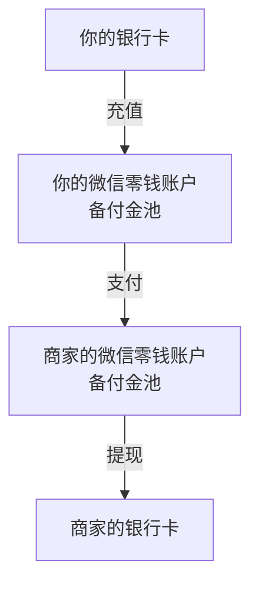
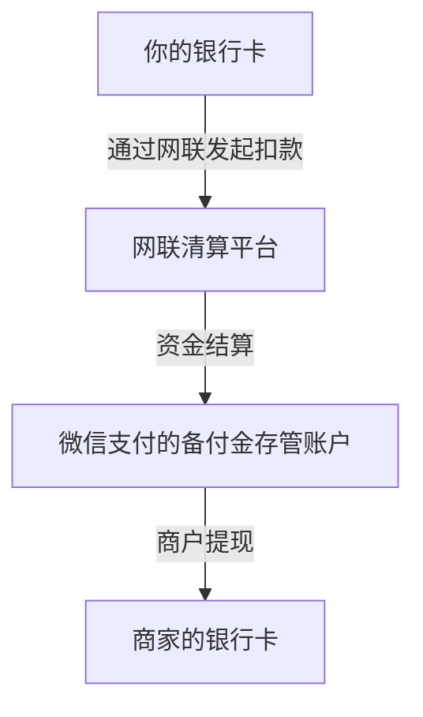

好的，这是一个非常棒的问题！它能帮助我们理解支付背后的资金流向。微信的“余额支付”和“银行卡支付”是两种截然不同的支付方式，其过程和资金流向有本质区别。

为了更直观地理解，我们可以用一个生活中的比喻：

*   **微信余额支付**：就像你从自己的**钱包**里直接掏现金给商家。
*   **微信银行卡支付**：就像你让商家拿着你的**银行卡**，去银行柜台办了一笔取款，然后你再把取出的现金给他。

下面我们来详细拆解这两个过程。

---

### 一、微信余额支付

这种方式使用的是你已经预先存放在微信支付平台里的钱。

#### **支付过程：**

1.  **用户操作**：你在商家处扫码或出示付款码，输入密码或验证指纹/人脸完成支付。
2.  **微信系统内部记账**：微信支付系统收到指令后，并不会立即联系银行或其他外部机构。它只是在腾讯内部的数据库中，进行了一次“内部转账”：
    *   **从**：你的“微信支付零钱账户”
    *   **到**：商家的“微信支付零钱账户”
3.  **完成**：你收到扣款通知，商家收到收款通知。整个过程在微信系统内瞬间完成。

#### **资金流向：**

**你的银行账户** → （之前已充值）→ **你的微信零钱账户** → （支付时）→ **商家的微信零钱账户**

**关键点：**
*   整个支付过程中，资金**完全没有离开腾讯的体系**，只是在微信支付的不同用户虚拟账户之间转移。
*   这笔钱在法律上被称为 **“客户备付金”** ，必须由腾讯在央行开立的集中存管账户进行统一存管，以保证资金安全。
*   商户之后可以**提现**这笔钱，这时资金才会从腾讯的备付金账户转移到商户的银行对公账户。

**图示：**

---

### 二、微信银行卡支付

这种方式是微信支付作为中介，帮助你向银行发起指令，从你绑定的储蓄卡或信用卡中直接扣款。

#### **支付过程：**

1.  **用户操作**：你选择用某张绑定的银行卡支付，输入支付密码/验证方式。
2.  **请求转发**：微信支付将你的支付请求和身份验证信息，通过 **“网联”** 平台发送给对应的发卡银行。
    *   **网联**：全称“非银行支付机构网络支付清算平台”，是所有第三方支付机构必须接入的官方清算通道。
3.  **银行扣款**：发卡银行（如工商银行）验证你的信息（密码、卡状态、余额/额度），验证通过后，直接从你的银行卡账户中扣款。
4.  **清算与结算**：
    *   银行扣款后，资金会进入由网联和央行管理的清算流程。
    *   最终，这笔钱会结算到微信支付为商户开设的**备付金集中存管账户**中。
5.  **完成**：微信支付通知你和商家支付成功。此时，你银行卡里的钱已经少了，但商户看到的仍是“已收款到微信支付”。

#### **资金流向：**

**你的银行卡账户** → （通过网联清算）→ **微信支付在央行的 备付金集中存管账户** → （商户提现时）→ **商家的银行账户**

**关键点：**
*   资金直接从你的银行账户转出，**不经过你的微信零钱账户**。
*   **网联** 在这个流程中扮演了关键角色，它使得支付流程对监管完全透明，切断了第三方支付机构与银行的“直连”，保障了资金安全。
*   对于信用卡支付，流程类似，只是银行端不是扣储蓄余额，而是记录一笔消费，计入账单。

**图示：**

---

### 核心对比总结

| 对比维度 | **微信余额支付** | **微信银行卡支付** |
| :--- | :--- | :--- |
| **资金源头** | 你已充入微信的零钱 | 你绑定的储蓄卡/信用卡 |
| **支付过程** | **腾讯内部记账**，不涉及银行实时操作 | **通过网联向银行发起扣款**，涉及银行实时授权 |
| **资金流向** | 在你的零钱账户和商家零钱账户间转移 | 从你的银行卡，经网联清算，进入微信备付金账户 |
| **清算机构** | 无（内部处理） | **网联** |
| **速度** | 极快（纯系统内部操作） | 较快（需与银行交互） |
| **对用户感受** | 像花“钱包里的现金” | 像“刷卡消费” |

简单来说，**余额支付是“花存量”，银行卡支付是“创流量”**。理解这两者的区别，有助于我们更好地管理个人财务，也能明白中国移动支付体系是如何在监管下高效运行的。
