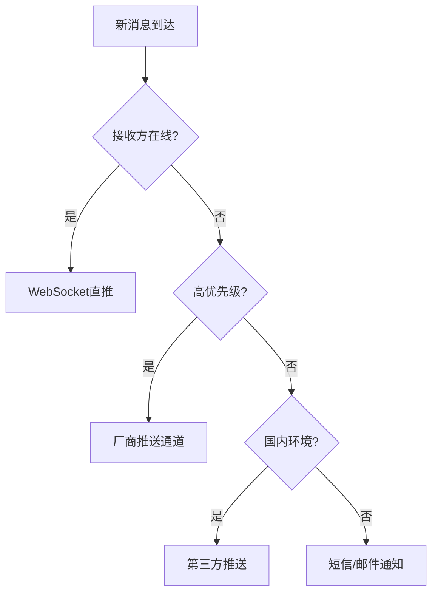

# 一、  （细看）IM系统如何实现消息推送功能，以微信或weLink为例

作为华为 GTS（Global Technical Service）工程师助手，我将结合**微信**和**华为 WeLink** 的典型架构实践，系统性地为你解析 IM（即时通讯）系统中**消息推送功能的实现原理**，涵盖：  
- 消息推送的核心场景  
- 在线消息投递（实时）  
- 离线消息推送（异步）  
- 移动端唤醒机制（APNs/华为 Push）  
- 高可用与可靠性保障  

> 💡 **GTS 视角**：在企业级 IM 系统（如 WeLink）或超大规模社交 IM（如微信）中，消息推送不仅是“发一条消息”，更是涉及**连接管理、状态同步、多端协同、省电优化、安全合规**的复杂工程问题。

---

## 一、IM 消息推送的核心场景

| 场景 | 说明 |
|------|------|
| **在线实时推送** | 接收方在线，通过长连接直接投递（毫秒级） |
| **离线消息推送** | 接收方离线，通过离线通知 + 拉取机制补推 |
| **多端同步** | 手机、PC、Web 多端在线，需广播或选择最优端投递 |
| **后台唤醒** | App 被杀后台后，通过系统推送通道唤醒 |
| **群聊广播** | 1 消息 → N 用户，需高效路由与投递 |

---

## 二、整体架构设计（以 WeLink / 微信为参考）

```text
+---------------------+
|     客户端（App/H5/PC）  |
|   - WebSocket 长连接    |
|   - 系统推送（APNs/HMS）|
+----------+----------+
           |
+----------v----------+     +------------------+
|   长连接网关层         |<--->| 服务发现（DNS/EDNS）|
| (基于 Netty)          |     +------------------+
+----------+----------+
           |（路由查询）
+----------v----------+
|   路由注册中心         |
| (Redis Cluster / ETCD)|
+----------+----------+
           |（消息转发）
+----------v----------+
|   消息中继 / Broker    |
| (Kafka / Pulsar)      |
+----------+----------+
           |
+----------v----------+
|   消息存储与离线服务     |
| (MySQL + Redis + ES)  |
+----------+----------+
           |
+----------v----------+
|   推送网关（Push Gateway）|
| (集成 APNs / FCM / HMS) |
+---------------------+
```

---

## 三、消息推送实现流程详解

### 场景 1：接收方在线（实时推送）

```text
发送方 → 网关 → 路由中心 → 接收方网关 → 接收方客户端（WebSocket）
```

#### 步骤说明：

1. **发送消息**
   - 客户端 A 发送消息 `{"to": "user_b", "msg": "hello"}` 到其连接的**长连接网关 A**。

2. **路由查询**
   - 网关 A 查询 **路由中心**（Redis），获取 `user_b` 当前连接的网关节点（如 `gateway-b.ip:port`）。

3. **消息中继**
   - 网关 A 将消息发送到 **消息中继（Kafka）**，主题为 `msg.to.user_b`。
   - 或直接通过内部 RPC 转发给网关 B。

4. **实时投递**
   - 网关 B 收到消息后，通过 **WebSocket 连接** 将消息推送给客户端 B。
   - 客户端 B 返回 `ACK`，确认接收。

5. **消息持久化**
   - 消息写入 **消息存储**（MySQL 分表 + Redis 缓存），用于历史消息查询。

> ✅ **特点**：延迟 < 50ms，无需系统推送。

---

### 场景 2：接收方离线（离线推送）

```text
发送方 → 网关 → 消息存储 → 推送网关 → 手机系统推送（APNs/HMS） → 客户端
```

#### 步骤说明：

1. **检测离线**
   - 路由中心查询 `user_b` 无在线连接（Redis 中无记录）。

2. **消息落盘**
   - 消息写入 **离线消息表**（MySQL），标记 `status=offline`。
   - 同时写入 Kafka，触发推送流程。

3. **触发推送**
   - **推送服务** 订阅 Kafka 消息，获取 `user_b` 的设备信息（Token、平台 iOS/Android）。

4. **调用系统推送通道**
   - 根据设备类型，调用对应推送网关：
     - **iOS**：Apple APNs（Apple Push Notification service）
     - **Android**：华为 HMS Push / 小米 MiPush / FCM（海外）
     - **WeLink**：深度集成 HMS，支持企业级推送策略

5. **系统级通知**
   - 手机收到系统通知（横幅、声音），即使 App 被杀后台也能唤醒。

6. **客户端拉取消息**
   - 用户点击通知 → App 启动 → 主动从服务器拉取未读消息（长轮询或直接查询）。

> ✅ **特点**：保证“可达性”，但延迟取决于系统推送时效（通常 < 5s）。

---

## 四、关键技术实现细节

### 1. **长连接管理（网关层）**

- **协议**：WebSocket + 自定义二进制协议（如 Protobuf）
- **心跳机制**：
  - 客户端每 30s 发送心跳包
  - 网关超时 90s 未收到心跳，判定离线，清理路由表
- **连接容量**：
  - 单网关节点支持 10W+ 长连接（优化 FD、内存、GC）
- **多端登录**：
  - 支持手机 + PC 同时在线
  - 路由中心维护 `uid → [device_id: gateway_node]` 映射
  - 群消息广播给所有在线设备，单聊可指定主设备

---

### 2. **路由中心设计**

- **存储**：Redis Cluster
- **Key 设计**：
  ```bash
  im:route:uid:{user_id} → {gateway_ip}:{port}:{device_id}
  ```
- **TTL**：与心跳周期一致（如 90s），自动过期
- **高可用**：Redis 主从 + 哨兵，RTO < 30s

---

### 3. **消息中继（Kafka / Pulsar）**

- **作用**：
  - 解耦网关与存储/推送服务
  - 削峰填谷（如群聊消息爆发）
  - 保证消息不丢失
- **Topic 设计**：
  - `im.msg.to.{uid}`：点对点消息
  - `im.msg.group.{gid}`：群聊消息
- **QoS**：
  - Kafka 设置 `acks=all`，`replication-factor=3`
  - 消费者幂等处理（防止重复投递）

---

### 4. **离线消息存储**

| 存储 | 用途 | 说明 |
|------|------|------|
| **MySQL** | 消息持久化 | 按 `user_id % 16` 分表，存储消息体、时间、状态 |
| **Redis** | 未读计数 + 热点消息缓存 | `im:unread:{uid}`，`im:latest:{uid}` |
| **Elasticsearch** | 消息搜索 | 支持关键词检索（WeLink 企业搜索） |

---

### 5. **推送网关（Push Gateway）**

| 平台 | 推送通道 | 特点 |
|------|----------|------|
| **iOS** | APNs | 苹果官方，稳定但不可定制 |
| **Android（华为手机）** | HMS Push | 华为生态，支持企业级策略、离线消息保留 |
| **Android（其他）** | FCM / 小米 / OPPO Push | 多通道备用 |
| **WeLink 优化** | HMS 深度集成 | 支持企业策略、静默推送、安全合规 |

> 🔐 **安全要求**：
> - 推送内容加密（如只推“您有新消息”，不推具体内容）
> - 企业 IM（如 WeLink）支持“禁止截屏”、“消息阅后即焚”

---

## 五、微信 vs WeLink 的推送策略对比

| 维度 | 微信 | WeLink（华为） |
|------|------|----------------|
| **推送通道** | 自研 + APNs/厂商通道 | 深度集成 HMS Push |
| **离线策略** | 强依赖系统推送 | 支持企业策略（如仅 WiFi 推送） |
| **多端同步** | 手机、PC、Web 实时同步 | 支持会议、邮件、IM 多端联动 |
| **消息安全** | 端到端加密（部分场景） | 企业级加密、审计、防泄漏 |
| **省电优化** | 后台保活（iOS 限制） | HMS 通道优化，低功耗 |
| **群聊性能** | 百人群广播优化 | 支持万人团队群，异步投递 |
| **API 开放** | 有限开放 | 提供企业 API，可集成 OA/ERP |

---

## 六、高可用与可靠性保障（GTS 实践）

| 问题 | 解决方案 |
|------|----------|
| **消息丢失** | Kafka 持久化 + 消费者 ACK + 存储落盘 |
| **重复投递** | 消息 ID 去重（Redis `SADD msg_id`） |
| **脑裂问题** | 路由中心单点写入，Redis 分布式锁 |
| **推送失败** | 多通道备用（HMS → FCM → 小米） |
| **雪崩风险** | 推送服务限流（令牌桶） + 异步队列 |
| **监控告警** | 监控：在线数、推送成功率、延迟（P99） |

> 📊 **关键指标（SLA）**：
> - 在线消息延迟：P99 < 100ms
> - 推送到达率：> 99.5%
> - 消息不丢失：RPO ≈ 0
> - 网关可用性：99.99%

---

## 七、移动端优化技巧

1. **省电策略**
   - 后台减少心跳频率（如 5min 一次）
   - 使用系统推送通道，避免常驻进程

2. **网络切换**
   - 支持 WiFi ↔ 4G 自动重连
   - 断线重连后补推离线消息

3. **消息去重**
   - 客户端缓存消息 ID，防止重复展示

4. **增量同步**
   - 拉取消息时带 `last_msg_id`，只同步增量

---

## 八、总结：IM 消息推送设计 checklist

✅ **在线推送**：
- 长连接网关 + 路由中心 + 实时投递

✅ **离线推送**：
- 消息落盘 + 推送网关 + 系统通道（APNs/HMS）

✅ **多端协同**：
- 路由中心支持多设备映射

✅ **高可用**：
- Kafka 持久化、Redis 高可用、网关集群

✅ **安全合规**：
- 内容脱敏、企业策略、审计日志

✅ **可监控**：
- 全链路监控：连接数、推送成功率、延迟

---

> 💡 **一句话总结**：  
> **IM 消息推送 = 长连接实时投递 + 系统推送兜底 + 多端协同 + 企业级可靠性**。  
> 微信胜在规模与生态，WeLink 胜在企业安全与 HMS 深度集成。

如你正在设计 IM 系统，欢迎提供具体场景（如“支持万人会议群”或“企业级消息审计”），我可为你定制架构方案与容量规划。


# 一、  （粗看）IM系统如何实现消息推送功能，以微信或weLink为例


# IM系统消息推送功能实现（以微信/WeLink为例）

## 一、消息推送整体架构

### 1. 核心分层设计
```
[客户端SDK] 
→ [接入网关层] 
→ [消息路由层] 
→ [持久化存储层] 
→ [推送服务层] 
→ [第三方通道]
```

### 2. 典型流程示例
1. 发送方发送消息 → 2. 服务端持久化 → 3. 查找接收方在线状态 
→ 4. 在线直接推送 → 5. 离线走推送通道 → 6. 客户端确认接收

## 二、关键技术实现方案

### 1. 长连接保活机制

**微信采用的多路复用技术**：
```java
// Android端示例：使用多连接保活
class WeChatConnection {
    private static final int MAIN_CHANNEL = 0;  // 主业务通道
    private static final int PUSH_CHANNEL = 1;  // 专用推送通道
    
    void init() {
        // 双通道连接
        createSocket(MAIN_CHANNEL, "gateway.wechat.com");
        createSocket(PUSH_CHANNEL, "push.wechat.com");
        
        // 心跳策略
        scheduleHeartbeat(MAIN_CHANNEL, 60s);
        scheduleHeartbeat(PUSH_CHANNEL, 300s);
    }
}
```

**优化技术**：
- **智能心跳**：根据网络环境动态调整间隔（Wi-Fi/4G切换时）
- **TCP Keepalive**：内核级保活（避免应用层心跳包被系统限制）
- **长连复用**：多个业务共享同一条TCP连接

### 2. 消息ID设计

**微信的消息序列号方案**：
```python
def generate_msg_id(uid, device_type, timestamp):
    """
    生成64位消息ID:
    - 高32位: 用户ID哈希值
    - 16位: 设备类型(手机/平板/PC等)
    - 16位: 时间戳差值(秒级)
    """
    user_hash = zlib.adler32(uid.encode()) & 0xFFFFFFFF
    device_code = DEVICE_TYPE_MAP[device_type]
    time_diff = (int(time.time()) - BASE_TIMESTAMP) & 0xFFFF
    return (user_hash << 32) | (device_code << 16) | time_diff
```

**关键特性**：
- 去中心化生成（无需全局协调）
- 保序性保证
- 设备维度唯一

### 3. 在线状态管理

**WeLink的会话跟踪实现**：
```go
type Session struct {
    UserID    string
    DeviceID  string 
    GatewayIP string
    ConnID    uint64
    LastActive int64 // 最后活跃时间
    Channels  []string // 订阅的频道
}

type SessionManager struct {
    sync.RWMutex
    localSessions  map[string]*Session // 本地内存存储
    redisClient    *redis.ClusterClient // 全局状态存储
}

func (sm *SessionManager) UpdateSession(session *Session) {
    sm.Lock()
    defer sm.Unlock()
    
    // 本地缓存
    sm.localSessions[session.DeviceID] = session
    
    // Redis集群存储
    pipe := sm.redisClient.Pipeline()
    pipe.HSet(ctx, "user:"+session.UserID, session.DeviceID, json.Marshal(session))
    pipe.Expire(ctx, "user:"+session.UserID, 24*time.Hour)
    pipe.Exec()
}
```

## 三、消息可靠投递保障

### 1. 确认机制设计

**三级确认体系**：
1. **TCP层ACK**：保证网络传输可靠
2. **业务层ACK**：客户端处理成功后回复
   ```protobuf
   message MsgAck {
     uint64 msg_id = 1;
     int32 status_code = 2; // 200=成功 500=处理失败
     string device_id = 3;  // 接收设备标识
   }
   ```
3. **已读回执**：用户打开聊天界面时触发

### 2. 离线消息处理

**微信的同步队列方案**：
```
┌───────────────────────────────────┐
│ MQ集群                            │
│ ┌─────────┐ ┌─────────┐ ┌───────┐ │
│ │ 用户A队列│ │ 用户B队列│ │ ...   │ │
│ │ 消息1   │ │ 消息1   │ │       │ │
│ │ 消息2   │ │         │ │       │ │
│ └─────────┘ └─────────┘ └───────┘ │
└───────────────────────────────────┘
```

**关键实现**：
- 每个用户维护独立队列
- 多设备同步时采用增量同步协议
- 消息合并压缩减少传输量

## 四、大规模并发优化

### 1. 接入层设计

**WeLink的网关架构**：
```
                    ┌───────────────┐
                    │ 全局负载均衡  │
                    └──────┬───────┘
                           ↓
┌───────────────────────────────────────────┐
│               接入网关集群                 │
│ ┌──────────┐ ┌──────────┐ ┌──────────┐    │
│ │ 网关节点1│ │ 网关节点2│ │   ...    │    │
│ │ 20万连接 │ │ 20万连接 │ │          │    │
│ └──────────┘ └──────────┘ └──────────┘    │
└───────────────────────────────────────────┘
```

**性能指标**：
- 单节点支撑20万+长连接
- 消息转发延迟<50ms（P99）
- 故障转移时间<3秒

### 2. 消息扩散优化

**读扩散 vs 写扩散选择**：
| 策略     | 适用场景                | 微信的应用案例             |
|----------|-------------------------|---------------------------|
| **写扩散** | 小群聊(5人以下)        | 私聊/小群直接写接收方收件箱|
| **读扩散** | 大群聊(100人以上)      | 500人群只存1份，成员拉取时扩展|

**混合模式实现**：
```java
public void dispatchMessage(Message msg, Group group) {
    if (group.getMembers().size() <= 5) {
        // 写扩散：直接投递到成员收件箱
        inboxService.batchInsert(msg, group.getMembers());
    } else {
        // 读扩散：存入群消息表
        groupMsgRepository.save(msg);
        // 维护最新消息指针
        groupService.updateLastMsgId(group.getId(), msg.getId());
    }
}
```

## 五、多端同步实现

### 1. 消息同步协议

**序列号同步机制**：
```
手机端                                  PC端
 |-------- GetDiff(sync_key=100) ------> |
 |<------- 消息105,107,110 已读位置108 -- |
 |-------- ACK(sync_key=110) -----------> |
```

### 2. 冲突解决策略

**微信采用的双向同步方案**：
1. **时间戳比对**：精确到毫秒的服务器时间
2. **操作标记**：区分用户主动发送 vs 同步消息
3. **最终一致性**：冲突时以最后操作时间为准

## 六、推送降级策略

### 1. 多通道分级推送

**WeLink的通道选择逻辑**：


### 2. 厂商通道特性对比
| 通道       | 到达率 | 唤醒能力 | 限制                  |
|------------|--------|----------|-----------------------|
| APNs       | >95%   | 优秀     | 每秒3次/设备          |
| 华为Push   | >90%   | 良好     | 每天1000条/应用       |
| 小米Push   | 88%    | 一般     | 频控严格              |
| 魅族Push   | 85%    | 较弱     | 需预装Flyme           |

## 七、安全与隐私保障

### 1. 端到端加密实现

**微信的加密流程**：
1. 会话建立时交换ECDH公钥
2. 生成临时会话密钥
3. 每份消息独立加密
   ```cpp
   // 加密示例
   void encryptMessage(Message* msg, const SessionKey& key) {
       byte iv[12] = generate_random_iv();
       byte ciphertext[msg->size() + 16];
       crypto_aead_encrypt(
           ciphertext, iv, 
           msg->data(), msg->size(),
           msg->header, key
       );
       msg->set_ciphertext(ciphertext);
       msg->set_auth_tag(ciphertext + msg->size());
   }
   ```

### 2. 频率限制策略
```nginx
# 防刷配置示例
limit_req_zone $binary_remote_addr zone=msg_rate:10m rate=10r/s;

location /api/send {
    limit_req zone=msg_rate burst=20 nodelay;
    proxy_pass http://backend;
}
```

## 八、性能优化关键点

1. **连接预热**：提前建立好长连接
2. **批处理消息**：合并短时间内的多消息
3. **协议优化**：使用Protocol Buffer+压缩
4. **智能心跳**：根据网络状态调整间隔
5. **优先级队列**：重要消息优先处理

## 九、典型架构案例：微信推送系统

```
                      ┌─────────────────┐
                      │    客户端       │
                      │ 多连接+智能心跳│
                      └────────┬───────┘
                               ↓
┌───────────────────────────────────────────┐
│               接入层                      │
│  ┌───────────┐ ┌───────────┐ ┌─────────┐ │
│  │ 网关集群1  │ │ 网关集群2  │ │   ...   │ │
│  │ 深圳机房   │ │ 上海机房   │ │         │ │
│  └─────┬─────┘ └─────┬─────┘ └─────────┘ │
│        ↓             ↓                   │
└───────────────────────────────────────────┘
                      ↓
┌───────────────────────────────────────────┐
│               消息路由层                   │
│ ┌─────────────────┐ ┌───────────────────┐│
│ │ 在线用户        │ │ 离线处理           ││
│ │ • 直接投递      │ │ • 存入消息队列     ││
│ │ • 多端同步      │ │ • 离线推送         ││
│ └─────────────────┘ └───────────────────┘│
└───────────────────────────────────────────┘
                      ↓
┌───────────────────────────────────────────┐
│               持久化层                     │
│ ┌─────────────┐ ┌─────────────┐           │
│ │ 消息存储     │ │ 关系存储    │           │
│ │ • 分库分表   │ │ • 好友关系   │           │
│ │ • 冷热分离   │ │ • 群组信息   │           │
│ └─────────────┘ └─────────────┘           │
└───────────────────────────────────────────┘
```

**性能指标**：
- 日均消息量：4500亿+
- 峰值QPS：800万+
- 送达率：99.99%（在线场景）
- 端到端延迟：<200ms（同城）
