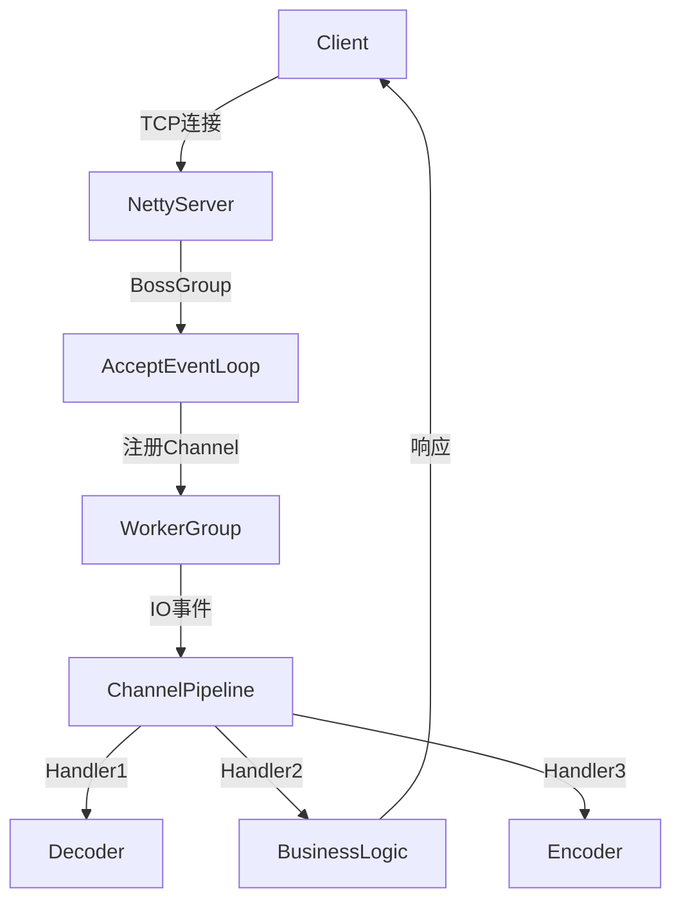

# 一、（粗看）详细介绍netty内部架构，工作原理，优缺点，使用场景；并与同类工具进行对比

以下是关于 **Netty** 的深度解析，包括内部架构、工作原理、优缺点、使用场景，以及与同类框架（如Mina、gRPC、Vert.x）的对比：

---

### **1. Netty 内部架构**
#### **核心组件**  
1. **Channel**  
   - 抽象化的网络连接（如Socket、NIO Channel），支持异步IO操作。  
2. **EventLoop & EventLoopGroup**  
   - **EventLoop**：单线程事件循环，处理Channel的IO事件（如读写、连接）。  
   - **EventLoopGroup**：管理多个EventLoop，实现线程池复用。  
3. **ChannelPipeline & ChannelHandler**  
   - **Pipeline**：责任链模式，将数据流通过多个Handler处理（如编解码、业务逻辑）。  
   - **Handler**：分为`Inbound`（处理入站数据）和`Outbound`（处理出站数据）。  
4. **ByteBuf**  
   - 高性能字节容器，支持堆内存/直接内存、引用计数和零拷贝。  
5. **Bootstrap**  
   - 服务启动辅助类，分为`ServerBootstrap`（服务端）和`Bootstrap`（客户端）。  

#### **线程模型**  
- **Reactor模式**：多EventLoopGroup分工（如BossGroup接收连接、WorkerGroup处理IO）。  
- **无锁化设计**：单EventLoop绑定固定Channel，避免多线程竞争。  

---

### **2. 工作原理**  
1. **服务端启动**：  
   ```java
   EventLoopGroup bossGroup = new NioEventLoopGroup(1);  
   EventLoopGroup workerGroup = new NioEventLoopGroup();  
   ServerBootstrap b = new ServerBootstrap()  
       .group(bossGroup, workerGroup)  
       .channel(NioServerSocketChannel.class)  
       .childHandler(new MyServerInitializer());  
   b.bind(8080).sync();  
   ```  
   - BossGroup监听连接请求，WorkerGroup处理已建立连接的IO事件。  

2. **事件处理流程**：  
   - 数据到达 → EventLoop触发`channelRead`事件 → Pipeline调用Handler链处理 → 返回响应。  

3. **零拷贝优化**：  
   - 通过`FileRegion`或`CompositeByteBuf`减少数据内存拷贝。  

---

### **3. 优缺点分析**  
| **优点**                          | **缺点**                              |  
|-----------------------------------|---------------------------------------|  
| **高性能**：基于NIO，支持百万级并发。  | **API复杂**：学习曲线陡峭。            |  
| **低延迟**：零拷贝、内存池优化。      | **回调地狱**：需处理异步回调（Future/Callback）。|  
| **高扩展性**：可自定义Protocol和Handler。 | **调试困难**：异步日志需额外工具（如tcpdump）。 |  
| **多协议支持**：HTTP/WebSocket/TCP等。 | **内存泄漏风险**：需手动管理ByteBuf引用计数。 |  

---

### **4. 使用场景**  
- **高并发网络应用**：游戏服务器、即时通讯（如微信后台）。  
- **RPC框架**：Dubbo、gRPC的底层通信层。  
- **IoT设备接入**：TCP长连接管理。  
- **大数据传输**：文件服务器、代理服务（如Shadowsocks）。  

---

### **5. 与同类工具对比**  
| **维度**       | **Netty**                          | **Apache Mina**               | **gRPC**                      | **Vert.x**                   |  
|----------------|------------------------------------|-------------------------------|-------------------------------|------------------------------|  
| **架构**        | 事件驱动、Reactor模式              | 事件驱动，类似Netty           | 基于HTTP/2的RPC框架           | 多语言响应式框架（Polyglot） |  
| **性能**        | 最高（优化至底层）                | 次之                          | 高（但依赖HTTP/2）           | 高（非阻塞IO）              |  
| **协议支持**    | 自定义任意协议                    | 定制协议需扩展                | 仅HTTP/2 + Protobuf          | HTTP/WebSocket/TCP等         |  
| **开发效率**    | 低（需手动编解码）                | 较低                          | 高（代码生成）               | 高（支持多种语言）          |  
| **典型场景**    | 需要极致性能的自定义协议          | 旧项目迁移（兼容性较好）      | 微服务间通信                 | 全栈响应式应用              |  

#### **关键区别**  
1. **Netty vs Mina**：  
   - Netty是Mina的升级版，性能更高，社区活跃。  
   - Mina对旧Java NIO API兼容更好，但已逐渐被淘汰。  
2. **Netty vs gRPC**：  
   - gRPC基于Netty实现，适合标准化RPC场景，Netty适合底层协议定制。  
3. **Netty vs Vert.x**：  
   - Vert.x构建在Netty之上，提供更高层抽象（如响应式编程），适合全栈开发。  

---

### **6. 工作原理图示**  


---

### **总结**  
- **选Netty**：需要高性能、自定义协议（如私有TCP协议）。  
- **选gRPC**：追求开发效率的标准化RPC场景。  
- **选Vert.x**：需要快速构建响应式全栈应用。  
- **Mina**：仅考虑老旧系统兼容时使用。  

如果需要具体代码示例（如实现WebSocket服务器）或性能调优技巧，可进一步探讨！

# 一、（粗看）详细介绍netty内部架构，工作原理，优缺点，使用场景；并与同类工具进行对比

作为华为GTS（Global Technical Service）的ICT服务助手GTSLLM，我将为您系统性地详细介绍 **Netty** 的内部架构、工作原理、优缺点、典型使用场景，并与同类网络通信框架（如 Java NIO 原生API、MINA、Grizzly、Akka）进行对比分析。Netty 在华为内部广泛应用于 **5G核心网、分布式存储、微服务通信、IoT网关、消息中间件** 等高并发、低延迟场景。

---

## 一、Netty 概述

**Netty** 是一个基于 Java NIO 的**异步事件驱动**的高性能网络应用框架，用于快速开发可维护的高性能协议服务器和客户端。

- 官网：https://netty.io
- 开发者：Trustin Lee（原JBOSS成员）
- 使用者：Dubbo、RocketMQ、Elasticsearch、Spark、Flink、Kafka、gRPC 等均基于 Netty 构建

---

## 二、内部架构（Architecture）

Netty 采用 **Reactor 模式** 的多线程变种，核心组件高度模块化，分为 **服务端启动器、事件循环、通道、处理器链、缓冲区、编解码器** 等。

### 1. 核心组件图解

```
+-------------------+
|   Bootstrap       |  ← 客户端启动器
|   ServerBootstrap |  ← 服务端启动器
+-------------------+
         |
         v
+------------------------+
|   EventLoopGroup       |  ← 线程池（Boss + Worker）
|   (MultithreadEventExecutorGroup) |
+------------------------+
         |
         v
+------------------------+
|   EventLoop            |  ← 单线程事件循环（每个线程一个）
|   (Selector + TaskQueue)|
+------------------------+
         |
         v
+------------------------+
|   Channel              |  ← 网络连接抽象（TCP/UDP）
+------------------------+
         |
         v
+------------------------+
|   ChannelPipeline      |  ← 处理器链（Inbound/Outbound）
|   +------------------+ |
|   | ChannelHandler   | |  ← 业务逻辑处理器
|   +------------------+ |
|   | Encoder/Decoder  | |  ← 编解码器（如Protobuf、JSON）
|   +------------------+ |
+------------------------+
         |
         v
+------------------------+
|   ByteBuf              |  ← 高性能缓冲区（池化、零拷贝）
+------------------------+
```

---

## 三、工作原理（How It Works）

### 1. 启动流程（以服务端为例）

```java
ServerBootstrap b = new ServerBootstrap();
b.group(bossGroup, workerGroup)           // 设置Boss和Worker线程组
 .channel(NioServerSocketChannel.class)   // 使用NIO通道
 .childHandler(new ChannelInitializer<SocketChannel>() {
     @Override
     public void initChannel(SocketChannel ch) {
         ch.pipeline().addLast(new Decoder());
         ch.pipeline().addLast(new Encoder());
         ch.pipeline().addLast(new BusinessHandler());
     }
 })
 .bind(8080).sync();
```

#### 步骤解析：
1. **Boss EventLoopGroup**：负责 accept 新连接（监听端口）
2. **Worker EventLoopGroup**：负责读写数据、处理IO事件
3. 每个 `EventLoop` 绑定一个线程和一个 `Selector`，轮询事件
4. 新连接接入后，由 Boss 分配给某个 Worker 的 `EventLoop`
5. 该连接的整个生命周期由同一个 `EventLoop` 处理（避免线程竞争）

---

### 2. 事件处理模型（Reactor 模式）

Netty 使用 **主从 Reactor 多线程模型**：

| 角色 | 职责 |
|------|------|
| **Main Reactor（Boss）** | 接收新连接（accept），注册到 Sub Reactor |
| **Sub Reactor（Worker）** | 处理已连接的读写事件（read/write） |
| **ChannelPipeline** | 责任链模式处理入站/出站事件 |
| **ByteBuf** | 高效内存管理，支持堆外内存、池化 |

> 所有 IO 操作异步执行，通过 `ChannelFuture` 监听结果。

---

### 3. 零拷贝与高性能机制

| 技术 | 说明 |
|------|------|
| **ByteBuf 池化** | 减少GC，支持 `PooledByteBufAllocator` |
| **CompositeByteBuf** | 合并多个Buffer，避免内存拷贝 |
| **FileRegion** | 使用 `transferTo()` 实现文件传输零拷贝 |
| **Direct Buffer** | 堆外内存，减少用户态与内核态拷贝 |
| **Gather/Scatter I/O** | 支持 `I/O Vector`，一次系统调用处理多个Buffer |

---

## 四、优缺点分析

### ✅ 优点

| 优势 | 说明 |
|------|------|
| **高性能** | 单机可支撑百万级并发连接（C10M问题） |
| **异步非阻塞** | 基于 NIO，无阻塞等待，资源利用率高 |
| **可扩展性强** | 插件式 `ChannelHandler`，易于定制协议 |
| **编解码支持丰富** | 内置 HTTP、WebSocket、Protobuf、JSON、Redis、MQTT 等编解码器 |
| **高可靠性** | 内存泄漏检测（ResourceLeakDetector）、流量控制（背压） |
| **社区活跃** | 文档完善，案例丰富，被主流中间件广泛采用 |

---

### ❌ 缺点

| 不足 | 说明 |
|------|------|
| **学习曲线陡峭** | Reactor 模式、事件驱动、线程模型理解成本高 |
| **调试困难** | 异步编程模型，堆栈不连续，日志追踪复杂 |
| **内存管理需谨慎** | `ByteBuf` 需手动释放，否则内存泄漏 |
| **线程模型复杂** | `EventLoop` 线程不能阻塞，否则影响其他连接 |
| **不适合简单场景** | 小项目使用过度设计，不如 Spring WebFlux 简单 |

---

## 五、典型使用场景（华为GTS实践）

| 场景 | 应用案例 |
|------|----------|
| **RPC 框架通信层** | Dubbo、gRPC、华为自研微服务框架 |
| **消息中间件** | RocketMQ Broker 与 Client 通信 |
| **分布式数据库** | 华为 GaussDB、TiDB 节点间通信 |
| **IoT 网关** | 海量设备接入（MQTT 协议） |
| **实时流处理** | Flink、Spark Streaming 网络 shuffle |
| **游戏服务器** | 多玩家实时交互，低延迟要求 |
| **5G 核心网信令面** | N4/N7 接口信令处理（PFCP 协议） |
| **自研负载均衡器** | 替代 Nginx 做四层转发（如华为云 ELB 数据面） |

---

## 六、与同类工具对比

| 对比项 | Netty | Java NIO 原生 | Apache MINA | Grizzly | Akka |
|--------|-------|---------------|-------------|---------|------|
| **抽象层次** | 高（封装良好） | 低（需手动管理） | 中 | 中 | 高（Actor模型） |
| **性能** | 极高 | 高（但易写错） | 高 | 高 | 中高（Actor开销） |
| **学习难度** | 中高 | 高 | 中 | 中 | 高（需理解Actor） |
| **线程模型** | Reactor 多线程 | Reactor 单线程/多线程 | 类似Netty | 类似NIO | Actor 模型（轻量线程） |
| **编解码支持** | 丰富（内置+可扩展） | 无 | 一般 | 一般 | 需Akka Streams |
| **社区生态** | 极强（主流中间件都在用） | JDK自带 | 弱（已基本停止维护） | 一般（GlassFish生态） | 强（Scala/Java） |
| **适用场景** | 高性能协议开发 | 教学/简单场景 | 旧项目迁移 | GlassFish相关 | 分布式Actor系统 |
| **内存管理** | 手动释放ByteBuf | 手动管理Buffer | 类似Netty | 手动 | JVM GC自动管理 |
| **背压支持** | 通过 `ChannelConfig` 控制 | 无 | 无 | 无 | Akka Streams 支持 |
| **华为使用情况** | 广泛（核心网、中间件） | 极少（封装在框架内） | 无 | 少量遗留系统 | 部分AI平台使用 |

---

## 七、Netty 在华为的典型应用案例（GTS视角）

### 案例1：5G UPF（用户面功能）数据面
- 使用 Netty 实现 N3/N6/N9 接口的 GTP-U 协议处理
- 单节点支持 100万+ 用户会话
- 基于 `PooledByteBufAllocator` 优化内存分配
- 自定义 `GtpDecoder` 解析 GTP 头部

### 案例2：华为云 IoT 平台
- 使用 Netty + MQTT 协议接入亿级设备
- 支持 QoS 0/1/2，遗嘱消息，连接保活
- 结合 Redis 实现会话持久化

### 案例3：分布式存储系统（如OceanStor）
- 使用 Netty 实现节点间数据同步（RDMA over TCP模拟）
- 支持大文件分块传输，零拷贝优化

---

## 八、最佳实践建议（华为GTS现场经验）

| 实践 | 建议 |
|------|------|
| **线程模型** | Boss线程数=1，Worker线程数=CPU核数×2 |
| **内存管理** | 使用 `PooledByteBufAllocator`，`ReferenceCountUtil.release(msg)` |
| **异常处理** | 在 `exceptionCaught` 中记录日志并关闭连接 |
| **心跳机制** | 使用 `IdleStateHandler` 检测空闲连接 |
| **日志追踪** | 在 `ChannelInitializer` 中注入 `TraceID`，实现全链路追踪 |
| **性能调优** | 调整 `SO_BACKLOG`、`TCP_NODELAY`、`SO_KEEPALIVE` |
| **安全防护** | 限制单连接速率，防止DDoS |

---

## 九、总结

| 维度 | Netty |
|------|-------|
| **定位** | 高性能网络编程框架 |
| **核心价值** | 简化 NIO 编程，提升开发效率与系统性能 |
| **适用领域** | 中间件、通信系统、IoT、云原生基础设施 |
| **未来趋势** | 与 RSocket、QUIC、WASM 结合，支持云原生协议 |

> 在华为GTS交付中，**Netty 是构建高可靠、高性能通信系统的首选底层框架**，尤其适用于对延迟、吞吐、稳定性有严苛要求的场景。

---

如您需要具体代码示例（如“如何用Netty实现一个简单的HTTP服务器”或“Netty + Protobuf 编解码实战”），我可进一步提供完整可运行代码片段。
