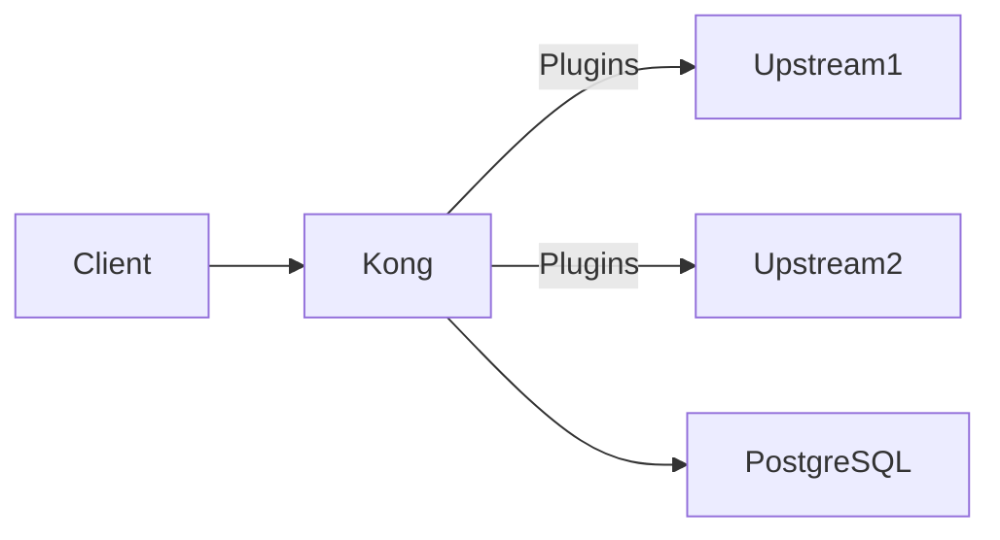
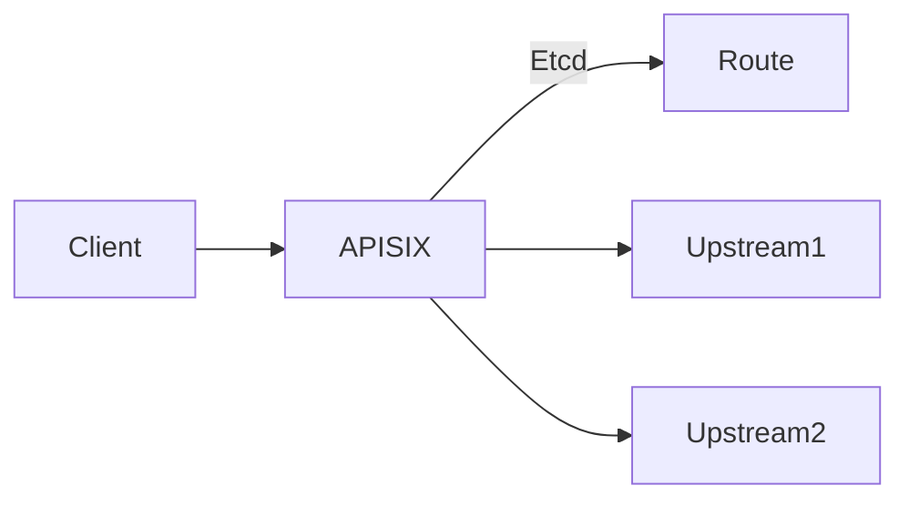
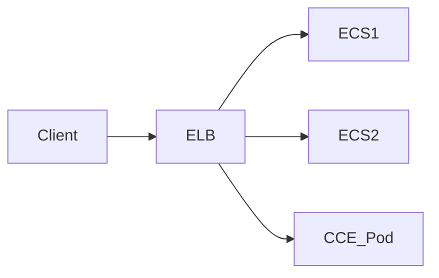

# 一、(全部粗看)详细介绍Kong 、 Apache APISIX 、华为云 ELB内部架构，工作原理，优缺点，使用场景；并进行对比
以下是关于 **Kong、Apache APISIX、华为云ELB** 的详细对比分析，涵盖架构设计、工作原理、优缺点及典型场景：

---

### **1. Kong**  
#### **内部架构**  
- **核心组件**：  
  - **Nginx**：基于OpenResty的高性能HTTP服务器。  
  - **PostgreSQL/Cassandra**：存储路由、插件配置（Kong默认依赖数据库）。  
  - **Plugins**：模块化扩展（如JWT鉴权、限流、日志）。  
- **数据平面与控制平面分离**：  
  - 数据平面：处理流量转发（高性能）。  
  - 控制平面：通过Admin API管理配置。  

#### **工作原理**  
1. 客户端请求到达Kong网关的监听端口（默认8000/8443）。  
2. 查询数据库匹配路由规则，按优先级执行插件链（如Auth→Rate Limiting）。  
3. 转发到上游服务（Upstream），响应经Kong返回客户端。  

#### **优点**  
- **成熟生态**：企业级插件丰富（如Kong Enterprise支持AI防御）。  
- **云原生支持**：Kubernetes Ingress Controller（KIC）集成。  
- **混合部署**：支持On-Prem和云环境。  

#### **缺点**  
- **依赖数据库**：PostgreSQL/Cassandra成为单点故障。  
- **资源消耗高**：内存占用较大（尤其开启多个插件时）。  

#### **使用场景**  
- 需要复杂API治理的企业（如银行开放平台）。  
- 微服务网关（与K8s集成）。  

---

### **2. Apache APISIX**  
#### **内部架构**  
- **核心设计**：  
  - **Etcd**：配置中心（无数据库依赖，实时生效）。  
  - **OpenResty**：动态路由和插件热加载。  
  - **插件化架构**：200+内置插件（如gRPC、MQTT支持）。  
- **多协议支持**：HTTP/HTTPS、WebSocket、TCP/UDP等。  

#### **工作原理**  
1. 请求到达APISIX，通过Etcd获取最新路由规则。  
2. 执行插件链（如IP黑白名单→OAuth2鉴权）。  
3. 负载均衡到后端（支持一致性哈希、最少连接等算法）。  

#### **优点**  
- **高性能**：单核支持18k QPS（基准测试高于Kong）。  
- **动态能力**：路由/插件热更新，无需重启。  
- **无状态设计**：依赖Etcd，易于横向扩展。  

#### **缺点**  
- **学习曲线**：插件开发需Lua基础（尽管支持多语言Wasm）。  
- **社区资源**：商业支持弱于Kong（但增长迅速）。  

#### **使用场景**  
- 高并发API网关（如电商大促）。  
- 多协议流量管理（如IoT设备接入）。  

---

### **3. 华为云ELB（弹性负载均衡）**  
#### **内部架构**  
- **全托管服务**：  
  - **四层ELB**：基于DPDK高性能转发（TCP/UDP）。  
  - **七层ELB**：基于Nginx扩展，支持HTTPS卸载。  
- **分布式架构**：跨可用区（AZ）高可用，自动弹性扩缩容。  

#### **工作原理**  
1. 用户配置监听器（Listener）和后端服务器组（Server Group）。  
2. 流量经ELB节点（华为云底层SDN）分发到ECS或CCE容器。  
3. 支持加权轮询、源IP哈希等算法。  

#### **优点**  
- **开箱即用**：无需维护基础设施，自动容灾。  
- **深度云集成**：与VPC、AS（弹性伸缩）联动。  
- **安全防护**：集成Anti-DDoS、WAF（需额外购买）。  

#### **缺点**  
- **厂商锁定**：仅适用于华为云生态。  
- **灵活性低**：不支持自定义插件或复杂路由逻辑。  

#### **使用场景**  
- 华为云上Web应用或微服务负载均衡。  
- 合规行业（如政务云）的托管服务需求。  

---

### **横向对比表**  
| **维度**         | **Kong**            | **APISIX**          | **华为云ELB**       |  
|------------------|---------------------|---------------------|---------------------|  
| **架构依赖**      | PostgreSQL/Cassandra | Etcd                | 华为云SDN           |  
| **性能**          | 中（1.5k QPS/核）   | 高（18k QPS/核）    | 高（硬件加速）      |  
| **扩展性**        | 插件需重启生效       | 动态热更新          | 仅支持华为云服务    |  
| **协议支持**      | HTTP/gRPC           | HTTP/TCP/UDP/MQTT   | HTTP/TCP/UDP        |  
| **部署模式**      | 自维护/云托管       | 自维护/云原生       | 全托管              |  
| **典型用户**      | 企业级API治理       | 高并发/多协议场景   | 华为云客户          |  

### **选型建议**  
1. **需要企业级支持与插件生态** → **Kong**（适合传统行业）。  
2. **追求极致性能与动态能力** → **APISIX**（适合互联网高并发场景）。  
3. **云原生全托管需求** → **华为云ELB**（适合上云企业）。  

---

### **工作原理图示对比**  
#### **Kong**  

#### **APISIX**  

#### **华为云ELB**  

如需具体场景的配置示例（如Kong+OAuth2或APISIX+Prometheus监控），可进一步展开说明！

# 一、(全部粗看)详细介绍Kong 、 Apache APISIX 、华为云 ELB内部架构，工作原理，优缺点，使用场景；并进行对比
作为华为GTS（Global Technical Service）的ICT服务助手GTSLLM，我将为您系统性地详细介绍 **Kong、Apache APISIX、华为云ELB** 三种主流API网关与负载均衡产品的**内部架构、工作原理、优缺点、典型使用场景**，并进行横向对比分析。这些技术广泛应用于华为云、企业微服务架构、运营商BSS/OSS系统等关键场景。

---

## 一、Kong（开源API网关）

### 1. 内部架构
Kong 是基于 **Nginx + OpenResty** 构建的开源API网关，采用插件化架构，支持高并发、可扩展的API管理。

#### 核心组件：
- **Nginx/OpenResty**：作为数据平面，处理HTTP请求，基于事件驱动模型
- **PostgreSQL/Cassandra**：作为控制平面，存储路由、服务、插件配置
- **Kong Admin API**：RESTful接口，用于动态配置网关
- **Plugins（插件系统）**：如限流、鉴权、日志、监控等，支持自定义Lua插件

> 架构模式：**控制面与数据面分离**

### 2. 工作原理
1. 客户端请求到达 Kong
2. Kong 根据 `Host` 或 `Path` 匹配路由（Route）
3. 路由绑定到服务（Service），服务指向后端真实地址
4. 执行插件链（Plugin Chain）：如 JWT鉴权 → 限流 → 日志 → 转发
5. 请求转发至后端服务，响应原路返回

> 插件执行顺序可配置，支持前置/后置处理。

### 3. 优缺点

| 优点 | 缺点 |
|------|------|
| ✅ 插件生态丰富（官方+社区） | ❌ 控制面依赖数据库，配置更新有延迟 |
| ✅ 基于OpenResty，性能高 | ❌ 插件用Lua编写，学习成本较高 |
| ✅ 支持gRPC、WebSocket | ❌ 动态服务发现能力弱（需外部集成） |
| ✅ 可集群部署，支持水平扩展 | ❌ 原生无图形化界面（需Konga等第三方） |

### 4. 使用场景
- 微服务统一入口（Spring Cloud、Dubbo）
- 多租户SaaS平台API管理
- 华为部分客户自建云平台中作为API网关

---

## 二、Apache APISIX（云原生API网关）

### 1. 内部架构
APISIX 是 Apache 基金会顶级项目，基于 **Nginx + OpenResty + etcd** 构建，专为云原生设计，强调**高性能、动态配置、低延迟**。

#### 核心组件：
- **Nginx/OpenResty**：数据平面，处理请求
- **etcd**：分布式配置中心，存储路由、插件、上游服务等配置
- **Control Plane（可选）**：如 APISIX Dashboard 或控制台
- **Plugins**：内置80+插件，支持热加载，可用Lua/Java/Python等编写

> 架构亮点：**配置热更新无reload**，通过监听etcd变化动态生效。

### 2. 工作原理
1. 请求进入 APISIX
2. 从 etcd 加载路由规则（无需重启）
3. 匹配路由 → 执行插件链（如限流、鉴权）
4. 通过负载均衡算法选择上游服务（支持服务发现：Nacos、Eureka、DNS等）
5. 转发请求，响应返回

> 支持 **gRPC、MQTT、Dubbo** 等多种协议。

### 3. 优缺点

| 优点 | 缺点 |
|------|------|
| ✅ 配置热更新，无需reload | ❌ etcd运维复杂度较高 |
| ✅ 性能优于Kong（延迟更低） | ❌ 社区文档相对分散 |
| ✅ 内置服务发现（Nacos/Eureka/DNS） | ❌ 企业级支持不如商业产品 |
| ✅ 插件热加载，支持多语言扩展 | ❌ 高可用需自行搭建etcd集群 |
| ✅ 支持WASM插件，未来可期 |  |

### 4. 使用场景
- 云原生微服务架构（Kubernetes Ingress）
- 高并发API平台（如开放平台、开发者门户）
- 华为GTS在客户云迁移项目中推荐用于替代传统Kong

---

## 三、华为云 ELB（Elastic Load Balance）

> 注：华为云提供多种负载均衡产品，此处重点介绍 **ELB（经典负载均衡）** 与 **ALB（应用型负载均衡）** 的融合视角，因“ELB”在华为云语境中常泛指弹性负载均衡系列。

### 1. 内部架构（以ALB为核心说明）
华为云ELB是**全托管、高可用、弹性伸缩**的负载均衡服务，分为：
- **CLB（Classic Load Balancer）**：支持TCP/UDP/HTTP/HTTPS，四层为主
- **ALB（Application Load Balancer）**：专注七层HTTP/HTTPS/gRPC，支持路径、域名路由
- **NLB（Network Load Balancer）**：超大吞吐四层负载均衡

#### 核心架构特点：
- **分布式集群部署**：跨AZ容灾，SLA 99.95%
- **控制面与数据面分离**：控制面管理配置，数据面处理流量
- **自动弹性**：根据QPS、连接数自动扩缩容
- **深度集成**：与VPC、ECS、CCE、WAF、云监控无缝对接
- **支持灰度发布、金丝雀发布、会话保持**

### 2. 工作原理
1. 客户端请求 → ELB VIP（虚拟IP）
2. ELB根据监听器协议（HTTP/HTTPS）处理
3. 匹配转发策略（如 `/api/*` → 后端服务器组A）
4. 执行健康检查，选择可用后端节点
5. 支持SSL卸载、Cookie会话保持、源IP保留
6. 请求转发至ECS/CCE实例

> ALB支持基于Header、Query参数的路由，适合微服务场景。

### 3. 优缺点

| 优点 | 缺点 |
|------|------|
| ✅ 完全托管，免运维 | ❌ 成本按实例+流量计费，长期使用成本较高 |
| ✅ 自动弹性，应对突发流量 | ❌ 定制化能力有限（无法自定义插件逻辑） |
| ✅ 高可用（多AZ部署） | ❌ 跨云迁移困难（厂商锁定） |
| ✅ 与华为云生态深度集成 | ❌ 不支持Lua/WASM等扩展机制 |
| ✅ 支持灰度发布、A/B测试 |  |

### 4. 使用场景
- 华为云上Web应用入口
- CCE（Kubernetes）集群Ingress后端
- 企业混合云架构中的统一接入点
- 华为GTS交付项目中推荐作为**云原生标准接入层**

---

## 四、三者对比总结表

| 维度 | Kong | Apache APISIX | 华为云 ELB（ALB） |
|------|------|----------------|--------------------|
| **类型** | 开源软件 | 开源软件 | 云服务（SaaS） |
| **层级** | L7（HTTP/HTTPS/gRPC） | L7为主，支持MQTT/Dubbo | L4/L7（ALB为L7） |
| **数据面** | Nginx + OpenResty | Nginx + OpenResty | 分布式集群（黑盒） |
| **控制面** | PostgreSQL/Cassandra | etcd（强一致性） | 华为云控制台/API |
| **配置动态性** | 需API触发，可能需reload | etcd监听，热更新无reload | 实时生效 |
| **插件机制** | Lua插件，丰富生态 | Lua/Java/Python/WASM，热加载 | 无（功能内置） |
| **服务发现** | 需外部集成 | 支持Nacos/Eureka/DNS | 支持CCE/ECS自动注册 |
| **性能** | 高（~10K QPS/节点） | 更高（~15K QPS/节点） | 极高（弹性集群） |
| **高可用** | 需自行部署集群 | 需etcd集群保障 | 内置多AZ容灾 |
| **运维成本** | 中（需维护DB、节点） | 中高（etcd运维） | 极低（全托管） |
| **扩展性** | 高（Lua插件） | 极高（多语言+WASM） | 低（功能固定） |
| **适用场景** | 自建API网关、混合云 | 云原生、高性能API平台 | 华为云上标准接入方案 |

---

## 五、华为GTS实践建议（现场交付视角）

| 场景 | 推荐方案 |
|------|----------|
| **客户坚持自建网关** | 推荐 **Apache APISIX**（性能更强、动态性更好） |
| **云上新建系统** | 推荐 **华为云ALB + CCE Ingress**，简化运维 |
| **已有Kong系统** | 可逐步迁移到APISIX或ALB，避免技术债务 |
| **需要深度定制逻辑** | 使用APISIX + WASM插件，或自研网关 |
| **金融级高可用要求** | ALB + 多AZ部署 + WAF + DDoS防护 |
| **灰度发布需求** | ALB支持金丝雀发布，优于Kong/APISIX原生能力 |

---

## 六、演进趋势（华为观点）

1. **从自建到托管**：Kong/APISIX → 华为云ALB/APIG（API网关）
2. **从静态到动态**：文件配置 → etcd/服务注册中心
3. **从单一功能到平台化**：负载均衡 → 安全、可观测、治理一体化
4. **从Lua到多语言扩展**：APISIX支持Java/Python/WASM，降低开发门槛
5. **与Service Mesh融合**：未来ALB/APISIX可能与Istio集成，实现南北向+东西向流量统一管理

> 在华为云战略中，**ALB + APIG + CSE（微服务引擎）** 构成企业级云原生流量治理标准栈。

---

如您有具体需求（如“如何用APISIX实现JWT鉴权+限流”或“ALB如何对接CCE集群”），我可进一步提供配置示例与最佳实践。
